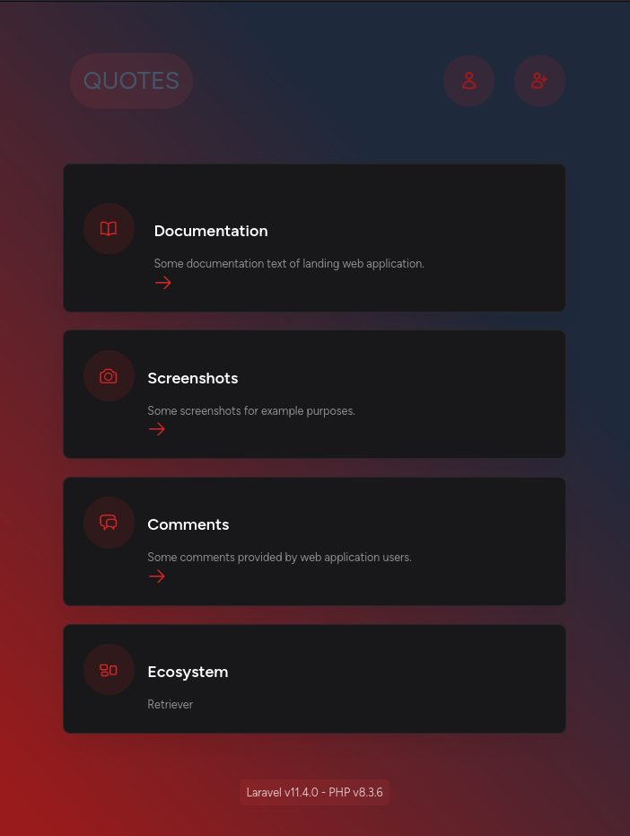
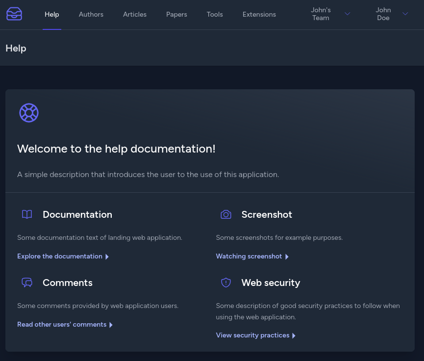
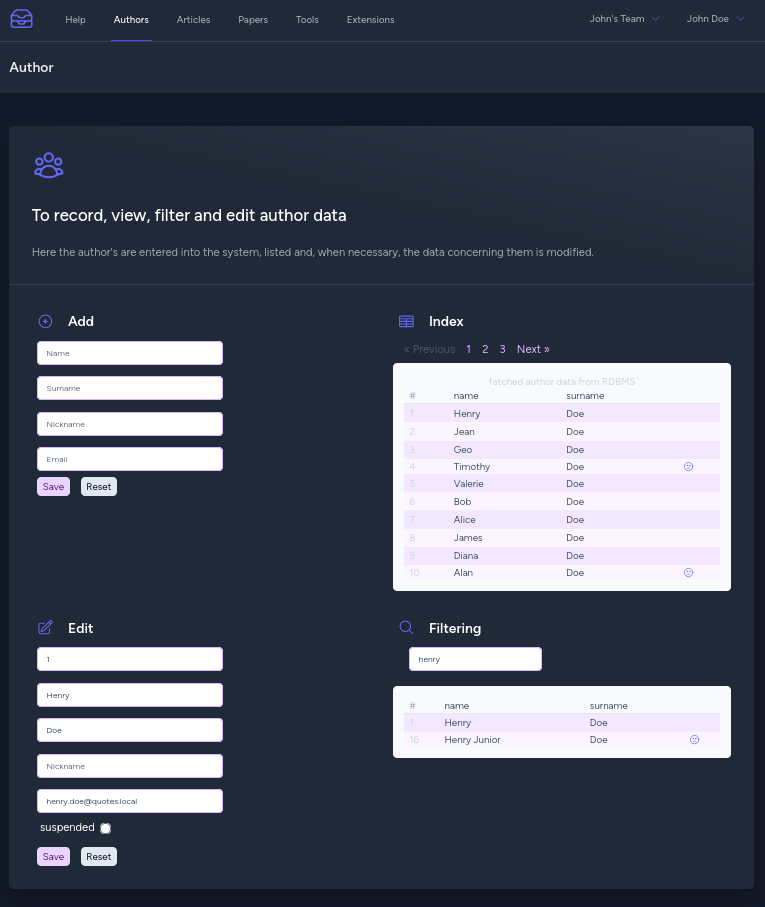
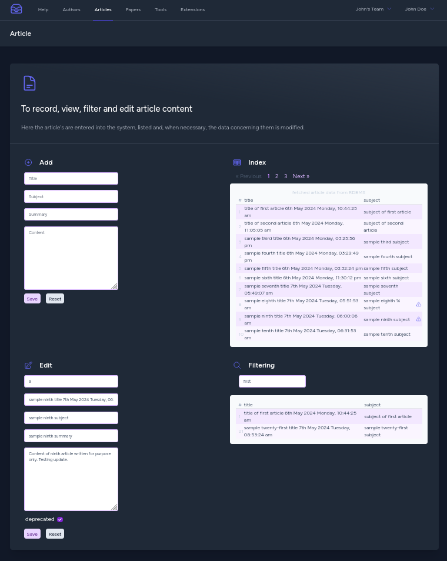
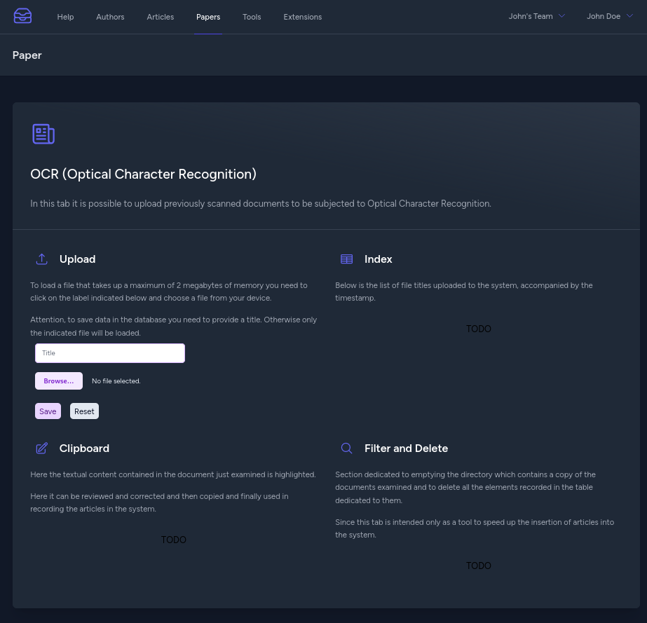
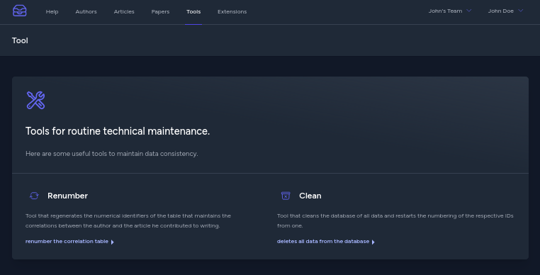
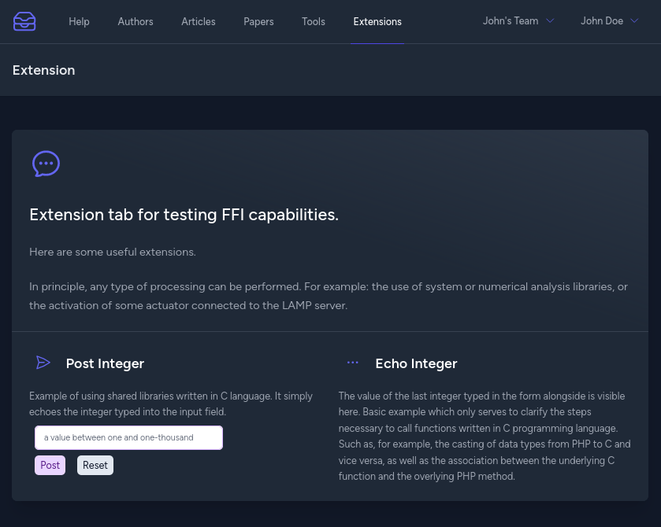
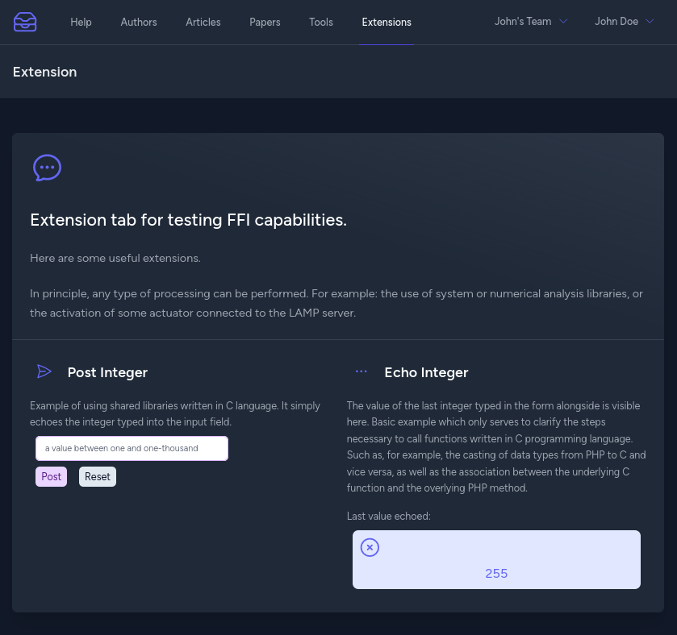

# hologram

Examples of LAMP stack configuration procedures to be used for local development of web applications.

## `quotes` version 3

Landing page:

Help tab:

Authors tab:

Articles tab:

Paper tab:

Tools tab:

Extensions tab, before sending the data to the shared library:

Articles tab, after sending the data to the shared library:

