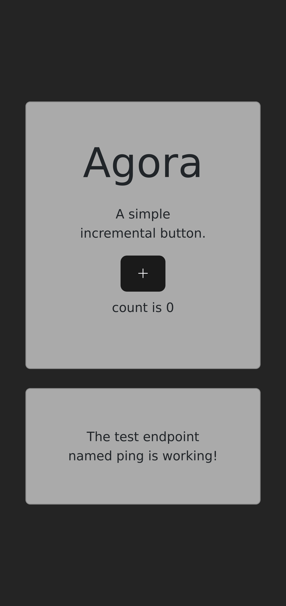
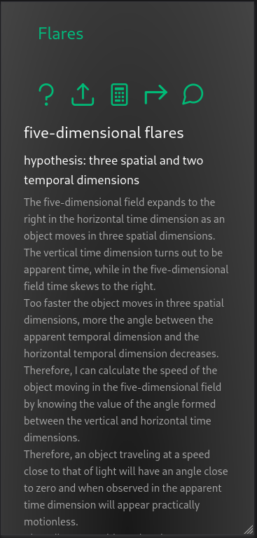

# hologram

Examples of LAMP stack configuration procedures to be used for local development of web applications.

It is good to remember that the link addresses mentioned in the procedures may change.
The procedures themselves may change or there may be more convenient ones.
Therefore, it is always necessary to refer to the official documentation hosted on the sites of the programming languages, servers and tools mentioned from time to time.
Thank you.

## `tasks` developed thanks to React Native and displayed in the format mobile device

## `tasks` developed thanks to Flutter and displayed in the format mobile device

## `agora`

The `Agora` project is a starting point for developing web applications that leave open as many alternatives as possible.
In fact, you can see that there are five different declinations of the same front end application whose development has been approached in five different ways.

Thanks to the React library:

Thanks to the Vue framework:

Thanks to the Angular framework:

Thanks to the jQuery library:

Thanks to the vanilla JavaScript:

The same application, but this time developed using the Svelte framework:

The same application, but this time developed using the SvelteKit framework:

While they may differ slightly, all applications converge toward the same premise: the flexibility to use similar technologies to achieve results efficiently.

## `catenaria`

Web application template:

Welcome

Login

Register

## `thesis`

Web application demo:

## `recode`

An example of an assistant application.

## `chatbot`

An example of a chatbot web application.

## `remark` 

An example of a social media that hosts the opinions of its users.

## `quotes` version 3

Landing page:

Register new user:

Login:

Help tab:

Authors tab:

Articles tab:

Paper tab:

Tools tab:

Extensions tab:

## ecosystem micro-frontend

## an example of a micro-frontend

How it looks on a desktop:

and on a mobile screen:

## an example of landing page

Below is an image of the landing page of an example container called `hologram-cntr-3` developed thanks to `React`.

