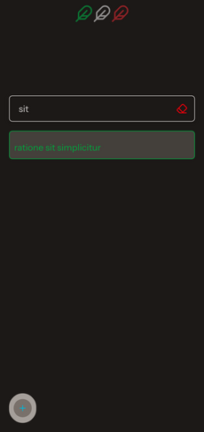
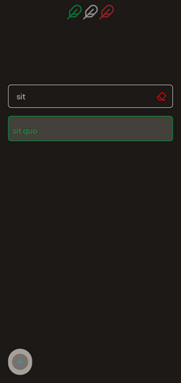
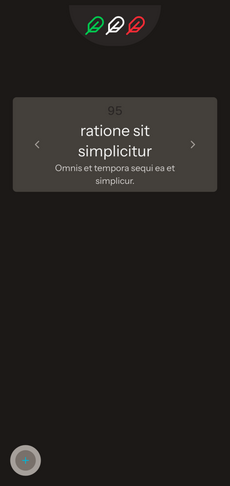
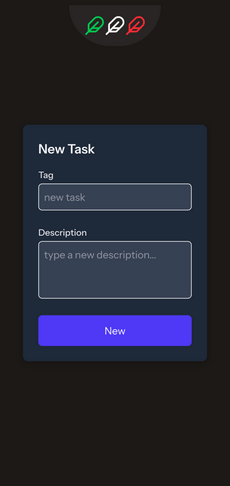
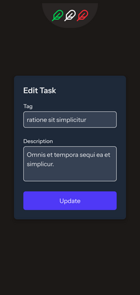

# `feather` Laravel Livewire web application

Feather-light app developed with ease for demonstration purposes.

---

This is a containerized LAMP stack application developed thanks to Laravel, Livewire 3, AlpineJS and Tailwind.
A web app oriented towards mobile, or rather, mobile first.
It can be described starting from its four main routes.
The route called "home" has a placeholder similar to a logo at the top, a little further down the search field sensitive to text entry with an icon on the right to delete its contents.
The search results are shown immediately below the text field and are navigable.
On the left-hand side there is a FAB button that is activated in a similar way to an interactive menu when it is hovered over by the cursor.
In the home route the active functions are the creation of a new task and a toggle to filter the search for tasks to be done or those that have already been completed.





Then there is the route defined "show-task" that shows the active logo to return to the home, the content of the task with two buttons to scroll to the previous or the next.
Below the FAB there is the option to create a new task, to edit the task shown in the center, even if it is not the one initially searched for; there is the option to set it as done or as to be done depending on the value of a task property itself and finally there is the option to delete it.



The application is completed by the last two routes, namely "create-task" and "edit-task" whose names are self-explanatory and do not present the FAB in the left-hand side, but only the form dedicated to them and the logo at the top to return to the home.





---

**Commands to be typed on the development host.**

Create a `.gitignore` file:

```shell
nano .gitignore
```

Edit `.gitignore` file:

```txt
.vscode/
.notes/
node_modules/
# possible virtual environment for Python
venv/
dist/
build/
data/
NOTES.md
.env
*.pyc
.DS_Store
*.log
```

```shell
git init
git branch -m main
git status
git add .
git commit -m "initializing the local repository"
git log
git tag -a v0.0.0 -m "starting version of clean repo"
git checkout -b staging
git merge --no-ff main -m "merge main into staging"
git checkout -b draft
git merge --no-ff main -m "merge main into draft"
git status
git add .
git commit -m "further adjustments"
git tag -a v0.0.1 -m "further adjustments"
git log
git branch --list | wc -l
git branch --list
git checkout staging
git merge --no-ff draft -m "merge draft into staging"
git checkout main
git merge --no-ff draft -m "merge draft into main"
```

If something were to go wrong:

```shell
git reset --hard v0.0.0
```

## setting

**Commands to type in the server environment.**

Now I positioning myself in the directory where I will collect the development environment:

```shell
cd ~/Projects/fullstack-project/lamp/
mkdir feather && cd feather/
touch README.md
mkdir html && chcon --type=container_file_t ./html/ && ls -ldZ ./html/
podman unshare chown -R 33:33 ./html/
podman pod create --name lamp-feather-app-pod --publish 8443:443 --publish 9003:9003 --volume $(pwd)/html:/var/www/html:Z
podman image ls | grep "lamp-landing-img"
podman run --detach --pod lamp-feather-app-pod --name lamp-feather-app --pull="never" lamp-landing-img:1.0
podman logs lamp-feather-app
podman exec -it --privileged lamp-feather-app bash
```

From inside the container:

```shell
apt update
apt list --upgradable
apt upgrade
apt-get install -y --reinstall ca-certificates
apt install curl unzip nano
ip addr
cat /etc/hosts
composer --version
composer list
composer diagnose
composer self-update
node -v
npm view node version
npm cache clean -f
npm install -g n
n stable
npm -v
npm view npm version
npm install -g npm@latest
```

### framework installation and project creation

```shell
cd /var/www/html/
ls -al
composer global require laravel/installer
composer global config bin-dir --absolute
echo 'export PATH="$HOME/.composer/vendor/bin:$PATH"' >> ~/.bashrc
source ~/.bashrc
which laravel
laravel --version
laravel new feather --no-interaction --verbose --database=sqlite --livewire --pest --npm --no-authentication
chown -R 33:33 .
# dangerous solution, acceptable in development
chmod -R 777 .
# permissions can be restored at any time
#chmod -R 755 .
cd feather/
```

Causes:

-   host and container UID/GID mismatch;
-   difficulty maintaining consistent permissions;
-   limitations of virtualization systems.

### reconfiguring the document root

```shell
nano /etc/apache2/sites-available/000-default.conf
```

To apply the following changes:

```xml
<VirtualHost *:80>
        ServerAdmin webmaster@localhost
        ServerName landing.local
        ServerAlias www.landing.local
        DocumentRoot /var/www/html/feather/public

        <Directory /var/www/html/feather/public>
            Options Indexes FollowSymLinks MultiViews
            AllowOverride All
            Require all granted
        </Directory>

        LogLevel warn

        ErrorLog ${APACHE_LOG_DIR}/error.log
        CustomLog ${APACHE_LOG_DIR}/access.log combined
</VirtualHost>
```

```shell
nano /etc/apache2/sites-available/default-ssl.conf
```

Now it's up to all the following changes:

```xml
<IfModule mod_ssl.c>
        <VirtualHost _default_:443>
                ServerAdmin webmaster@localhost
                ServerName landing.local
                ServerAlias www.landing.local
                DocumentRoot /var/www/html/feather/public

                <Directory /var/www/html/feather/public>
                    Options Indexes FollowSymLinks MultiViews
                    AllowOverride All
                    Require all granted
                </Directory>

                LogLevel warn

                ErrorLog ${APACHE_LOG_DIR}/error.log
                CustomLog ${APACHE_LOG_DIR}/access.log combined

                SSLEngine on

                SSLCertificateFile /etc/ssl/self_signed_certs/landing.pem
                SSLCertificateKeyFile /etc/ssl/self_signed_certs/landing.key

                <FilesMatch "\.(cgi|shtml|phtml|php)$">
                    SSLOptions +StdEnvVars
                </FilesMatch>

                <Directory /usr/lib/cgi-bin>
                    SSLOptions +StdEnvVars
                </Directory>
        </VirtualHost>
</IfModule>
```

```shell
exit
```

A pod restart is now required:

```bash
podman pod stop lamp-feather-app-pod
podman pod start lamp-feather-app-pod
podman exec -it lamp-feather-app bash
```

Pointing your browser to link <http://192.168.XXX.XXX:8443/> will almost certainly result in errors, which can be resolved as follows:

## inside the app container

```shell
podman exec -it --privileged lamp-feather-app bash
cd /var/www/html/feather/
id www-data
chown --recursive www-data:www-data .
```

Remembering to replace the placeholder `192.168.XXX.XXX` with your IP address.

Checking connections on the specified database:

```shell
php artisan db:monitor --help
php artisan db:monitor --databases=sqlite
```

Display information about the specified database table:

```shell
php artisan db:table --help
php artisan db:table users
php artisan db:table cache
php artisan db:table jobs
```

## some methods for making queries from the tinker shell:

```shell
php artisan tinker
```

then I type the following commands:

```shell
DB::connection('sqlite')->getPdo();
DB::connection('sqlite')->select('SELECT 1');
```

Some queries on table `users`:

```shell
dump(collect(DB::select('SELECT * FROM users'))->all());
print_r(collect(DB::select('SELECT * FROM users'))->all());
DB::table('users')->limit(10)->get()->toArray();
```

Query that returns a JSON object:

```shell
echo json_encode(array_map(fn($r)=>(array)$r, DB::select('SELECT * FROM users')), JSON_PRETTY_PRINT);
```

Query on table `cache`:

```shell
DB::table('cache')->limit(10)->get()->toArray();
```

Query on table `jobs`:

```shell
DB::table('jobs')->limit(10)->get()->toArray();
quit
```

## editing screenshots from the shell

An example of how to resize a screenshot using an ImageMagick command:

```shell
convert feather_show-task.png -resize 40% feather_show-task.out.png
```
