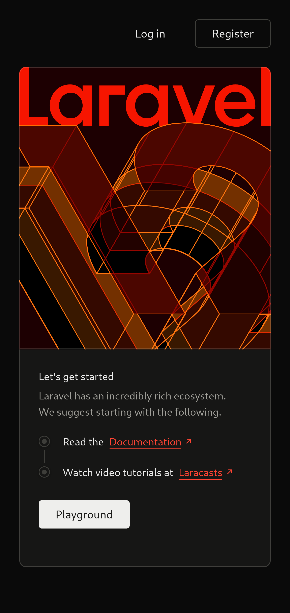
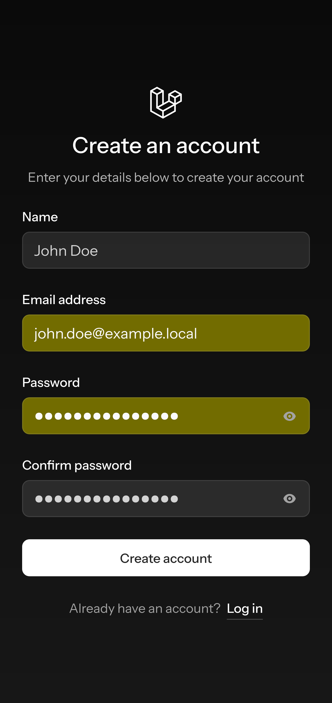
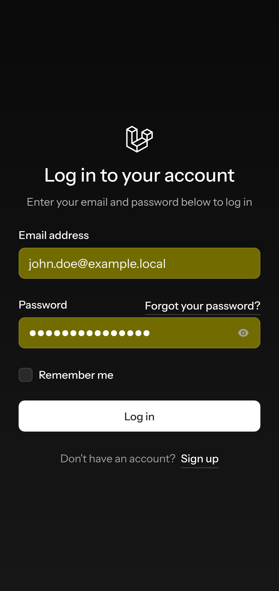

# `playground`

## summary

- **Definition:** A **`playground`** can refer to an environment (often lightweight and interactive) for experimenting with code, libraries, technologies, or APIs without complex setup.  
- **Practical use:** It is used to test snippets, try new frameworks, explore library behavior, or quickly validate ideas.  
- **Prototyping:** It can be considered a development environment for prototyping ideas—typically for proofs of concept, demos, or quick experiments, not for production.  
- **Common features:** instant feedback, isolation, easy reset, REPL or web interface, pre-configured examples, shareable results.  
- **Examples:** online editors (CodePen, JSFiddle), API sandboxes, interactive notebooks (Jupyter), integrated environments for ML or graphics.  

The **`playground`** is an appropriate term for a development environment intended for testing and prototyping ideas.







## local repository

__Commands to be typed on the development host.__

Create a `.gitignore` file:

```shell
nano .gitignore
```

Edit `.gitignore` file:

```txt
.vscode/
.notes/
node_modules/
# possible virtual environment for Python
venv/
dist/
build/
data/
NOTES.md
.env
*.pyc
.DS_Store
*.log
```

```shell
git init
git branch -m main
git status
git add .
git commit -m "initializing the local repository"
git log
git tag -a v0.0.0 -m "starting version of clean repo"
git checkout -b staging
git merge --no-ff main -m "merge main into staging"
git checkout -b draft
git merge --no-ff main -m "merge main into draft"
git status
git add .
git commit -m "creation of all branches"
git tag -a v0.0.1 -m "creation of all branches"
git log
git status
git add .
git commit -m "further adjustments"
git tag -a v0.0.2 -m "further adjustments"
git log
git branch --list | wc -l
git branch --list
git checkout main
git merge --no-ff draft -m "merge draft into main"
```

If something were to go wrong:

```shell
git reset --hard v0.0.0
```

## setting

__Commands to type in the server environment.__

Now I positioning myself in the directory where I will collect the development environment:

```shell
ls -al ~/applications/stacks/LAMP/playground/
cd ~/applications/stacks/LAMP/playground/
```

### I create the directories that will host the volumes

I create directory for `data` volume:

```shell
mkdir --parents data/{mariadb,postgres} && chcon --recursive --type=container_file_t ./data/ && ls -ldZ ./data/
```

I create directory for `html` volume:

```shell
mkdir html && chcon --type=container_file_t ./html/ && ls -ldZ ./html/
```

### I create a network that acts as a bridge between two pods

```shell
podman network create lamp-playground-net
podman network ls
podman network inspect lamp-playground-net
```

### I create the pod `lamp-playground-db-pod`

```shell
podman pod create --name lamp-playground-db-pod --network lamp-playground-net --publish 3306:3306
```

I start the MariaDB database container:

```shell
podman run --detach --pod lamp-playground-db-pod --name lamp-playground-db --user root --volume $(pwd)/data/mariadb:/var/lib/mysql:Z --env MYSQL_ROOT_PASSWORD=qwerty123 --env MYSQL_DATABASE=playground_db --env MYSQL_USER=playground_admin --env MYSQL_PASSWORD=qwerty123 --env MYSQL_ALLOW_EMPTY_PASSWORD=no --restart=always --pull="never" mariadb:11.8.3-ubi9 --default-authentication-plugin=mysql_native_password --character-set-server=utf8mb4 --collation-server=utf8mb4_unicode_ci
```

### I create the pod `lamp-playground-app-pod`

```shell
podman unshare chown -R 33:33 ./html/
podman pod create --name lamp-playground-app-pod --network lamp-playground-net --publish 8443:443 --publish 9003:9003 --volume $(pwd)/html:/var/www/html:Z
```

I create the container for the web server that accesses to the html volume:

```bash
podman image ls | grep "lamp-landing-img"
podman run --detach --pod lamp-playground-app-pod --name lamp-playground-app --pull="never" lamp-landing-img:1.0
```

Some useful commands for setting up the server firewall that runs the containers.

```shell
ss -tuln | grep 3306
ss -tuln | grep 8443
ss -tuln | grep 9003
```

Now just point the browser to the HTTP link assigned to the service, I don't know, like: <http://192.168.XXX.XXX:8443/> to carry out the usual installation and management activities, remembering to replace the placeholder `192.168.XXX.XXX` with your IP address.

### inspect the logs:

```shell
podman logs lamp-playground-db
podman logs lamp-playground-app
```

### ports check

```shell
podman ps --format "{{.Names}} {{.Ports}}"
```

### example of technical intervention from the perspective of the `mariadb` container 

```shell
podman exec -it lamp-playground-db sh
ip addr
mariadb -u root -p
```

To check the permissions granted to user `playground_admin`:

```sql
SELECT User, Host FROM mysql.user WHERE User='playground_admin';
SHOW GRANTS FOR 'playground_admin'@'%';
USE playground_db;
SHOW TABLES;
quit
exit
```

## scaffolding

__Commands to type in the container environment.__

To access the container:

```shell
podman exec -it --privileged lamp-playground-app bash
```

By issuing commands from inside the container.

```bash
apt update
apt list --upgradable
apt upgrade
apt-get install -y --reinstall ca-certificates
apt install curl unzip nano
ip addr
cat /etc/hosts
# add only if the IP address and lamp-playground-db container association is not already present
echo "IP_ADDR_previously_obtained       lamp-playground-db" >> /etc/hosts
ping -c 3 lamp-playground-db
```

### any updates

```shell
composer --version
composer list
composer diagnose
composer self-update
node -v
npm view node version
npm cache clean -f
npm install -g n
n stable
npm -v
npm view npm version
npm install -g npm@latest
```

### framework installation and project creation

```shell
cd /var/www/html/
ls -al
rm --recursive landing/
composer global require laravel/installer
composer global config bin-dir --absolute
echo 'export PATH="$HOME/.composer/vendor/bin:$PATH"' >> ~/.bashrc
source ~/.bashrc
which laravel
laravel --version
laravel new playground --no-interaction --verbose --database=sqlite --livewire --using=laravel/jetstream --pest --npm
chown -R 33:33 .
# dangerous solution, acceptable in development
chmod -R 777 .
# permissions can be restored at any time
#chmod -R 755 .
cd playground/
```

Causes:
- host and container UID/GID mismatch;
- difficulty maintaining consistent permissions;
- limitations of virtualization systems.

### reconfiguring the document root

```shell
nano /etc/apache2/sites-available/000-default.conf
```

To apply the following changes:

```xml
<VirtualHost *:80>
        ServerAdmin webmaster@localhost
        ServerName landing.local
        ServerAlias www.landing.local
        DocumentRoot /var/www/html/playground/public

        <Directory /var/www/html/playground/public>
            Options Indexes FollowSymLinks MultiViews
            AllowOverride All
            Require all granted
        </Directory>

        LogLevel warn

        ErrorLog ${APACHE_LOG_DIR}/error.log
        CustomLog ${APACHE_LOG_DIR}/access.log combined
</VirtualHost>
```

```shell
nano /etc/apache2/sites-available/default-ssl.conf
```

Now it's up to all the following changes:

```xml
<IfModule mod_ssl.c>
        <VirtualHost _default_:443>
                ServerAdmin webmaster@localhost
                ServerName landing.local
                ServerAlias www.landing.local
                DocumentRoot /var/www/html/playground/public

                <Directory /var/www/html/playground/public>
                    Options Indexes FollowSymLinks MultiViews
                    AllowOverride All
                    Require all granted
                </Directory>

                LogLevel warn

                ErrorLog ${APACHE_LOG_DIR}/error.log
                CustomLog ${APACHE_LOG_DIR}/access.log combined

                SSLEngine on

                SSLCertificateFile /etc/ssl/self_signed_certs/landing.pem
                SSLCertificateKeyFile /etc/ssl/self_signed_certs/landing.key

                <FilesMatch "\.(cgi|shtml|phtml|php)$">
                    SSLOptions +StdEnvVars
                </FilesMatch>

                <Directory /usr/lib/cgi-bin>
                    SSLOptions +StdEnvVars
                </Directory>
        </VirtualHost>
</IfModule>
```

```shell
exit
```

A pod restart is now required:

```bash
podman pod stop lamp-playground-app-pod
podman pod start lamp-playground-app-pod
podman exec -it lamp-playground-app bash
```

## stop and start pods

```shell
podman pod stop lamp-playground-app-pod
podman pod stop lamp-playground-db-pod
podman pod start lamp-playground-app-pod
podman pod start lamp-playground-db-pod
podman stats lamp-playground-app lamp-playground-db
```

Show statistics only once:

```shell
podman stats --no-stream
```

---

## rebuild at every change

I edit the `package.json` file by adding the following line inside the scripts section:

```json
        "build:watch": "vite build --watch"
```

I enter the development container:

```shell
podman exec -it --privileged lamp-playground-app bash
```

I position myself in the root directory of the project and start the watch mode:

```shell
cd /var/www/html/playground/
npm run build:watch
```

---

## remove everything:

```bash
podman pod stop lamp-playground-pod
podman pod rm lamp-playground-pod
sudo rm -Rf data/
sudo rm -Rf html/
```

## environment configuration

I need to edit the `.env` file located in the root of the project

```env
APP_NAME=playground

DB_CONNECTION=sqlite

MARIA_DB_CONNECTION=mariadb
# I need to set the IP address of the pod hosting the database server that I found with the `ip addr` command run inside the `lamp-playground-db` container
MARIA_DB_HOST=XXX.XXX.XXX.XXX # Remember to replace the placeholder with your IP address of interest
MARIA_DB_PORT=3306
MARIA_DB_DATABASE=playground_db
MARIA_DB_USERNAME=playground_admin
MARIA_DB_PASSWORD=qwerty123
```

I need to edit the `config/database.php` file in the `mariadb` section:

```php

        'mariadb' => [
            'driver' => 'mariadb',
            'url' => env('DB_URL'),
            'host' => env('MARIA_DB_HOST', '127.0.0.1'),
            'port' => env('MARIA_DB_PORT', '3306'),
            'database' => env('MARIA_DB_DATABASE', 'laravel'),
            'username' => env('MARIA_DB_USERNAME', 'root'),
            'password' => env('MARIA_DB_PASSWORD', ''),
            'unix_socket' => env('DB_SOCKET', ''),
            'charset' => env('DB_CHARSET', 'utf8mb4'),
            'collation' => env('DB_COLLATION', 'utf8mb4_unicode_ci'),
            'prefix' => '',
            'prefix_indexes' => true,
            'strict' => true,
            'engine' => null,
            'options' => extension_loaded('pdo_mysql') ? array_filter([
                PDO::MYSQL_ATTR_SSL_CA => env('MYSQL_ATTR_SSL_CA'),
            ]) : [],
        ],
```

Checking connections on the specified database:

```shell
php artisan db:monitor --help
php artisan db:monitor --databases=sqlite
php artisan db:monitor --databases=mariadb
```

Only at this point can I proceed to check the connectivity of the configured databases:

```shell
php artisan tinker
```

then I type the following commands:

```shell
DB::connection('sqlite')->getPdo();
DB::connection('mariadb')->getPdo();
quit
```
