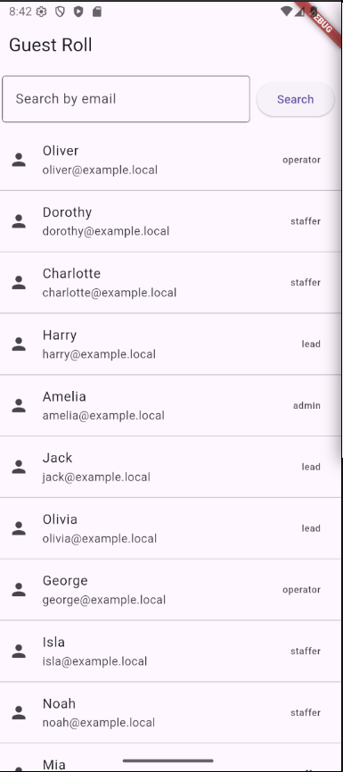
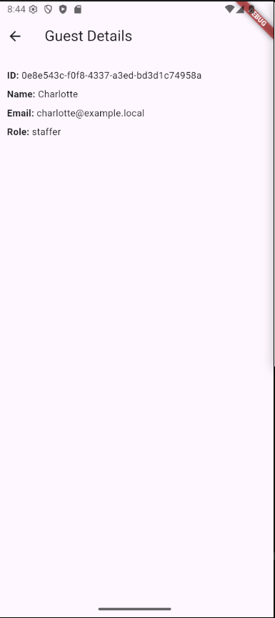
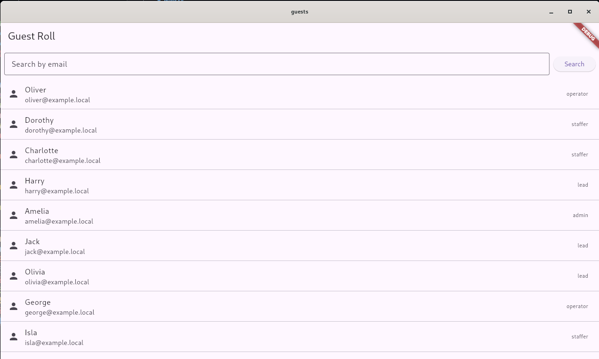
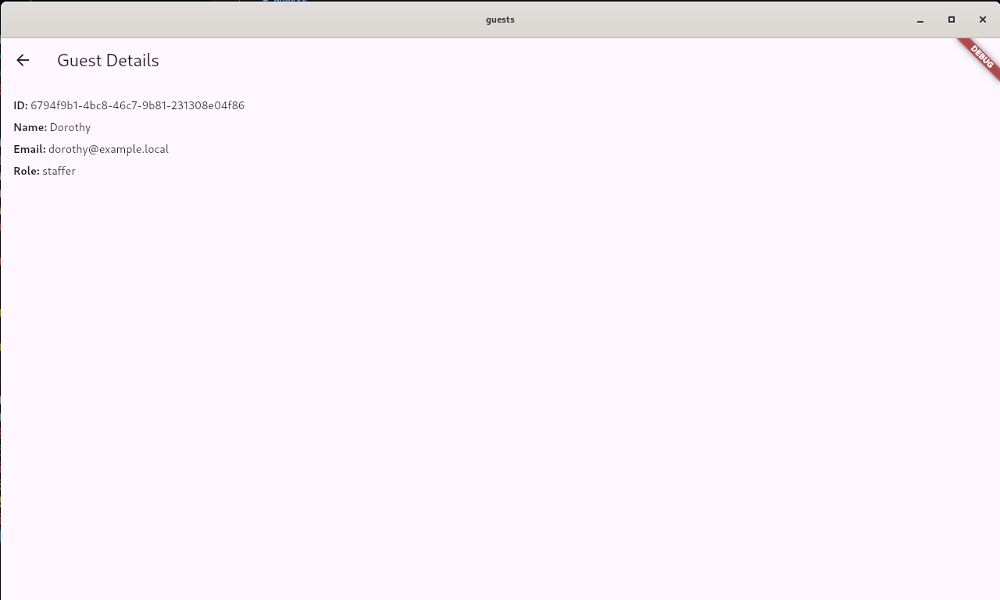
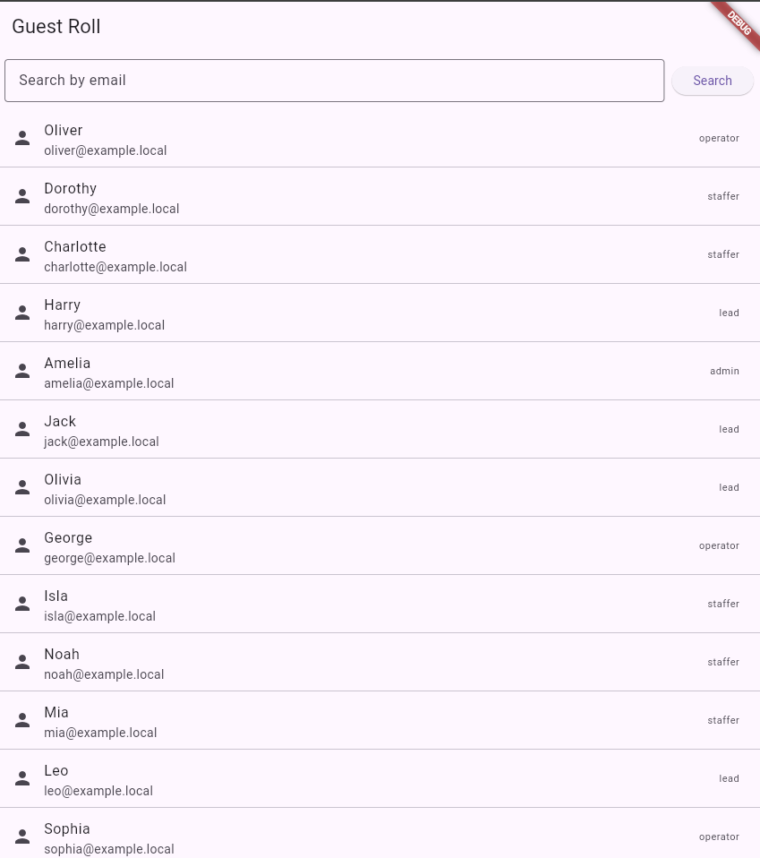
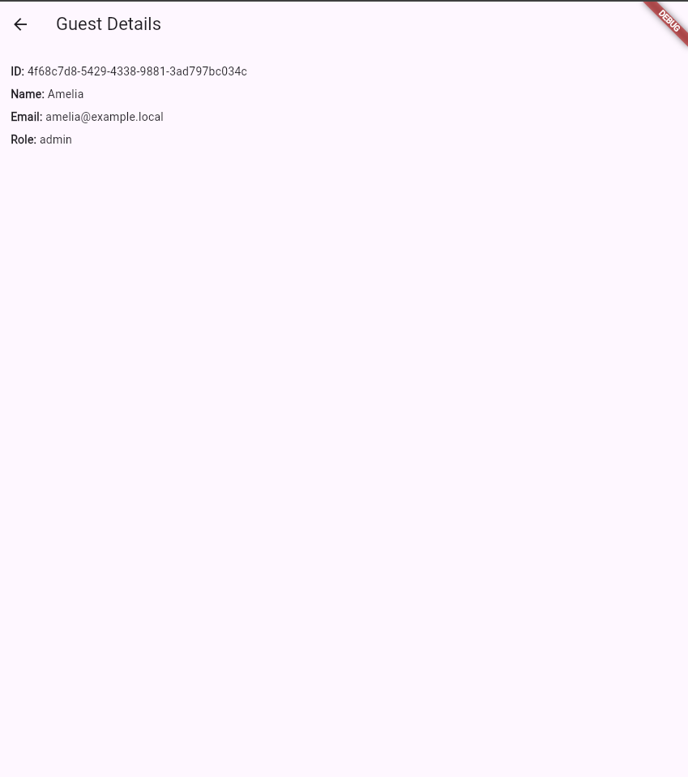

# `guests` a PGF, (PostgreSQL-Go-Flutter), full-stack application

PGF stands for PostgreSQL RDBMS, Go programming language and Flutter framework.

So the stack I'm going to present uses PostgreSQL as the database server, Go as the back-end programming language, and Flutter as the front-end framework, with the programming language Dart.

## screenshots

<!--  -->


<!--  -->


---

<!--  -->


<!--  -->


---

<!--  -->


<!--  -->


---

In this demo I will try to combine remote development on a test server and history maintenance exclusively locally thanks to `git`.

In the `.vscode` directory I will have something similar to the following `sftp.json` file:

```json
{
  "$schema": "http://json-schema.org/draft-07/schema",
  "name": "guests",
  "username": "developer",
  "privateKeyPath": "/home/developer/.ssh/id_rsa",
  "passphrase": "secure_passphrase",
  "host": "192.168.XXX.XXX",
  "remotePath": "/home/developer/Projects/fullstack-project/pgf/guests",
  "port": 22,
  "connectTimeout": 20000,
  "uploadOnSave": true,
  "watcher": {
    "files": "dist/*.{js,css}",
    "autoUpload": false,
    "autoDelete": false
  },
  "syncOption": {
    "delete": true,
    "update": false
  },
  "ignore": [
    ".vscode",
    ".howto",
    ".docs",
    ".notes",
    "backup",
    "data",
    "frontend",
    ".git",
    ".DS_Store",
    "TEMP",
    "nbproject",
    "probe.http",
    "NOTES.md"
  ]
}
```

_note that the `frontend` directory should not be copied to the server unless you intend to serve the UI from a container with a web server_

Well, given that, with this procedure I will have a VCS that only I will be able to access, in order to test the features before sharing them with a possible team.

Therefore, every time I have synchronized the contents of the project locally, I will obtain a snapshot on the remote server that I can test appropriately.

---

## overview of commands to create the local repository

```shell
git init
git branch -m main
```

Creating an `.gitignore` ​​file:

```shell
cat > .gitignore <<'EOF'
.vscode/
node_modules/
# possible virtual environment for Python
venv/
dist/
build/
data/
.env
*.pyc
.DS_Store
*.log
EOF
```

Other commands follow to build the project scaffolding:

```shell
git add .
git commit -m "initializing the local repository"
git checkout -b draft/database
git checkout -b staging/database
git checkout -b draft/backend
git checkout -b staging/backend
git checkout -b draft/frontend
git checkout -b staging/frontend
git checkout main
git status
git checkout draft/database
mkdir database
cd database/
touch .dockerignore Dockerfile
mkdir data env sql
touch env/.env
touch sql/initdb.sh
git add .
git status
git commit -m "usage purposes and database image structure template"
git status
git checkout main
git add -u
git status
git commit -m "edited .gitignore and added command list in README.md"
```

## partial list of useful commands

### remove files from the stage

To remove all files from the stage:

```shell
git reset
```

To cancel the interactive or partial add already staged I can use:

```shell
git reset -p
```

### undo the last commit

To undo the last commit while keeping the changes in the working tree but removing them from the stage:

```shell
git reset HEAD~1
```

### merge the `draft/database` branch into `main`:

It would be a good idea to resolve any conflicts first, after which you can proceed with the following commands:

```shell
git branch
git branch --show-current
git checkout main
git merge --no-ff draft/database -m "merge draft/database into main"
```

## delete a branch

```shell
git branch -d draft/frontend
```

---

## use the orchestration provided by `podman`

To carry out these operations I will have to move to the test server.

1. Create the pod (map RESTful API port 8080 on the host):

```shell
ls ~/Projects/fullstack-project/pgf/guests/
cd ~/Projects/fullstack-project/pgf/guests/
podman pod create --name pgf-guests-pod --publish 8080:8080
podman pod ps
```

2. Start PostgreSQL in the pod:

It is important to remember that both directory `data` and directory `sql` must be usable by containers.
Additionally, the `initdb.sh` file must be an executable.

```shell
ls database/
ls -al database/env/
cd database/
ls -al
mkdir data
ls -ldZ ./data/
chcon --recursive --type=container_file_t ./data/
ls -ldZ ./data/
ls -l sql/initdb.sh
chmod +x ./sql/initdb.sh
ls -l sql/initdb.sh
ls -ldZ ./sql/
chcon --recursive --type=container_file_t ./sql/
ls -ldZ ./sql/
podman run --detach --pod pgf-guests-pod --name pgf-guests-db-cntr --env-file ./env/.env --volume $(pwd)/data:/var/lib/postgresql/18/docker --volume $(pwd)/sql:/docker-entrypoint-initdb.d:ro --pull=never postgres:18.0-alpine3.22
```

3. Verify that the postgres container is running and providing logs:

```shell
podman ps --pod
podman logs -f pgf-guests-db-cntr
```

4. Build the API image:

```shell
ls -al ~/Projects/fullstack-project/pgf/guests/backend/
cd ~/Projects/fullstack-project/pgf/guests/backend/
```

Assuming the Dockerfile is in the current directory.

If I haven't done it already, I'll have to create the `go.sum` file with the following command, in the shell inside the development host:

```shell
cd src/ && go mod tidy && cd ..
```

Now I can build the RESTful API docker image:

```shell
ls -l src/
podman build --tag pgf-guests-be-img:1.0 .
```

5. Start the API in the pod:

```shell
podman run --detach --pod pgf-guests-pod --name pgf-guests-be-cntr --pull=never pgf-guests-be-img:1.0
```

Note: Containers in the pod share the same loopback network, so the RESTful API can use 127.0.0.1:5432 to connect to Postgres within the same pod.

6. Check that everything is running:

```shell
podman ps --pod
podman logs -f pgf-guests-be-cntr
```

7. Optional debugging from the development host:

```shell
nc -vz -w 3 192.168.XXX.XXX 8080 | grep succeeded
```

---

## finally

Now I can test the APIs from another host's shell on the local network with the curl program:

```shell
curl --verbose http://192.168.XXX.XXX:8080/guests/amelia@example.local
```

And if everything went well I get:

```text
*   Trying 192.168.XXX.XXX:8080...
* Connected to 192.168.XXX.XXX (192.168.XXX.XXX) port 8080 (#0)
> GET /guests/amelia@example.local HTTP/1.1
> Host: 192.168.XXX.XXX:8080
> User-Agent: curl/7.88.1
> Accept: */*
>
< HTTP/1.1 200 OK
< Content-Type: application/json
< Date: Fri, 24 Oct 2025 07:00:33 GMT
< Content-Length: 204
<
{"id":{"String":"d18d7545-2f9b-4105-9ca7-62a48287f0b6","Valid":true},"name":{"String":"Amelia","Valid":true},"email":{"String":"amelia@example.local","Valid":true},"role":{"String":"admin","Valid":true}}
* Connection #0 to host 192.168.XXX.XXX left intact
```

Then, I might want to know how many operators are registered in the system:

```shell
curl --verbose http://192.168.XXX.XXX:8080/guests | grep -o 'operator' | wc -l
```
