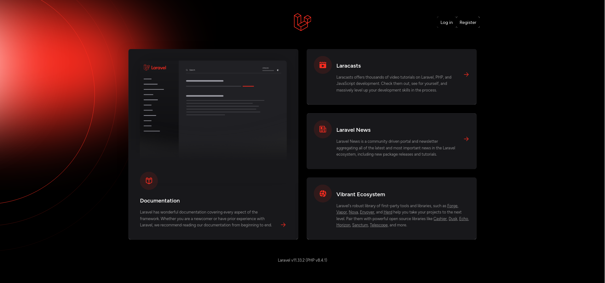

# `lamp-php-cntr-8-4-1` landing



## scaffolding

```bash
composer create-project laravel/laravel landing
cat /etc/passwd | grep 'root'
cat /etc/passwd | grep 'www-data'
chown --recursive --verbose 0:33 landing/
cd landing
ls -l
stat -c %a bootstrap/cache
find bootstrap/cache -printf '%m %p \n'
find storage -printf '%m %p \n'
find database -printf '%m %p \n'
chmod --recursive 775 bootstrap/cache && chmod --recursive 775 storage && chmod --recursive 775 database
php artisan cache:clear
```

## setup of Jetstream

Considering I'm in the root directory of the project:

```bash
composer require laravel/jetstream
php artisan jetstream:install livewire --teams --dark
npm install
```

## database application setup

Edit `.env`

```text
APP_NAME=landing
...
```

## useful notes for solving small problems

Remember to always run the following command whenever you edit files involving HTML:

```bash
npm run build
```

When I ran into an authorization error it was helpful to repeat the following commands:

```bash
chown --recursive --verbose root:www-data .
chmod --recursive 775 bootstrap/cache && chmod --recursive 775 storage && chmod --recursive 775 database
```

I have to remember to issue the following commands when I add a new route and it is not listed:

```bash
php artisan route:cache
php artisan route:clear
php artisan route:list
```
