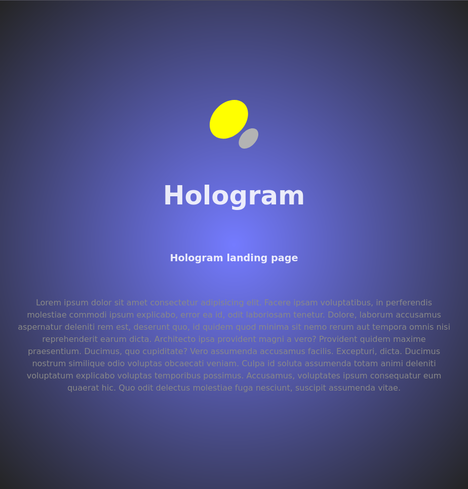

# hologram-kind (some tests thanks to Kind)

Preparing a local multi-node CaaS, (Container as a Service), in `on premise` configuration thanks to a virtual server with GNU/Linux Debian 12, `bookworm`, installed.

Below is an image of the landing page of an example container called `hologram-cntr-3` developed thanks to `React`.

It is good to remember that the link addresses mentioned in the procedures may change.
The procedures themselves may change or there may be more convenient ones.
Therefore, it is always necessary to refer to the official documentation hosted on the sites of the programming languages, servers and tools mentioned from time to time.
Thank you.
