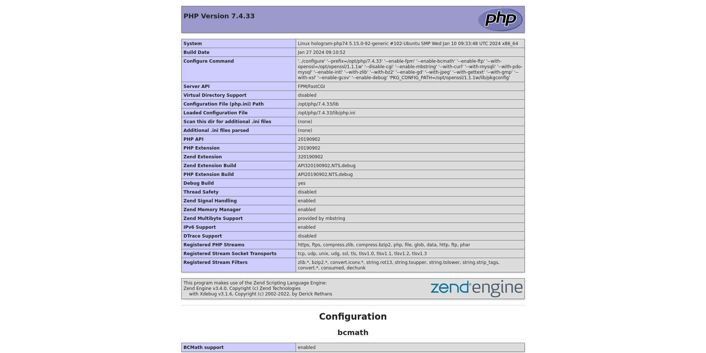

# hologram-php74

Based on some statistics, it seems that PHP version 7.4, together with 8.1 and 8.0, is among the most used.

Here are the procedures for obtaining a LAMP server stack with version 7.4 of PHP.

However, PHP version 7.4, being without support, I will proceed in order to obtain a development environment to migrate to version 8.3 of PHP.

At the end of the procedure you will obtain a migration stack LAMP with two virtual hosts, one with PHP version 7.4, the other with PHP version 8.3.

