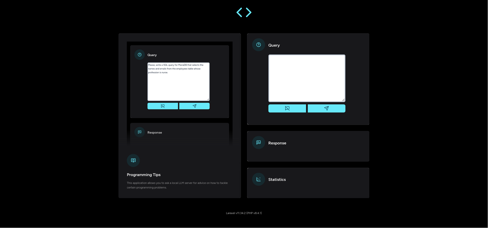
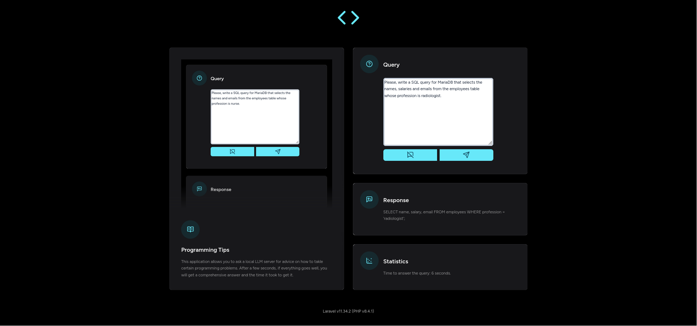

# development of `recode` web application

## first scaffold

```bash
cd /var/www/html/
composer create-project laravel/laravel recode
cd recode/
chmod --recursive 775 bootstrap/cache && chmod --recursive 775 storage && chmod --recursive 775 database
chown --recursive developer_username:apache .
```



## example of query

> Please, write a SQL query for MariaDB that selects the names, salaries and emails from the employees table whose profession is radiologist.



### parameter for generate keys:

Here is just an example of the parameters to keep on hand:

```text
[national_acronym]
[state]
[city]
recode-php84.local
recode-php84.local
recode-php84.local
[webmaster@localhost]
```

It is obvious that the first three parameters must be appropriately valued.

Therefore I can proceed with the generation of the self-signed certificate without the passphrase thanks to the `-nodes` flag:

```bash
ls -al /etc/ssl/
sudo openssl req -new -x509 -nodes -days 365 -newkey rsa:2048 -keyout /etc/ssl/private/recode-php84.key -out /etc/ssl/certs/recode-php84.crt
sudo ls -al /etc/ssl/private/
sudo ls -al /etc/ssl/certs/
```

### file `/etc/httpd/conf.d/recode-php84.local.conf`

```bash
sudo nano /etc/httpd/conf.d/recode-php84.local.conf
```

```xml
<VirtualHost *:80>
        ServerAdmin webmaster@localhost
        ServerName recode-php84.local
        ServerAlias www.recode-php84.local
        DocumentRoot /var/www/html/recode/public
        Redirect permanent "/" "https://recode-php84.local/"
</VirtualHost>

<VirtualHost *:443>
        ServerAdmin webmaster@localhost
        ServerName recode-php84.local
        ServerAlias www.recode-php84.local
        DocumentRoot /var/www/html/recode/public

        <Directory /var/www/html/recode/public>
                Options Indexes FollowSymLinks MultiViews
                AllowOverride All
                Require all granted
        </Directory>

        SSLEngine on

        SSLCertificateFile /etc/ssl/certs/recode-php84.crt
        SSLCertificateKeyFile /etc/ssl/private/recode-php84.key

        ErrorLog /var/log/httpd/recode-php84_error_log

        <FilesMatch "\.(cgi|shtml|phtml|php)$">
                SSLOptions +StdEnvVars
        </FilesMatch>
</VirtualHost>
```

### application scaffolding

With developer user credentials:

```bash
sudo apachectl configtest
sudo systemctl reload httpd
systemctl status httpd --no-pager
```

If I encounter any problems I can investigate with the following command:

```bash
journalctl -u httpd --since today --no-pager
```

### continuation of scaffolding

```bash
composer show | grep "livewire"
composer require livewire/livewire
npm install
npm run build
php artisan migrate:status
```

### to improve the development of `Livewire` components

```bash
composer require wire-elements/wire-spy --dev
```

### fix coding stile with `pint`

```bash
./vendor/bin/pint --help
./vendor/bin/pint --test
./vendor/bin/pint
```

## install Pest

```bash
composer require --dev --with-all-dependencies pestphp/pest
./vendor/bin/pest --init
composer require --dev pestphp/pest-plugin-laravel
```

### migrate all tests from PHPUnit to Pest

```bash
composer require --dev pestphp/pest-plugin-drift
./vendor/bin/pest --drift
```

### run all the tests

Please, pay attention, to verify the validity of the texts with the `--coverage` option, it is necessary to have appropriately modified the `php.ini` file with, for example, a line similar to the following:

```ini
xdebug.mode=develop,debug,trace,coverage
```

```bash
php artisan test --coverage
```

## how to check installed packages

```bash
composer show --help
composer show
composer show --tree
composer show | grep laravel
composer show | grep pest
```

## how to check licenses of installed packages

```bash
composer require --dev dominikb/composer-license-checker
./vendor/bin/composer-license-checker help
./vendor/bin/composer-license-checker list
./vendor/bin/composer-license-checker check
./vendor/bin/composer-license-checker report
```

## commands that may prove useful

```bash
composer suggest --all
```

To diagnose any problems:

```bash
composer --help diagnose
composer diagnose
```

## how to create a new testing class with Pest

```bash
php artisan make:test --help
```

### `web` routes example test

```bash
php artisan make:test --pest WelcomeFeatureTest
```

```php
<?php

test('welcome feature test', function () {
    $response = $this->get('/');

    $response->assertStatus(200);
});
```

```bash
php artisan test --filter WelcomeFeatureTest
```

## update dependencies to the latest version

```bash
composer update --help
composer update --ignore-platform-reqs
```

## reset the entire database

Edit `.env`:

```env
# DB_CONNECTION=sqlite

# recode_db_v1
DB_CONNECTION=mariadb
DB_HOST=127.0.0.1
DB_PORT=3306
DB_DATABASE=recode_db_v1
DB_USERNAME=developer_username
DB_PASSWORD=developer_password

# IP address of LLM server on the same local network
OLLAMA_URL=http://192.168.1.XXX:11434/v1
```

Create a new database with collection type `utf8_unicode_ci`, and type:

```bash
php artisan db:wipe
php artisan migrate:fresh
php artisan migrate:status
```

and, if I have already prepared what is needed to generate the test data, I can also send the following command:

```bash
php artisan db:seed
```

### only if I need to go back to the previous migration

```bash
php artisan migrate:rollback
```

## I have to remember to issue the following commands when I add a new route and it is not listed:

```bash
npm run build
chmod --recursive 775 bootstrap/cache
chmod --recursive 775 storage
chmod --recursive 775 database
chown --recursive developer_username:apache .
php artisan route:cache && php artisan route:clear && php artisan route:list
```

and, if I am examining the presence of a specific route, the following command has been useful to me:

```bash
php artisan route:list | grep "help"
```

## to get inspired to write custom commands

```bash
php artisan inspire
```

## to integrate a Laravel web application with an LLM service

```bash
composer require echolabsdev/prism
php artisan vendor:publish --tag=prism-config
```

and edit `config/prism.php` like this:

```php
<?php

return [
    'prism_server' => [
        // The middleware that will be applied to the Prism Server routes.
        'middleware' => [],
        'enabled' => env('PRISM_SERVER_ENABLED', true),
    ],
    'providers' => [
        'ollama' => [
            'url' => env('OLLAMA_URL', 'http://localhost:11434/v1'),
        ],
    ],
];
```

Finally, a further check on the licenses of the packages installed in the web application:

```bash
./vendor/bin/composer-license-checker report
```

### `BasicLlmUnitTest`

```bash
php artisan make:test --pest --unit BasicLlmUnitTest
```

```php
<?php

use EchoLabs\Prism\Prism;
use EchoLabs\Prism\Enums\Provider;
use EchoLabs\Prism\ValueObjects\Usage;
use EchoLabs\Prism\Enums\FinishReason;
use EchoLabs\Prism\Providers\ProviderResponse;

test('basic LLM unit test', function () {

    $fakeProvidedResponse = new ProviderResponse(
        text: 'This is a basic LLM test!',
        toolCalls: [],
        usage: new Usage(10, 20),
        finishReason: FinishReason::Stop,
        response: ['id' => 'fake_provided_1', 'model' => 'fake_model']
    );

    $fakePrism = Prism::fake([$fakeProvidedResponse]);

    $prismResponse = Prism::text()
        ->using(Provider::Ollama, 'llama3.2')
        ->withPrompt('Hello!')
        ->generate();

    var_dump($prismResponse->text);

    expect($prismResponse->text)->toBe('This is a basic LLM test!');
});
```

```bash
php artisan test --filter BasicLlmUnitTest
```

## recode data tables

### model `Documentation`

```bash
php artisan make:model --all Documentation
php artisan livewire:form DocumentationForm
```

### model `Statistic`

```bash
php artisan make:model --all Statistic
php artisan livewire:form StatisticForm
```

```bash
php artisan migrate --pretend
php artisan migrate
```

## recode UI

```bash
php artisan make:livewire llm/recode-documentation
php artisan make:livewire llm/recode-query
php artisan make:livewire llm/recode-response
php artisan make:livewire llm/recode-statistic
```

## rollback `Statistic` and `Documentation` migration

```bash
php artisan migrate:rollback
```

After you have properly modified the migration files:

```bash
php artisan migrate --pretend
php artisan migrate
php artisan migrate:status
```
