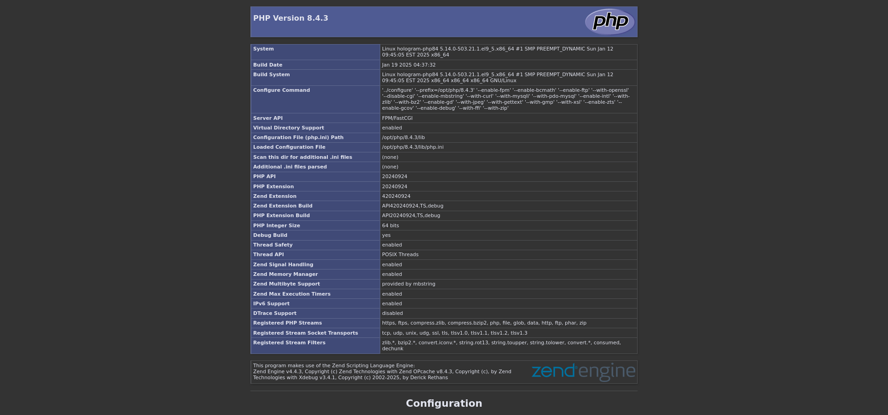
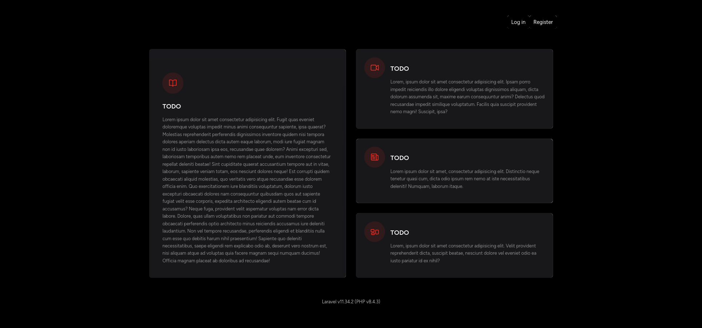

# hologram-php84

Here are the procedures for obtaining a LAMP server stack with version 8.4 of PHP thanks to the distribution AlmaLinux 9.5.

`www.hologram-php84.local` info page:

Example of virtual hosting on Apache, where instead of a simple site, it exposes a starting base for a web application.

`www.landing-php84.local` landing page:

