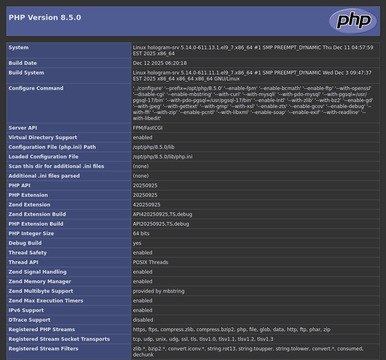

# hologram-php85

Here are the procedures for obtaining a LAMP server stack with version 8.5 of PHP thanks to the distribution AlmaLinux 9.7.

The following command was used to reduce the size of the following screenshot:

```shell
convert PHP_8.5.0_phpinfo_screenshot.jpg -resize 40% PHP_8.5.0_phpinfo.jpg
```



The following command is used to obtain information about the system in use:

```shell
hostnamectl
```
