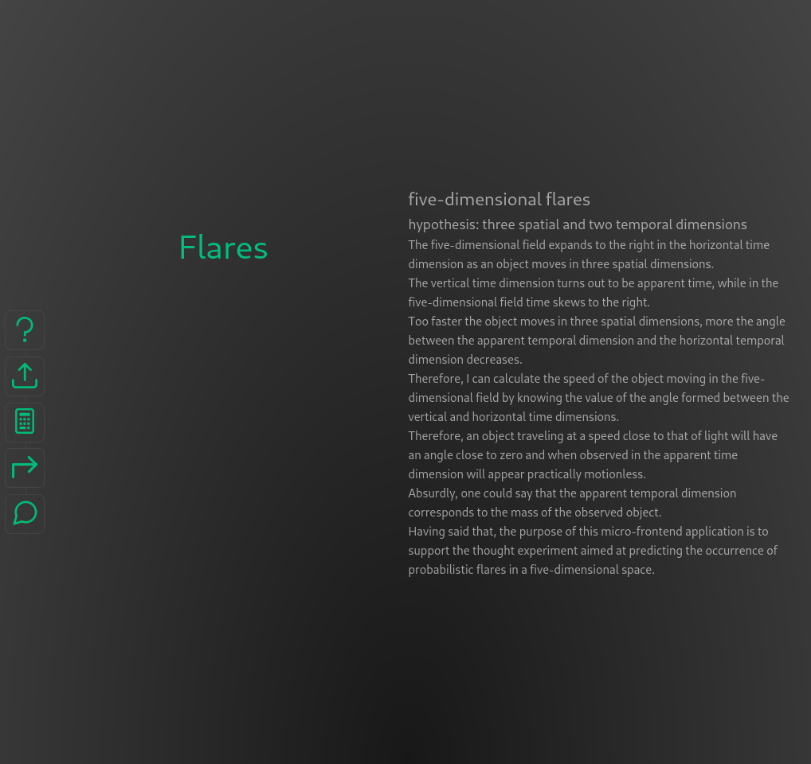
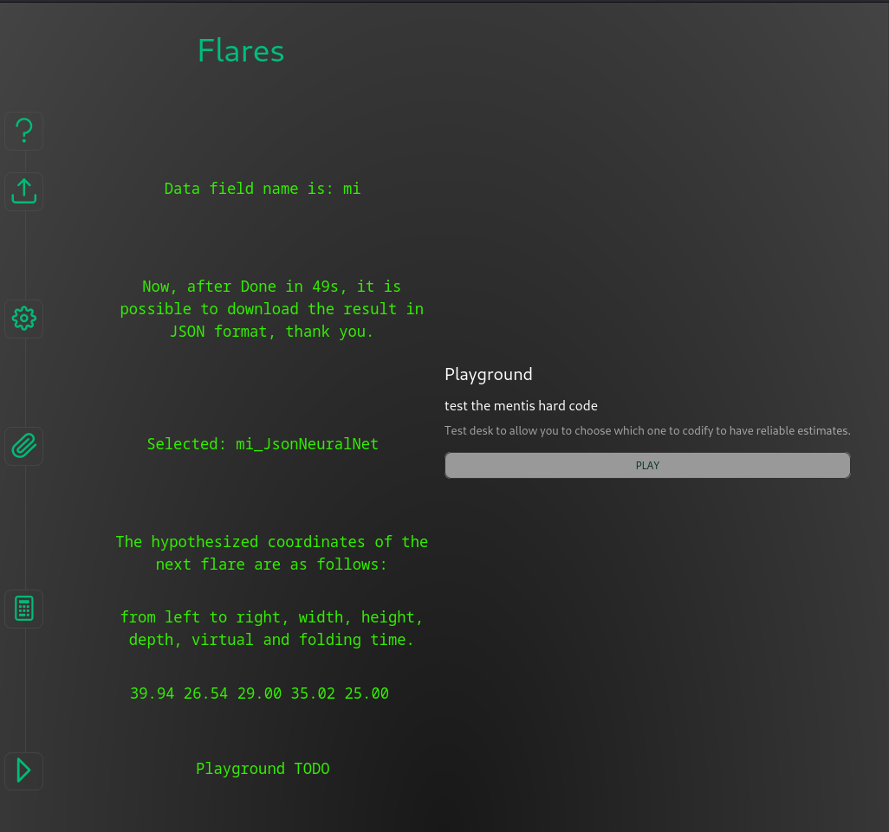

# `flares` Vue micro-frontend application

To make sure I have the latest versions:

```bash
node -v
npm view node version
sudo npm cache clean -f
sudo npm install -g n
sudo n stable
npm -v
npm view npm version
sudo npm install -g npm@latest
```

How it looks on a desktop:



and on a small screen:


## scaffolding

I'll start by assuming that the web application you use as a template is located in a directory under your `/home/your_username_directory/`:

```sh
cd ~/webapps/
cp --recursive ./templates /var/www/html/
cd /var/www/html/
ls -al
mv templates flares && cd flares
sed -i 's/templates/flares/g' ./package.json
sed -i 's/templates/flares/g' ./env.js
sed -i 's/Templates/Novelty/g' ./index.html
sed -i 's/Templates/Novelty/g' ./src/App.vue
```

I type the name of the web application and continue choosing the options I need from those offered by the interactive system.

## install dependencies

```sh
npm install
npm run format
npm i gl
npm i brain.js@1.6.1
npm i -D vite-plugin-node-polyfills
```

## check the licenses of the packages used

```sh
license-report --output=csv > licenses_report.csv
nlf --csv > nlf_licenses_report.csv
license-checker --csv > license_checker_report.csv
```

## configure `vite-plugin-node-polyfills` on `vite.config.js` file

```js
import { fileURLToPath, URL } from 'node:url'

import { defineConfig } from 'vite'
import vue from '@vitejs/plugin-vue'
import vueDevTools from 'vite-plugin-vue-devtools'
import { nodePolyfills } from 'vite-plugin-node-polyfills'
import { OUT_DIR_NAME, URL_BASE } from './env'

// https://vitejs.dev/config/
export default defineConfig(({ mode }) => ({
  plugins: [
    vue(), 
    vueDevTools(),
    nodePolyfills()
  ],
  resolve: {
    alias: {
      '@': fileURLToPath(new URL('./src', import.meta.url))
    }
  },
  define: {
    __VUE_PROD_DEVTOOLS__: mode !== 'production'
  },
  build: {
    outDir: OUT_DIR_NAME
  },
  base: URL_BASE
}))
```

## configure `primevue`

Remember that in order to use the `primevue` framework it is necessary to appropriately configure the components you want to use by modifying the `main.js` file in a similar way to the following:

```js
import './assets/main.css'

import { createApp } from 'vue'
import { createPinia } from 'pinia'

// Imports dedicated to primevue components
import PrimeVue from 'primevue/config'
import Button from 'primevue/button'

import App from './App.vue'
import router from './router'

const app = createApp(App)

app.use(createPinia())
app.use(router)

// Configuration of primevue and list of components used in this application
app.use(PrimeVue, {
    // this is where the options would go
    unstyled: true
})
app.component('Button', Button)

app.mount('#app')
```

## here is an example of a file `env.js` that collects some micro-frontend settings

```js
export const URL_BASE = '/flares/deployment'
export const OUT_DIR_NAME = 'deployment'
export const MIN_COORDINATES_VALUE = 0
export const MAX_COORDINATES_VALUE = 100
export const BINARY_THRESH = 0.5
export const ACTIVATION = 'sigmoid'
export const LEAKY_RELU_ALPHA = 0.01
export const INPUT_SIZE = 5
export const INPUT_RANGE = 5
export const OUTPUT_SIZE = 5
export const LEARNING_RATE = 0.01
export const DECAY_RATE = 0.999
export const ITERATIONS = 20000
export const TIMEOUT = 1200000
export const HIDDEN_LAYERS = [5, 100, 5]
```

## build

```sh
npm run build
chown --recursive developer_username:www-data .
```

## check for updates

```sh
npm outdated
```

## do the update

```sh
npm update
license-checker --csv > license_checker_report.csv
npm run build
chown --recursive developer_username:www-data .
```

but if, for example, I only wanted to update a specific package, it would be better to use the following command:

```sh
npm install eslint@latest
```

## example of sftp.json

```json
{
    "$schema": "http://json-schema.org/draft-07/schema",
    "name": "flares",
    "username": "your_username",
    "privateKeyPath": "/home/your_username/.ssh/id_rsa",
    "passphrase": "your_passphrase",
    "host": "192.168.1.XXX",
    "remotePath": "/var/www/html",
    "port": 22,
    "connectTimeout": 20000,
    "uploadOnSave": true,
    "watcher": {
        "files": "dist/*.{js,css}",
        "autoUpload": false,
        "autoDelete": false
    },
    "syncOption": {
        "delete": true,
        "update": false
    },
    "ignore": [
        ".vscode",
        ".howto",
        ".docs",
        ".git",
        ".DS_Store",
        "screenshots",
        "TEMP",
        "nbproject",
        "probe.http"
    ]
}
```

## final considerations

It is good to remember that a template could be useful, but, considering the evolutionary times of frameworks, any template is subject to rapid obsolescence.

## `flares` complete process


