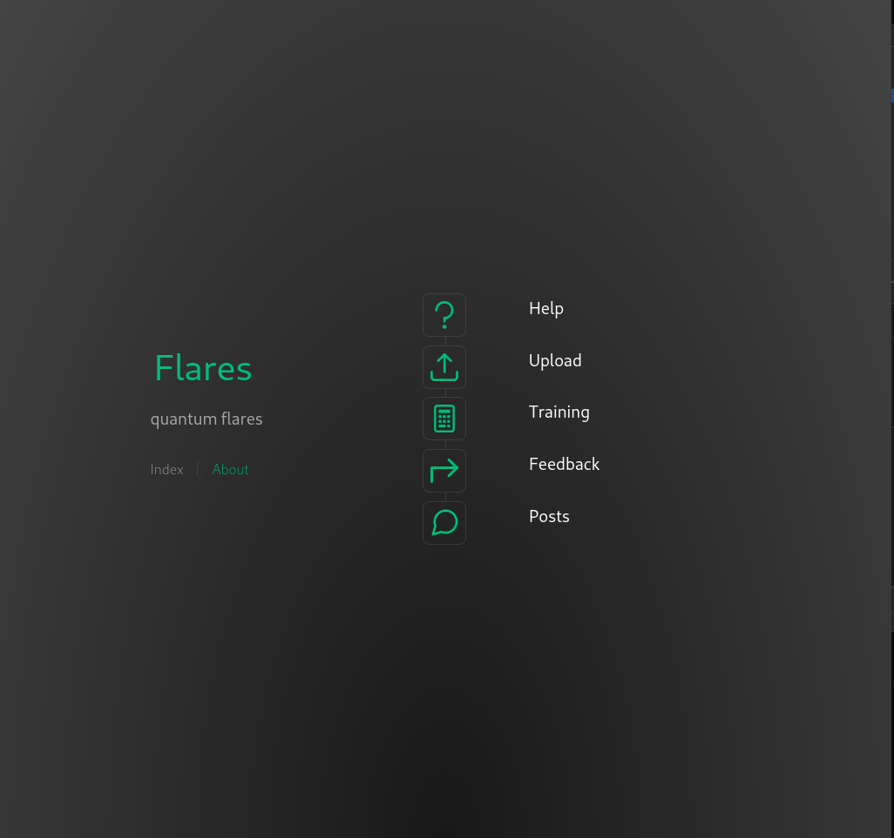
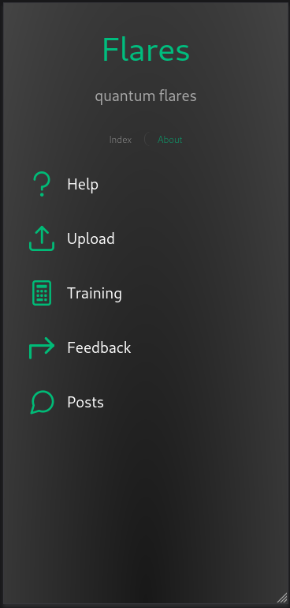

# `flares` Vue web application

How it looks on a desktop:



and on a small screen:



## scaffolding

Scaffolding of the application:

```sh
cd /var/www/html/
npm create vue@latest
```

I type the name of the web application and continue choosing the options I need from those offered by the interactive system.

## first start

```sh
cd flares/
npm install
npm run format
```

Install a set of open source UI components for `Vue.js`:

```sh
npm i primevue
npm i primeicons
```

Then I install the packages that will be used to make the application work:

```sh
npm i axios
npm i csv-parse
npm i gl
npm i brain.js@1.6.1
```

## check the licenses of the packages used

```sh
cd /var/www/html/flares/
license-checker --csv > license_checker_report.csv
```

## facilitate the development of the micro-frontend

To facilitate the development of the micro-frontend I made the following changes, file `package.json`:

```json
"build": "vite build --mode development",
```

Additionally, at the root of the micro-frontend project I added the `env.js` file to set some environment variables:

```js
export const URL_BASE = 'flares/deployment'
export const OUT_DIR_NAME = 'deployment'
```

## copy the application to the server

Now I edit the `vite.config.js` file once development is finished:

```js
import { fileURLToPath, URL } from 'node:url'

import { defineConfig } from 'vite'
import vue from '@vitejs/plugin-vue'
import vueDevTools from 'vite-plugin-vue-devtools'
import { OUT_DIR_NAME, URL_BASE } from './env'

// https://vitejs.dev/config/
export default defineConfig(({ mode }) => ({
  plugins: [vue(), vueDevTools()],
  resolve: {
    alias: {
      '@': fileURLToPath(new URL('./src', import.meta.url))
    }
  },
  define: {
    __VUE_PROD_DEVTOOLS__: mode !== 'production'
  },
  build: {
    outDir: OUT_DIR_NAME
  },
  base: URL_BASE
}))
```

## build

```sh
npm run build
chown --recursive developer_username:www-data .
```

## check for updates

```sh
cd /var/www/html/flares/
npm outdated
```

## do the update

```sh
npm update
license-checker --csv > license_checker_report.csv
npm run build
chown --recursive developer_username:www-data .
```

but if, for example, I only wanted to update a specific package, it would be better to use the following command:

```sh
npm install eslint@latest
```
