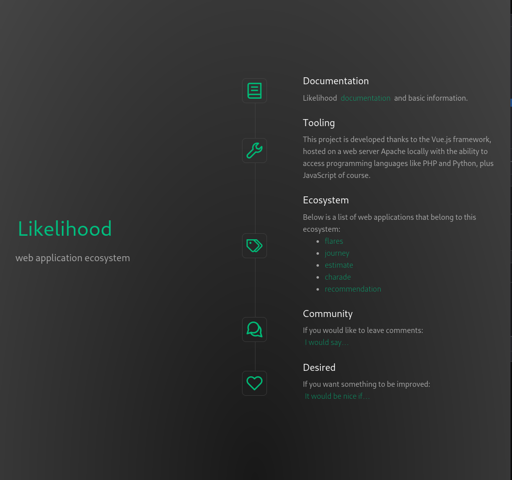

# `likelihood` Vue web application



## scaffolding

To make sure I have the latest versions:

```bash
node -v
npm view node version
sudo npm cache clean -f
sudo npm install -g n
sudo n stable
npm -v
npm view npm version
sudo npm install -g npm@latest
```

and then continue with the scaffolding of the application:

```sh
cd /var/www/html/
npm create vue@latest
```

I type the name of the web application and continue choosing the options I need from those offered by the interactive system.

## first start

```sh
cd likelihood/
npm install
npm run format
```

Install `primeicons`:

```sh
npm i primeicons
```

## check the licenses of the packages used

Here are some utilities to choose from:

```sh
sudo npm install -g license-report
sudo npm install -g nlf
sudo npm install -g license-checker
```

and here are three tips on how to use them:

```sh
cd ~/webapps/vue/likelihood/
license-report --output=csv > licenses_report.csv
nlf --csv > nlf_licenses_report.csv
license-checker --csv > license_checker_report.csv
```

## facilitate the development of the micro-frontend

To facilitate the development of the micro-frontend I made the following changes, file `package.json`:

```json
"build": "vite build --mode development",
```

Additionally, at the root of the micro-frontend project I added the `env.js` file to set some environment variables:

```js
export const URL_BASE = 'https://192.168.1.XXX/likelihood/deployment'
export const OUT_DIR_NAME = 'deployment'
export const FLARES = '/flares/deployment'
export const JOURNEY = '/journey/deployment'
export const ESTIMATE = '/estimate/deployment'
export const CHARADE = '/charade/deployment'
export const RECOMMENDATION = '/recommendation/deployment'
```

## copy the application to the server

Now I edit the `vite.config.js` file once development is finished:

```js
import { fileURLToPath, URL } from 'node:url'

import { defineConfig } from 'vite'
import vue from '@vitejs/plugin-vue'
import vueDevTools from 'vite-plugin-vue-devtools'
import { OUT_DIR_NAME, URL_BASE } from './env'

// https://vitejs.dev/config/
export default defineConfig(({ mode }) => ({
  plugins: [vue(), vueDevTools()],
  resolve: {
    alias: {
      '@': fileURLToPath(new URL('./src', import.meta.url))
    }
  },
  define: {
    __VUE_PROD_DEVTOOLS__: mode !== 'production'
  },
  build: {
    outDir: OUT_DIR_NAME
  },
  base: URL_BASE
}))
```

At this point I can issue the following commands:

```sh
npm run build
chown --recursive developer_username:www-data .
sudo sed -i 's:DocumentRoot /var/www/html:DocumentRoot /var/www/html/likelihood/deployment:g' /etc/apache2/sites-available/default-ssl.conf
sudo sed -i 's:<Directory /var/www/html>:<Directory /var/www/html/likelihood/deployment>:g' /etc/apache2/sites-available/default-ssl.conf
sudo sed -i 's:DocumentRoot /var/www/html:DocumentRoot /var/www/html/likelihood/deployment:g' /etc/apache2/sites-available/000-default.conf
sudo sed -i 's:<Directory /var/www/html>:<Directory /var/www/html/likelihood/deployment>:g' /etc/apache2/sites-available/000-default.conf
apachectl configtest
sudo systemctl restart apache2
sudo systemctl status apache2 --no-pager
```

## check for updates

```sh
cd ~/webapps/vue/likelihood/
npm outdated
```

## do the update

```sh
npm update
npm run build
chown --recursive developer_username:www-data .
```

To quickly return to the previous configuration:

```sh
sudo sed -i 's:DocumentRoot /var/www/html/likelihood/deployment:DocumentRoot /var/www/html:g' /etc/apache2/sites-available/default-ssl.conf
sudo sed -i 's:<Directory /var/www/html/likelihood/deployment>:<Directory /var/www/html>:g' /etc/apache2/sites-available/default-ssl.conf
sudo sed -i 's:DocumentRoot /var/www/html/likelihood/deployment:DocumentRoot /var/www/html:g' /etc/apache2/sites-available/000-default.conf
sudo sed -i 's:<Directory /var/www/html/likelihood/deployment>:<Directory /var/www/html>:g' /etc/apache2/sites-available/000-default.conf
apachectl configtest
sudo systemctl restart apache2
sudo systemctl status apache2 --no-pager
```

Because, at least for now, I prefer the flexibility offered by a specially written `.htaccess` configuration file.
For example, now I am able to return personalized pages in case of errors.
In addition to setting predefined pages for applications that I still have to implement.


