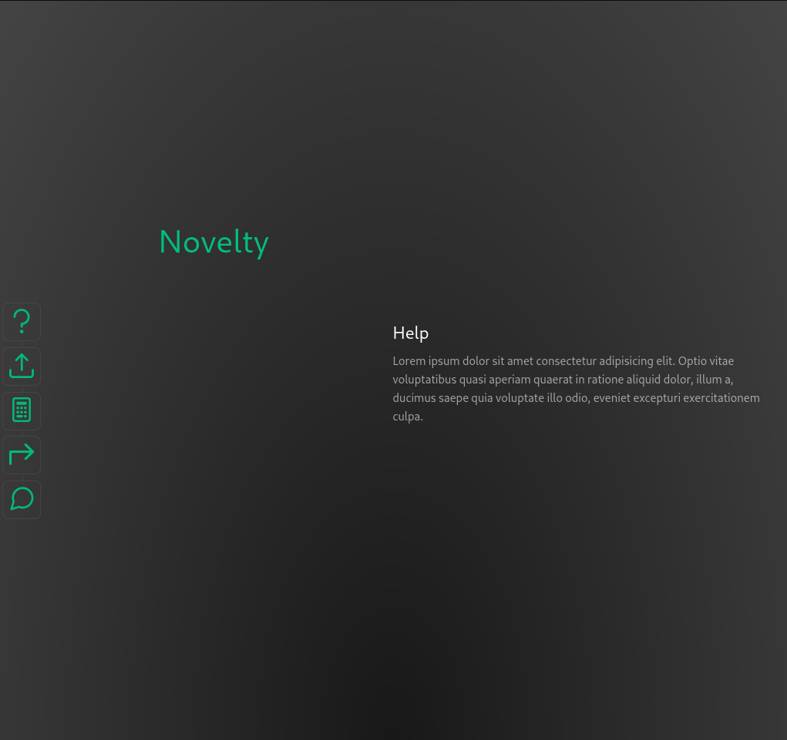
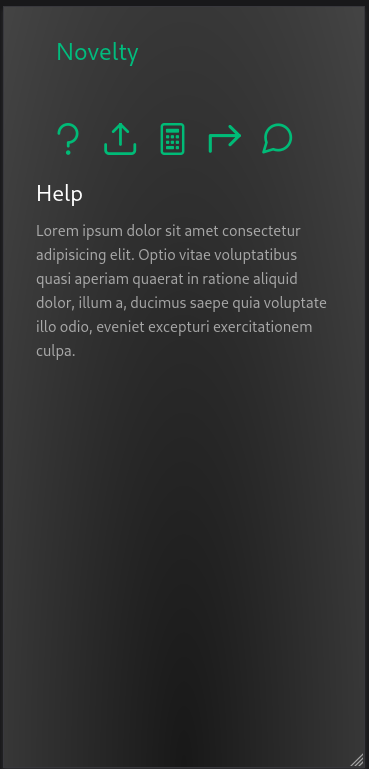

# `templates` Vue web application

## scaffolding

I'll start by assuming that the web application you use as a template is located in a directory under your `/home/your_username_directory/`:

```sh
cd ~/webapps/
cp --recursive ./templates /var/www/html/
cd /var/www/html/
ls -al
mv templates novelty && cd novelty
sed -i 's/templates/novelty/g' ./package.json
sed -i 's/templates/novelty/g' ./env.js
sed -i 's/Templates/Novelty/g' ./index.html
sed -i 's/Templates/Novelty/g' ./src/App.vue
```

I type the name of the web application and continue choosing the options I need from those offered by the interactive system.

## install dependencies

```sh
npm install
npm run format
```

## check the licenses of the packages used

```sh
license-checker --csv > license_checker_report.csv
```

## build

```sh
npm run build
chown --recursive developer_username:www-data .
```

## check for updates

```sh
npm outdated
```

## do the update

```sh
npm update
license-checker --csv > license_checker_report.csv
npm run build
chown --recursive developer_username:www-data .
```

but if, for example, I only wanted to update a specific package, it would be better to use the following command:

```sh
npm install eslint@latest
```

## example of sftp.json

```json
{
    "$schema": "http://json-schema.org/draft-07/schema",
    "name": "novelty",
    "username": "your_username",
    "privateKeyPath": "/home/your_username/.ssh/id_rsa",
    "passphrase": "your_passphrase",
    "host": "192.168.1.XXX",
    "remotePath": "/var/www/html",
    "port": 22,
    "connectTimeout": 20000,
    "uploadOnSave": true,
    "watcher": {
        "files": "dist/*.{js,css}",
        "autoUpload": false,
        "autoDelete": false
    },
    "syncOption": {
        "delete": true,
        "update": false
    },
    "ignore": [
        ".vscode",
        ".howto",
        ".docs",
        ".git",
        ".DS_Store",
        "screenshots",
        "TEMP",
        "nbproject",
        "probe.http"
    ]
}
```

## screenshots

How it looks on a desktop:



and on a mobile screen:



## final considerations

It is good to remember that a template could be useful, but, considering the evolutionary times of frameworks, any template is subject to rapid obsolescence.
