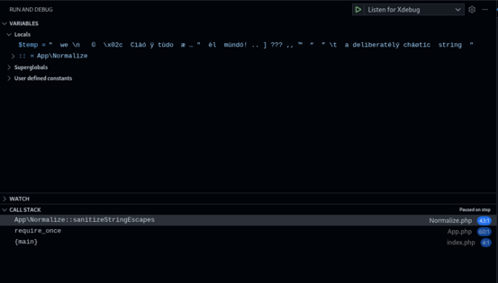
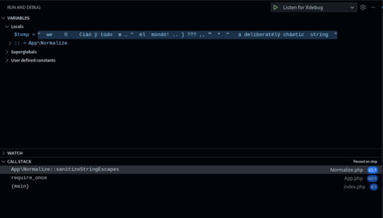
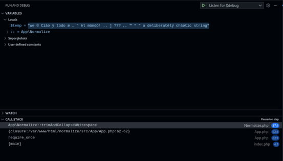
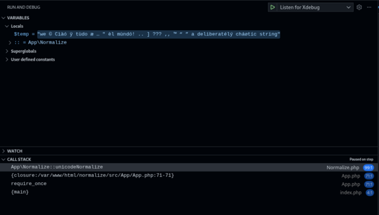
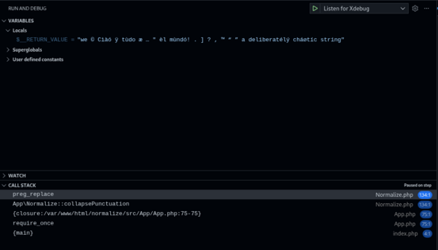

# Xdebug setup

Side note, if you don't want to continuously repeat the `sudo` command and like me in this case you need to issue numerous commands from root, the following command might be useful:

```shell
cd ~
su -
```

First, however, it is necessary to make PHP also usable from the command line.

## make PHP accessible globally not just from Apache

Quick warning, if the following links are already there, you will need to remove them first. To then recreate new ones that point to the newly installed versions.

```shell
rm --force /usr/bin/php
rm --force /usr/bin/phar
rm --force /usr/bin/phpize
rm --force /usr/bin/php-config
```

Otherwise, if this is the first installation from sources, we immediately move on to the following instructions:

```shell
ln --symbolic --verbose /opt/php/8.5.1/bin/php /usr/bin/php
ln --symbolic --verbose /opt/php/8.5.1/bin/phar.phar /usr/bin/phar
ln --symbolic --verbose /opt/php/8.5.1/bin/phpize /usr/bin/phpize
ln --symbolic --verbose /opt/php/8.5.1/bin/php-config /usr/bin/php-config
exit
```

## install Xdebug from source

Be sure to replace the real link of the version you prefer.

```shell
mkdir xdebug && cd xdebug
wget --spider --https-only https://xdebug.org/files/xdebug-3.5.0.tgz
wget --https-only https://xdebug.org/files/xdebug-3.5.0.tgz
sha256sum xdebug-3.5.0.tgz
tar -xzf xdebug-3.5.0.tgz
ls -l
cd xdebug-3.5.0/
phpize
mkdir build_session_date && cd build_session_date
../configure --help
../configure --prefix=/opt/php/xdebug --enable-xdebug
make
sudo make install
```

Instead, if it is a PHP version update:

```shell
cd ~/xdebug/xdebug-3.5.0/
phpize
mkdir build_session_update_n && cd build_session_update_n
../configure --help
../configure --prefix=/opt/php/xdebug --enable-xdebug
make
sudo make install
```

## setup of Xdebug

```shell
php --ini
sudo updatedb
locate xdebug.ini
rnano /opt/php/8.5.1/lib/php.ini
```

First it is a good idea to view the contents of the file without risking causing damage.
And now I edit `/opt/php/8.5.1/lib/php.ini` configuration file

```shell
sudo nano /opt/php/8.5.1/lib/php.ini
```

I add this section at the end of file:

```text
...
;;;;;;;;;;;;;;;;;;
; Xdebug         ;
;;;;;;;;;;;;;;;;;;

zend_extension=xdebug

; xdebug.mode=[off,develop,coverage,debug,gcstats,profile,trace]
xdebug.mode=develop,debug,trace,coverage
xdebug.cli_color=1
xdebug.start_with_request=trigger
xdebug.discover_client_host=1
xdebug.mode=debug
; placeholder to be replaced with your IP address
xdebug.client_host=192.168.XXX.XXX
xdebug.client_port=9003
xdebug.connect_timeout_ms=2000
xdebug.idekey=VSCODE
...
```

As can be seen from the last setting I considered using vscode.

Then I have to restart the `PHP-FPM` service

```shell
sudo systemctl reload php-fpm
systemctl status php-fpm --no-pager
php --version
```

### on client setup of vscode

Now you need to add file `launch.json` to folder `.vscode`.
Adding the following:

```json
{
  "version": "0.2.0",
  "configurations": [
    {
      "name": "Listen for Xdebug",
      "type": "php",
      "request": "launch",
      "port": 9003,
      "pathMappings": {
        "/var/www/html": "${workspaceFolder}/html"
      }
    },
    {
      "name": "Launch currently open script",
      "type": "php",
      "request": "launch",
      "program": "${file}",
      "cwd": "${fileDirname}",
      "port": 0,
      "runtimeArgs": ["-dxdebug.start_with_request=yes"],
      "env": {
        "XDEBUG_MODE": "debug,develop",
        "XDEBUG_CONFIG": "client_port=${port}"
      }
    },
    {
      "name": "Launch Built-in web server",
      "type": "php",
      "request": "launch",
      "runtimeArgs": [
        "-dxdebug.mode=debug",
        "-dxdebug.start_with_request=yes",
        "-S",
        "localhost:0"
      ],
      "program": "",
      "cwd": "${workspaceRoot}",
      "port": 9003,
      "serverReadyAction": {
        "pattern": "Development Server \\(http://localhost:([0-9]+)\\) started",
        "uriFormat": "http://localhost:%s",
        "action": "openExternally"
      }
    }
  ]
}
```

## debugging of `App.php`

To start a remote debugging session, you need to add the instruction `xdebug_break();` at the point where you want to interrupt the execution.

```php
<?php
    declare (strict_types = 1);
    // Enforce strict type checking - no implicit coercions

    /**
     * Namespace declaration.  All code in this file belongs to the App namespace,
     * which keeps symbols (classes, functions, constants) isolated from the global scope.
     */
    namespace App;

    /**
     * Import two classes from the same namespace so we can use them without the full
     * namespace prefix.  They are defined in other files that will be autoloaded.
     */
    use App\Normalize;
    use App\Utils;

    /**
     * Register a very simple PSR‑0/PSR‑4 style autoloader.  Whenever a class is referenced
     * that hasn't been loaded yet, PHP will call this closure with the fully‑qualified
     * class name (e.g. App\Normalize).  The closure converts namespace separators
     * to directory separators and includes the corresponding PHP file.
     *
     *   App\Normalize   =>  ../src/App/Normalize.php
     *
     * This keeps the code in this file free of a bunch of manual require_once statements.
     */
    spl_autoload_register(
        function (string $class) {
            // Convert namespace separators (\) to directory separators (/)
            $path = '../src/' . str_replace('\\', '/', $class) . '.php';
            // Include the class file
            require $path;
        }
    );


    /**
     * Core logic - normalizing a messy string
     *
     * $strTrash contains a deliberately chaotic string:
     * - Leading/trailing spaces
     * - Mixed Latin & non‑Latin characters
     * - Various punctuation marks
     * - Invisible/zero‑width characters
     * - Multiple consecutive spaces
     *
     * I want to clean it up so that it can be safely output in HTML.
     *
     * PHP 8.5 introduced the **pipe operator (|>)** which allows us to
     * pipe the value from left to right through a series of callbacks.
     *
     * Each stage receives the result of the previous stage, does something,
     * and returns a new value.  The final value is assigned back to $strTrash.
     */

   /*  TODO: This is essential instruction for applying debugging techniques! */
    xdebug_break();

    $strTrash = '  we \n   ©  \x02c  Cìàó ÿ tùdo  æ … "  èl  mùndó! .. ] ??? ,, ™  “  ” \t  a deliberatélý cháøtíc  string  '
        // Sanitize the string
        // The ellipsis (…) is left untouched.
        |> Normalize::sanitizeStringEscapes(...)
        // Trim leading/trailing whitespace **and** collapse runs of internal whitespace to a single space.
        |> (fn($v) => Normalize::trimAndCollapseWhitespace($v))
        // Unicode normalization (NFC/NFKC).
        // Problem: Unicode allows multiple ways to represent the same visual character.
        // Objective: convert equivalent text strings into a single canonical form.
        // Forms of normalization:
        // NFC (Normalization Form Canonical Composition)
        // NFD (Normalization Form Canonical Decomposition)
        // NFKC (Normalization Form Compatibility Composition)
        // NFKD (Normalization Form Compatibility Decomposition)
        |> (fn($v) => Normalize::unicodeNormalize($v))
        // Remove characters that are invisible to the user.
        |> (fn($v) => Normalize::removeInvisible($v))
        // Collapse duplicate punctuation.
        |> (fn($v) => Normalize::collapsePunctuation($v))
        // Convert accented Latin letters to HTML entities.
        |> (fn($v) => Normalize::accentedToHtmlEntities($v));
?>

<!DOCTYPE html>
<html lang="en">
<head>
    <meta charset="UTF-8">
    <!-- Make the page responsive on mobile devices -->
    <meta name="viewport" content="width=device-width, initial-scale=1.0">
    <title>Normalize</title>
    <!-- Link to an external stylesheet -->
    <link rel="stylesheet" href="./assets/css/app.css">
</head>
<body>
    <main class="box">
        <!-- Output the normalized string inside an h3 element. -->
        <!-- Because $strTrash already contains HTML‑entity‑encoded characters, it is safe to echo it directly. -->
        <h3 class="card"><?= $strTrash ?></h3>
    </main>
</body>
</html>
```

## screenshots

### before `sanitizeStringEscapes`



### after `sanitizeStringEscapes`



### after `trimAndCollapseWhitespace`



### after `unicodeNormalize`



### after `removeInvisible`


### after `collapsePunctuation`



### after `accentedToHtmlEntities`


## instructions for resizing images

```shell
# Show original dimensions
identify -format "%wx%h\\n" Screenshot_before_Normalize_sanitizeStringEscapes.png
# Forced resizing to 600×315 pixels
convert Screenshot_before_Normalize_sanitizeStringEscapes.png -resize 600x315! Screenshot_after_Normalize_sanitizeStringEscapes.out.png
# Resize to 600×315 pixels while maintaining the aspect ratio
convert Screenshot_before_Normalize_sanitizeStringEscapes.png -resize 600x315 Screenshot_before_Normalize_sanitizeStringEscapes.out.png
convert Screenshot_after_Normalize_sanitizeStringEscapes.png -resize 600x315 Screenshot_after_Normalize_sanitizeStringEscapes.out.png
convert Screenshot_after_Normalize_trimAndCollapseWhitespace.png -resize 600x315 Screenshot_after_Normalize_trimAndCollapseWhitespace.out.png
convert Screenshot_after_Normalize_unicodeNormalize.png -resize 600x315 Screenshot_after_Normalize_unicodeNormalize.out.png
convert Screenshot_after_Normalize_removeInvisible.png -resize 600x315 Screenshot_after_Normalize_removeInvisible.out.png
convert Screenshot_after_Normalize_collapsePunctuation.png -resize 600x315 Screenshot_after_Normalize_collapsePunctuation.out.png
convert Screenshot_after_Normalize_accentedToHtmlEntities.png -resize 600x315 Screenshot_after_Normalize_accentedToHtmlEntities.out.png
```
