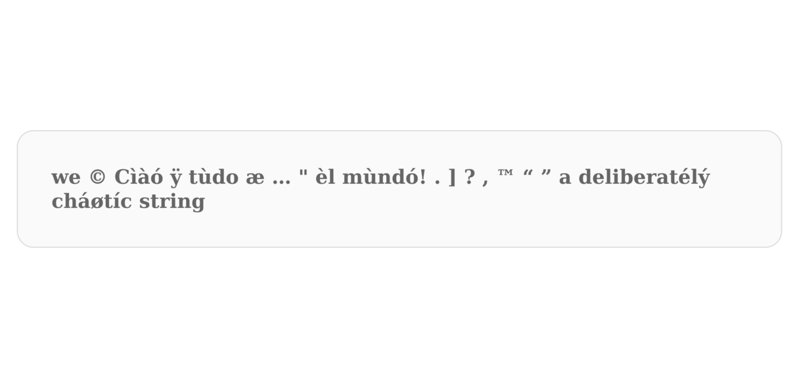

# `normalize` is an example of vanilla PHP 8.5 web application



---

**Commands to be typed on the development host.**

Create a `.gitignore` file:

```shell
nano .gitignore
```

Edit `.gitignore` file:

```txt
.vscode/
.notes/
node_modules/
# possible virtual environment for Python
venv/
dist/
build/
data/
NOTES.md
.env
*.pyc
.DS_Store
*.log
```

```shell
git init
git branch -m main
git status
git add .
git commit -m "initializing the local repository"
git tag -a v0.0.0 -m "starting version of clean repo"
git log
git checkout -b staging
git merge --no-ff main -m "merge main into staging"
git checkout -b draft
git merge --no-ff main -m "merge main into draft"
git status
git add .
git commit -m "further adjustments"
git tag -a v0.0.1 -m "further adjustments"
git log
git branch --list | wc -l
git branch --list
git checkout staging
git merge --no-ff draft -m "merge draft into staging"
git checkout main
git merge --no-ff draft -m "merge draft into main"
git checkout draft
```

If something were to go wrong:

```shell
git reset --hard v0.0.0
```

## some examples of using the Normalize class

### classical usage before the pipe operator in PHP 8.5

```php
    // Sanitize the string from escape characters.
    $strTrash = Normalize::sanitizeStringEscapes($strTrash);

    // Remove unnecessary whitespace.
    $strTrash = Normalize::trimAndCollapseWhitespace($strTrash);

    // Unicode normalization.
    $strTrash = Normalize::unicodeNormalize($strTrash);

    // Eliminate control characters.
    $strTrash = Normalize::removeInvisible($strTrash);

    // Collapse excess punctuation.
    $strTrash = Normalize::collapsePunctuation($strTrash);

    // Transliterate accented characters to HTML entities.
    $strTrash = Normalize::accentedToHtmlEntities($strTrash);

    // If I want a slug to use in a descriptive URL.
    $slug = Normalize::toSlugSafe($strTrash);
```

### use with the pipe operator in PHP 8.5

```php
// Example of using the pipe operator thanks to a closure for each step.
    $strTrash = '  we \n   ©  \x02c  Cìàó ÿ tùdo  æ … "  èl  mùndó! .. ] ??? ,, ™  “  ” \t  a deliberatélý cháøtíc  string  '
        |> (fn($v) => Normalize::sanitizeStringEscapes($v))
        |> (fn($v) => Normalize::trimAndCollapseWhitespace($v))
        |> (fn($v) => Normalize::unicodeNormalize($v))
        |> (fn($v) => Normalize::removeInvisible($v))
        |> (fn($v) => Normalize::collapsePunctuation($v))
        |> (fn($v) => Normalize::accentedToHtmlEntities($v));
    var_dump($strTrash)

// Example of using it with callable array, (it seems to work only if the pipe operator is used once).
    $strTrash = '  we \n   ©  \x02c  Cìàó ÿ tùdo  æ … "  èl  mùndó! .. ] ??? ,, ™  “  ” \t  a deliberatélý cháøtíc  string  ';
    $strTrash = $strTrash |> [Normalize::class, 'sanitizeStringEscapes'];
    var_dump($strTrash);
    $strTrash = $strTrash |> [Normalize::class, 'trimAndCollapseWhitespace'];
    var_dump($strTrash);
    $strTrash = $strTrash |> [Normalize::class, 'unicodeNormalize'];
    var_dump($strTrash);
    $strTrash = $strTrash |> [Normalize::class, 'removeInvisible'];
    var_dump($strTrash);
    $strTrash = $strTrash |> [Normalize::class, 'collapsePunctuation'];
    var_dump($strTrash);
    $strTrash = $strTrash |> [Normalize::class, 'accentedToHtmlEntities'];
    var_dump($strTrash)

// Example of using it with a pipe Utils::pipeline() helper that applies an array of callables in a loop.
    $strTrash = Utils::pipeline('  we \n   ©  \x02c  Cìàó ÿ tùdo  æ … "  èl  mùndó! .. ] ??? ,, ™  “  ” \t  a deliberatélý cháøtíc  string  ', [
        [Normalize::class, 'sanitizeStringEscapes'],
        [Normalize::class, 'trimAndCollapseWhitespace'],
        [Normalize::class, 'unicodeNormalize'],
        [Normalize::class, 'removeInvisible'],
        [Normalize::class, 'collapsePunctuation'],
        [Normalize::class, 'accentedToHtmlEntities'],
    ]);
```
