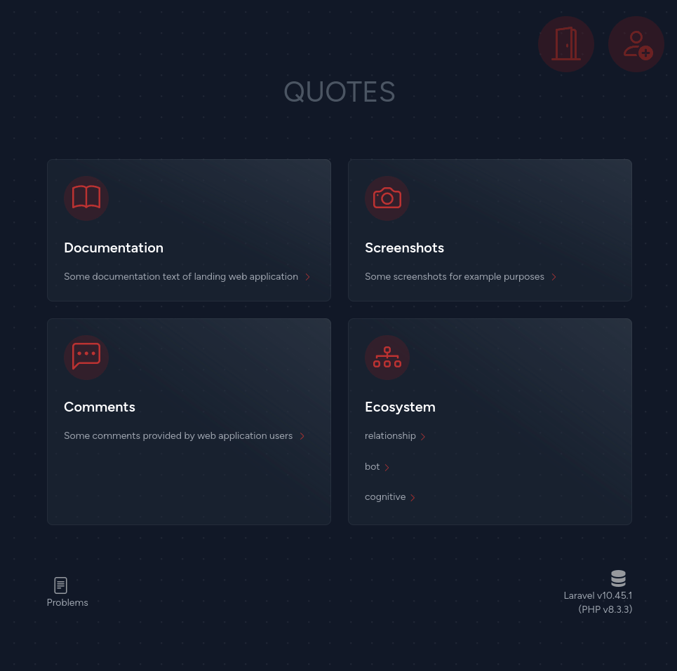
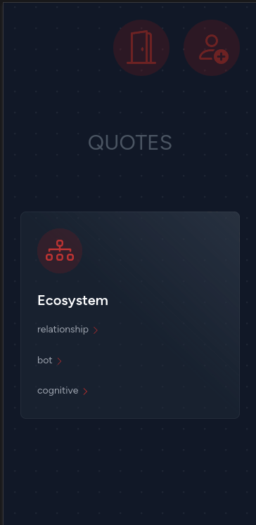
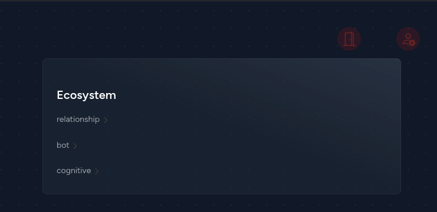
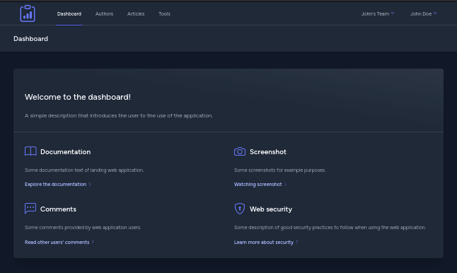
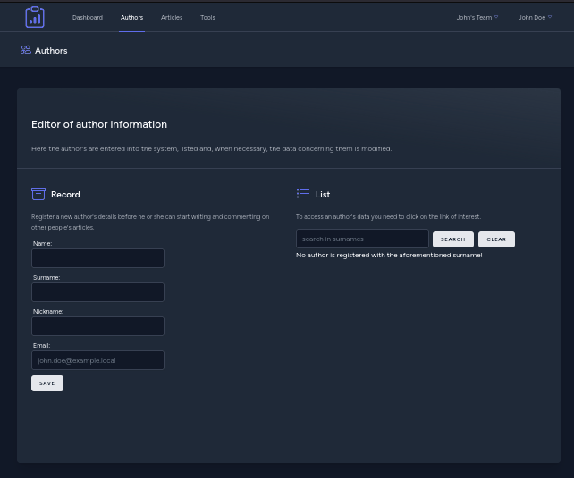
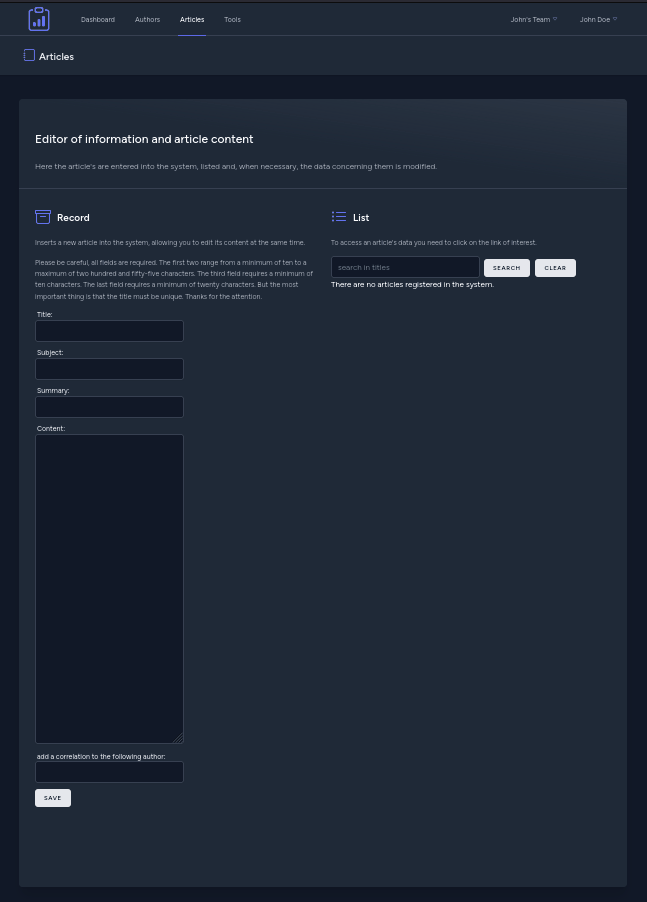
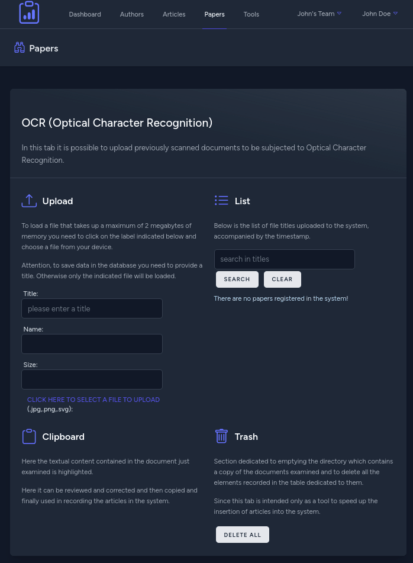

# quotes

Of course, this is just an application example.

As I usually do, I match the name of the example web application to the name of the virtual machine.
An example of a web application to collect quotes and correlate them to their respective authors.

Here are the procedures for obtaining a LAMP server stack with PHP version 8.3 from the source code, thanks also to the Laravel framework.

## screenshots

Landing page on workstation monitor:

Landing page on mobile display with portrait orientation:

Landing page on mobile display with landscape orientation:

Below are the screenshots of the tabs of this web application example:

