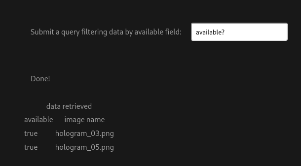
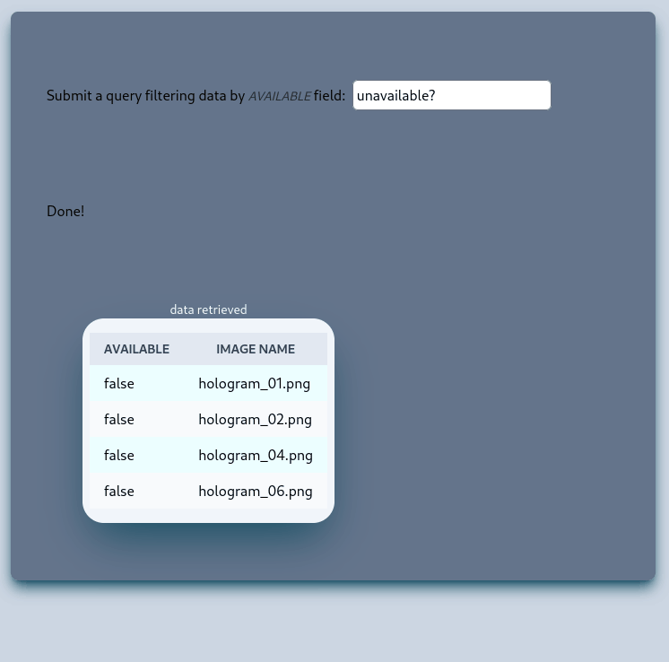

# `retriever` an example of Micro-Frontend application

This is an example of a Micro-Frontend application, which together with others, can be collected in a sort of ecosystem of the main application.
Micro-Frontend Applications instead of a monolithic Single Page Application, to be developed quickly when needed, avoiding the risk of affecting already well-tested functionality.
And, perhaps, at a later time, once consolidated, it will be possible to bring together the Micro-Frontend applications that had until then been developed separately in a new Single Page Application.

Below is the screenshot before integrating the Tailwind framework into the micro-frontend application.



And after the aforementioned integration.



The nice thing about a class-centric framework is that with almost the same HTML code I can get very different results.

## scaffolding

```sh
npm create vue@latest
cd retriever
```

## setup

```sh
npm install
```

## transpiling and hot-reload for development

```sh
npm run dev
```

It is necessary to remember that to access the routes dedicated to the APIs collected in file `routes/api.php` of framework `Laravel` that each path must be preceded by the indication `/api`, as in the following example:

```javascript
export const API_TEST = 'https://192.168.1.XXX/api/test'
```

These paths can be collected in a single file, as can be, for example, `env.js`.

## lint

```sh
npm run lint
```

## transpile and minify

```sh
npm run build
```

## deploy setup

To successfully deploy to your development web server you need to edit the `vite.config.js` file similar to the following.

```javascript
...
  build: {
    outDir: OUT_DIR_NAME
  },
  base: URI_BASE,
...
```

Being careful to assign the correct paths to the constants present in the code.

I simply built the micro-frontend application and then copied it into the public folder of the main application.
Finally, I assigned a link that points from the landing page to the micro application.

## integrate Tailwind into Vue.js project

1. Tailwind and its official plugins

```sh
npm i -D tailwindcss postcss autoprefixer
npm i -D @tailwindcss/typography @tailwindcss/forms @tailwindcss/aspect-ratio
```

2. I create a configuration file

```sh
npx tailwindcss init -p
```

I edit tailwind.config.js

```js
import typography from '@tailwindcss/typography';
import forms from '@tailwindcss/forms';
import aspectRatio from '@tailwindcss/aspect-ratio';

/** @type {import('tailwindcss').Config} */
export default {
  content: [
    "./index.html",
    "./src/**/*.{vue,js,ts,jsx,tsx}",
  ],
  theme: {
    extend: {},
  },
  plugins: [
    typography,
    forms,
    aspectRatio,
  ],
}
```

3. I add Tailwind directive on CSS

I edit src/style.css

```css
@tailwind base;
@tailwind components;
@tailwind utilities;
```

4. I add into .eslintrc.js

```js
...
    rules: {
        "vue/no-multiple-template-root": "off"
    }
...
```

5. I add into ./vscode/settings.json

```json
...
    "files.associations": {
        "*.css": "tailwindcss",
    }
...
```

6. I add into package.json this line after "dev" command:

```json
"stylize": "npx tailwindcss -i ./src/style.css -o ./src/assets/style.css",
```

And now I can run development build.

```sh
npm run dev
```

In another virtual terminal I go back to compiling the style sheet only when I need it with the following command:

```sh
npm run stylize
```

## to conclude

I believe that this type of micro-frontend application can implement various functionalities only when a need arises. Such as, filter the data, show it in a graph, collect it in a spreadsheet or simply convert it to another portable format.
