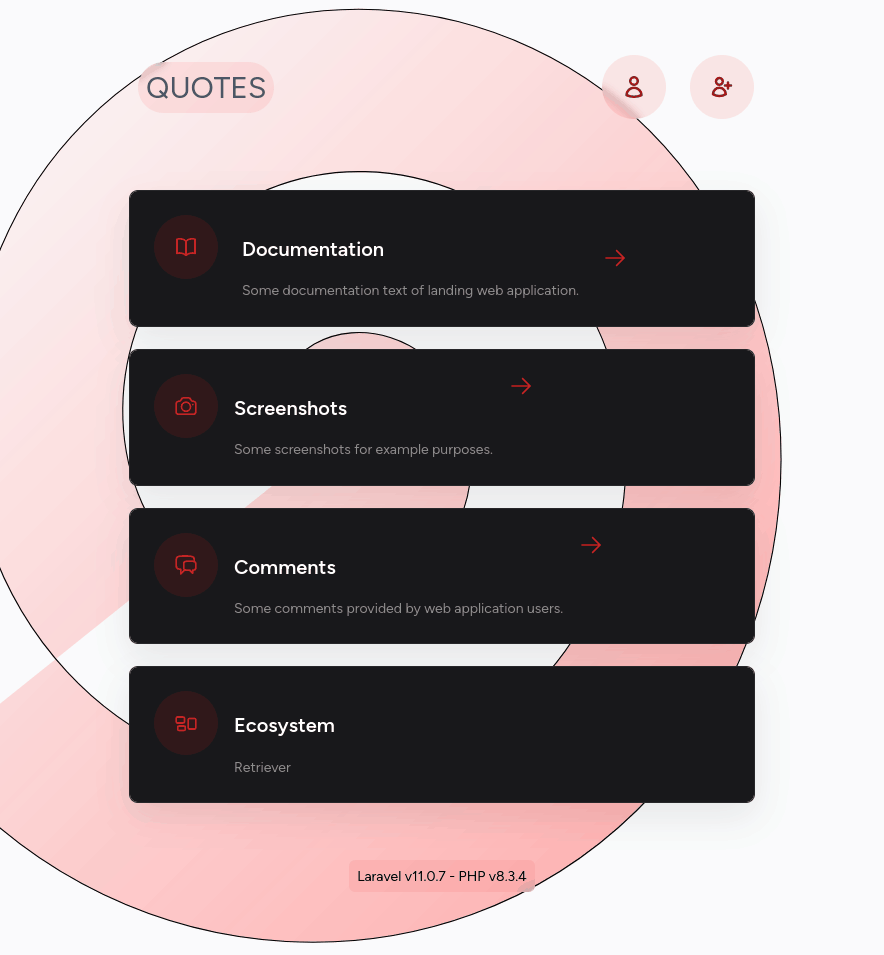
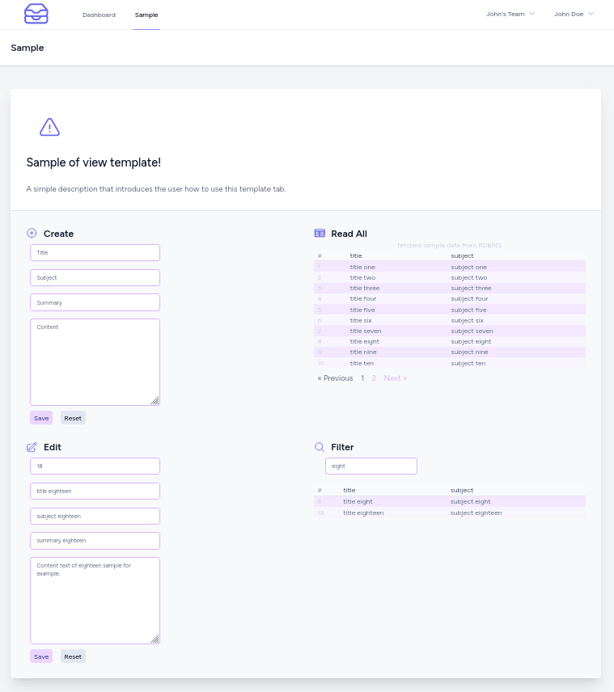

# `quotes` version 2

Updating web application `quotes` so that it can use version `11` of framework `Laravel`.


Which is followed by a further graphic revision.






Note that in the second case, the `Filter` view, I developed the pagination only on the client side.

In the first case, `Read All`, each pagination requires a GET request to the server. And, in this case, I let the filter field get cleaned up.

## how to

### `quotes`

```bash
cd /var/www/html/v2/quotes/v2/
composer create-project laravel/laravel:^11.0 quotes
chown --recursive --verbose developer_username:www-data .
chmod --recursive 775 bootstrap/cache
chmod --recursive 775 storage
chmod --recursive 775 database
```

### Apache 2 setup

```bash
sudo nano /etc/apache2/sites-available/default-ssl.conf
```

```xml
<IfModule mod_ssl.c>
        <VirtualHost _default_:443>
                ServerAdmin webmaster@localhost
                ServerName quotes.local
                ServerAlias www.quotes.local
                DocumentRoot /var/www/html/v2/quotes/public

                <Directory /var/www/html/v2/quotes/public>
                        Options Indexes FollowSymLinks MultiViews
                        AllowOverride All
                        Require all granted
                </Directory>

                LogLevel warn

                ErrorLog ${APACHE_LOG_DIR}/quotes_v2_error.log
                CustomLog ${APACHE_LOG_DIR}/quotes_v2_access.log combined

                SSLEngine on

                SSLCertificateFile /etc/ssl/self_signed_certs/quotes.pem
                SSLCertificateKeyFile /etc/ssl/self_signed_certs/quotes.key

                <FilesMatch "\.(cgi|shtml|phtml|php)$">
                                SSLOptions +StdEnvVars
                </FilesMatch>
                <Directory /usr/lib/cgi-bin>
                                SSLOptions +StdEnvVars
                </Directory>
        </VirtualHost>
</IfModule>
```

```bash
sudo nano /etc/apache2/sites-available/000-default.conf
```

```xml
<VirtualHost *:80>

        ServerAdmin webmaster@localhost
        ServerName quotes.local
        ServerAlias www.quotes.local
        DocumentRoot /var/www/html/v2/quotes/public
        Redirect "/" "https://192.168.1.103/"

        <Directory /var/www/html/v2/quotes/public>
                Options Indexes FollowSymLinks MultiViews
                AllowOverride All
                Require all granted
        </Directory>

        LogLevel warn

        ErrorLog ${APACHE_LOG_DIR}/quotes_v2_error.log
        CustomLog ${APACHE_LOG_DIR}/quotes_v2_access.log combined

</VirtualHost>
```

```bash
apache2ctl configtest
sudo systemctl restart apache2
sudo systemctl status apache2 --no-pager
sudo systemctl status php-fpm --no-pager
tail -f /var/log/apache2/quotes_v2_error.log
tail -f /var/log/apache2/quotes_v2_access.log
```

### database setup

```bash
mariadb -u root -p
```

```sql
SHOW DATABASES;
CREATE DATABASE IF NOT EXISTS `laravel_v2_db`;
CREATE DATABASE IF NOT EXISTS `quotes_v2_db`;
GRANT ALL ON `laravel_v2_db`.* TO 'developer_username'@'localhost';
GRANT ALL ON `quotes_v2_db`.* TO 'developer_username'@'localhost';
GRANT ALL ON `laravel_v2_db`.* TO 'developer_username'@'%';
GRANT ALL ON `quotes_v2_db`.* TO 'developer_username'@'%';
FLUSH PRIVILEGES;
quit
```

### edit `.env`

```text
APP_NAME=quotes
APP_ENV=local
...

APP_URL=https://192.168.1.XXX/
...


DB_CONNECTION=sqlite

LARAVEL_V2_DB_CONNECTION=mariadb
LARAVEL_V2_DB_HOST=127.0.0.1
LARAVEL_V2_DB_PORT=3306
LARAVEL_V2_DB_DATABASE=laravel_v2_db
LARAVEL_V2_DB_USERNAME=developer_username
LARAVEL_V2_DB_PASSWORD=db_password

QUOTES_V2_DB=quotes_v2_db
...
```

Edit the `config/database.php` configuration file appropriately.

## setup of Jetstream

```bash
cd /var/www/html/v2/quotes/
php artisan jetstream:install inertia --teams
npm install
npm run build
php artisan migrate:fresh
php artisan schema:dump
chown --recursive --verbose developer_username:www-data .
```

## install a collection of Vue composition utilities

```bash
npm i @vueuse/core
```

## add Sample model

```bash
cd /var/www/html/v2/quotes/
php artisan make:model --all Sample
chown --recursive --verbose developer_username:www-data .
php artisan migrate --pretend --path=./database/migrations/2024_03_26_205553_create_samples_table.php
php artisan migrate --path=./database/migrations/2024_03_26_205553_create_samples_table.php
```
