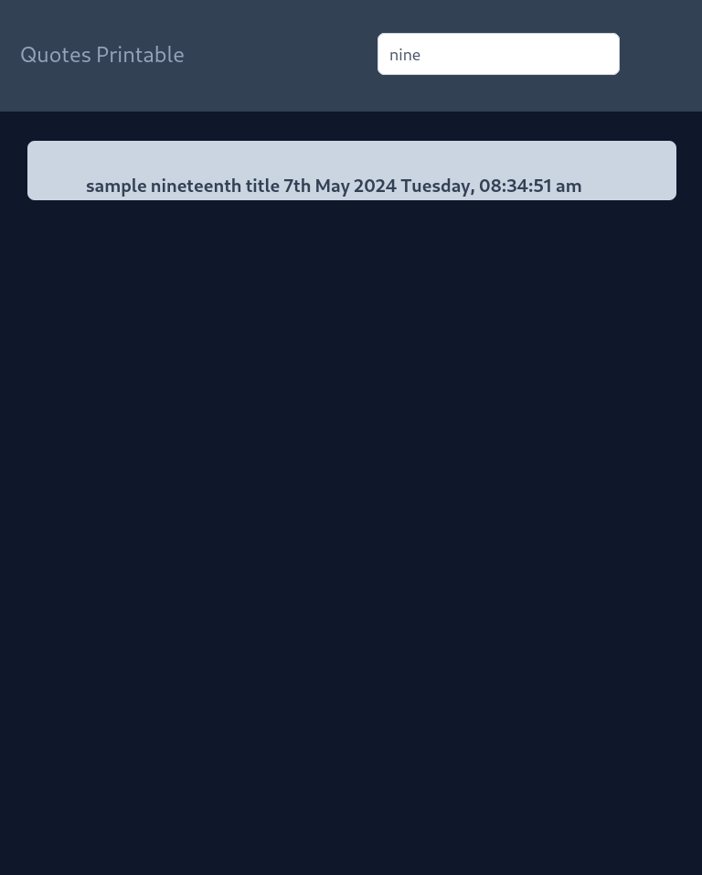

# printable

## scaffolding

On the server, starting from my home directory:

```sh
mkdir -p webapps/vue
cd webapps/vue/
npm create vue@latest
cd printable/
npm install
npm i axios
npm i jspdf
```

## prepare environment for developing and preview

```sh
sudo ufw status verbose
sudo ufw status numbered
sudo ufw allow from 192.168.1.0/24 proto tcp to any port 8080
sudo ufw status numbered
sudo ufw reload
```

Edit package.json to the line indicating preview from this:

```json
"preview": "vite preview",
```

to this:

```json
"preview": "vite preview --host 0.0.0.0 --port 8080",
```

Then, issue the following commands from the server, in the directory of the project under development:

```sh
npm run build
npm run preview
```

Then, to check the connectivity, I will need to move to the client and type the following command from the terminal:

```sh
sudo nmap 192.168.122.103 -Pn -p 8080
```

Finally, I can type the following address:

```text
http://192.168.1.XXX:8080
```

on the respective browser bar and get a preview of the micro-frontend web application.

To facilitate the development of the micro-frontend I made the following changes,

file `package.json`:

```json
"dev": "vite build --mode development",
```

file `vite.config.js`:

```js
// import { OUT_DIR_NAME, URL_BASE } from './env'

// https://vitejs.dev/config/
export default defineConfig(({ mode }) => ({
  plugins: [vue(), VueDevTools()],
  resolve: {
    alias: {
      '@': fileURLToPath(new URL('./src', import.meta.url))
    }
  },
  define: {
    __VUE_PROD_DEVTOOLS__: mode !== 'production'
  }
  // build: {
  //   outDir: OUT_DIR_NAME
  // },
  // base: URL_BASE
}))
```

Additionally, at the root of the micro-frontend project I added the `env.js` file to set some environment variables:

```js
export const BASE = 'https://192.168.1.XXX'
export const OUT_DIR_NAME = 'printable'
export const URL_BASE = 'https://192.168.1.XXX/printable'
export const ARTICLES_API = '/api/articles'
export const API_TOKEN = 'the_token_should_be_pasted_here'
```

Of course, the IP address must be set appropriately so that it is valid.

## integrate Tailwind in this micro-frontend application

1. Tailwind and its official plugins

```sh
npm i -D tailwindcss postcss autoprefixer
npm i -D @tailwindcss/typography @tailwindcss/forms @tailwindcss/aspect-ratio
```

2. I create a configuration file

```sh
npx tailwindcss init -p
```

I edit tailwind.config.js

```js
import typography from '@tailwindcss/typography'
import forms from '@tailwindcss/forms'
import aspectRatio from '@tailwindcss/aspect-ratio'

/** @type {import('tailwindcss').Config} */
export default {
  content: ['./index.html', './src/**/*.{vue,js,ts,jsx,tsx}'],
  theme: {
    extend: {}
  },
  plugins: [typography, forms, aspectRatio]
}
```

3. I add Tailwind directive on CSS

I edit src/style.css

```css
@tailwind base;
@tailwind components;
@tailwind utilities;
```

4. I add into .eslintrc.cjs

```js
...
    rules: {
        "vue/no-multiple-template-root": "off"
    }
...
```

5. I add into ./vscode/settings.json

```json
...
    "files.associations": {
        "*.css": "tailwindcss",
    }
...
```

6. I add into package.json this line after "dev" command:

```json
"stylize": "npx tailwindcss -i ./src/style.css -o ./src/assets/main.css",
```

And now I can run development build.

```sh
npm run dev
```

In another virtual terminal I go back to compiling the style sheet only when I need it with the following command:

```sh
npm run stylize
```

## view what has been developed so far

```sh
npm run dev && npm run preview
```

## a preview of the result

To generate the PDF document starting from the data stored in the database, simply click on the item listed.



## copy the application to the server

Now I edit the `vite.config.js` file once development is finished:

```js
import { fileURLToPath, URL } from 'node:url'

import { defineConfig } from 'vite'
import vue from '@vitejs/plugin-vue'
import VueDevTools from 'vite-plugin-vue-devtools'
import { OUT_DIR_NAME, URL_BASE } from './env'

// https://vitejs.dev/config/
export default defineConfig(({ mode }) => ({
  plugins: [vue(), VueDevTools()],
  resolve: {
    alias: {
      '@': fileURLToPath(new URL('./src', import.meta.url))
    }
  },
  define: {
    __VUE_PROD_DEVTOOLS__: mode !== 'production'
  }
  build: {
    outDir: OUT_DIR_NAME
  },
  base: URL_BASE
}))
```

At this point I can issue the following commands:

```sh
cd ~/webapps/vue/printable/
npm run build
```

and then move the result into the `public` directory of the main project:

```sh
mv printable/ /var/www/html/v3/quotes/public/
```

but, in case I have already done a first deploy of this application, it will first be necessary to remove what is present in the `public` directory of the project::

```sh
rm --recursive /var/www/html/v3/quotes/public/printable/
mv printable/ /var/www/html/v3/quotes/public/
```

Naturally, it will be necessary to create a link on the landing page of the main project that refers to the micro-frontend application just deployed.

## check for updates

```sh
cd ~/webapps/vue/printable/
npm outdated
```

## do the update

```sh
cd ~/webapps/vue/printable/
npm update
npm run stylize && npm run build
rm --recursive /var/www/html/v3/quotes/public/printable/
mv printable/ /var/www/html/v3/quotes/public/
```
