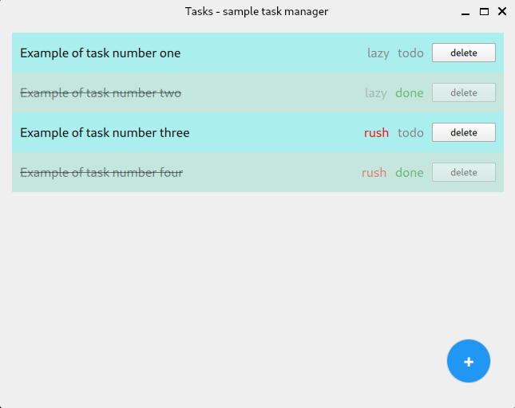
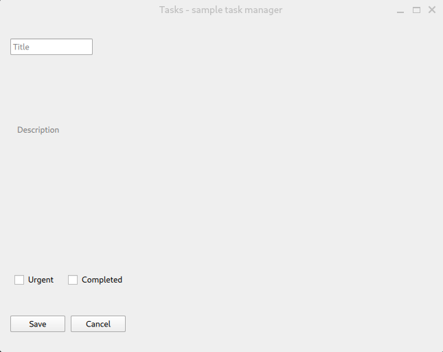
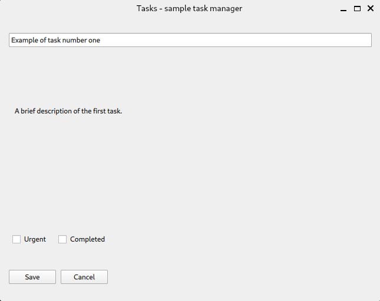

# Tasks

A simple project developed for educational and demonstration purposes using the open source version of the Qt6 framework.

## screenshots







## project structure

```txt
.
├── assets
│   ├── icon.svg
│   ├── logo.svg
│   └── style.qss
├── CMakeLists.txt
├── README.md
├── resources.qrc
└── src
    ├── Functions.cpp
    ├── Functions.h
    ├── main.cpp
    ├── main.qml
    ├── pages
    │   ├── EditTaskPage.qml
    │   ├── NewTaskPage.qml
    │   └── TaskListPage.qml
    ├── Task.cpp
    ├── Task.h
    ├── TaskModel.cpp
    ├── TaskModel.h
    ├── TaskProvider.cpp
    ├── TaskProvider.h
    └── widgets
        ├── ScaffoldWithAppBar.qml
        └── TaskTile.qml
```

## settings file

**Please note that file paths depend on the Linux distribution you are using.**

The following are the four main settings files exposed for example purposes only:

### settings.json

```json
{
  "cmake.configureOnOpen": false,
  "cmake.sourceDirectory": "${workspaceFolder}",
  "cmake.buildDirectory": "${workspaceFolder}/build",
  "C_Cpp.default.configurationProvider": "ms-vscode.cmake-tools",
  "files.exclude": {
    "**/build": true
  },
  "cSpell.words": []
}
```

### .vscode/launch.json

```json
{
  "configurations": [
    {
      "name": "Qt Quick (CMake)",
      "type": "cppdbg",
      "request": "launch",
      "program": "${workspaceFolder}/build/${workspaceFolderBasename}",
      "args": [],
      "stopAtEntry": false,
      "cwd": "${workspaceFolder}",
      "environment": [],
      "externalConsole": true
    }
  ]
}
```

### .vscode/CMakePresets.json

```json
{
  "version": 3,
  "cmakeMinimumRequired": {
    "major": 3,
    "minor": 19,
    "patch": 0
  },
  "configurePresets": [
    {
      "name": "default",
      "hidden": false,
      "generator": "Unix Makefiles",
      "binaryDir": "${sourceDir}/build",
      "cacheVariables": {
        "CMAKE_BUILD_TYPE": "Debug"
      }
    }
  ]
}
```

### .vscode/c_cpp_properties.json

```json
{
  "configurations": [
    {
      "name": "Linux-GCC",
      "compileCommands": "${workspaceFolder}/compile_commands.json",
      "includePath": [
        "${workspaceFolder}/**",
        "/usr/include",
        "/usr/include/x86_64-linux-gnu",
        "/usr/include/x86_64-linux-gnu/qt6",
        "/usr/include/x86_64-linux-gnu/qt6/QtCore",
        "/usr/include/x86_64-linux-gnu/qt6/QtGui",
        "/usr/include/x86_64-linux-gnu/qt6/QtWidgets",
        "${workspaceFolder}/build"
      ],
      "defines": [],
      "intelliSenseMode": "linux-gcc-x64",
      "cStandard": "c11",
      "cppStandard": "c++17",
      "browse": {
        "path": [
          "${workspaceFolder}",
          "/usr/include",
          "/usr/include/x86_64-linux-gnu",
          "/usr/include/x86_64-linux-gnu/qt6",
          "${workspaceFolder}/build"
        ],
        "limitSymbolsToIncludedHeaders": true,
        "databaseFilename": ""
      }
    }
  ],
  "version": 4
}
```

## build

### a first way to proceed

Only if necessary:

```shell
cd ..
rm -Rf build/
```

then type:

```shell
mkdir build && cd build && cmake .. -DCMAKE_BUILD_TYPE=Debug && cmake --build .
```

### in an alternative way

Only if necessary:

```shell
cd ..
rm -Rf build/
```

then type:

```shell
mkdir build && cd build && cmake .. -DCMAKE_BUILD_TYPE=Debug -DCMAKE_EXPORT_COMPILE_COMMANDS=ON && cmake --build . --verbose
```

## run

```shell
ls -l
./Tasks
```

## re-build

```shell
cd .. && rm -Rf build/ && mkdir build && cd build && cmake .. -DCMAKE_BUILD_TYPE=Debug -DCMAKE_EXPORT_COMPILE_COMMANDS=ON && cmake --build . --verbose
```

## what to do if vscode reports errors that are actually false positives

By opening a shell in the project root, you can proceed as follows:

```shell
rm -Rf build/
mkdir build && cd build
cmake .. -DCMAKE_BUILD_TYPE=Debug -DCMAKE_EXPORT_COMPILE_COMMANDS=ON
cmake --build . --verbose
ls compile_commands.json
cd ..
ln -sf build/compile_commands.json compile_commands.json
ls compile_commands.json
```

Now you can get feedback on the outcome of what you just did by closing and reopening the project.
