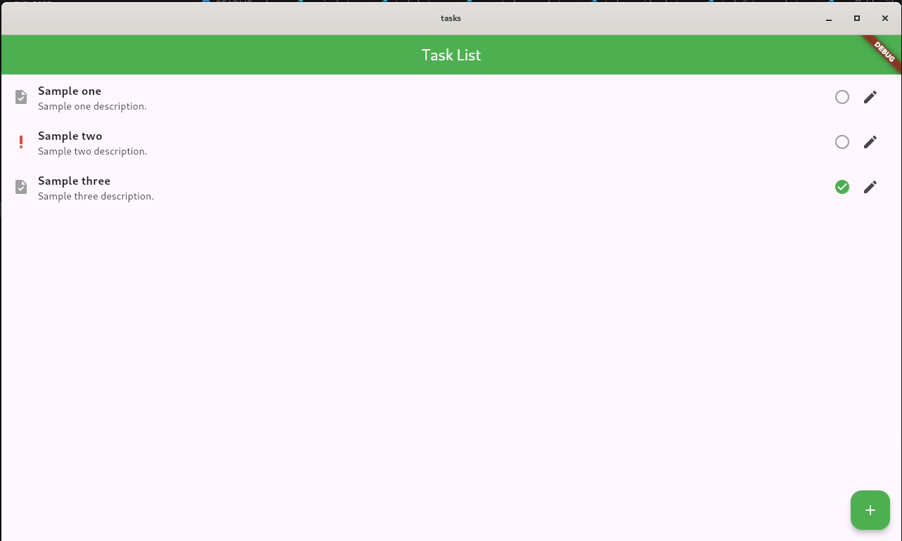
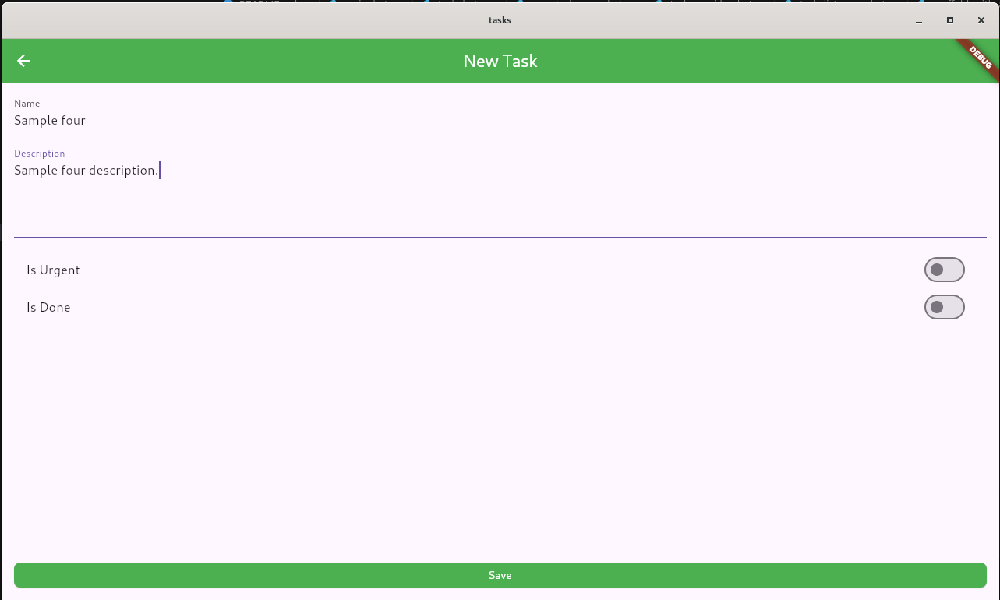
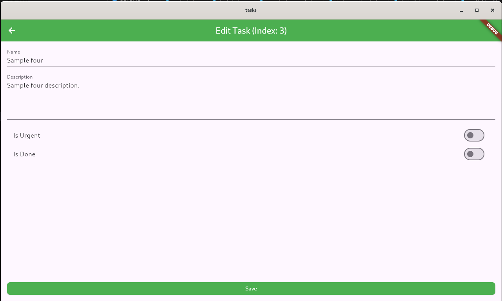
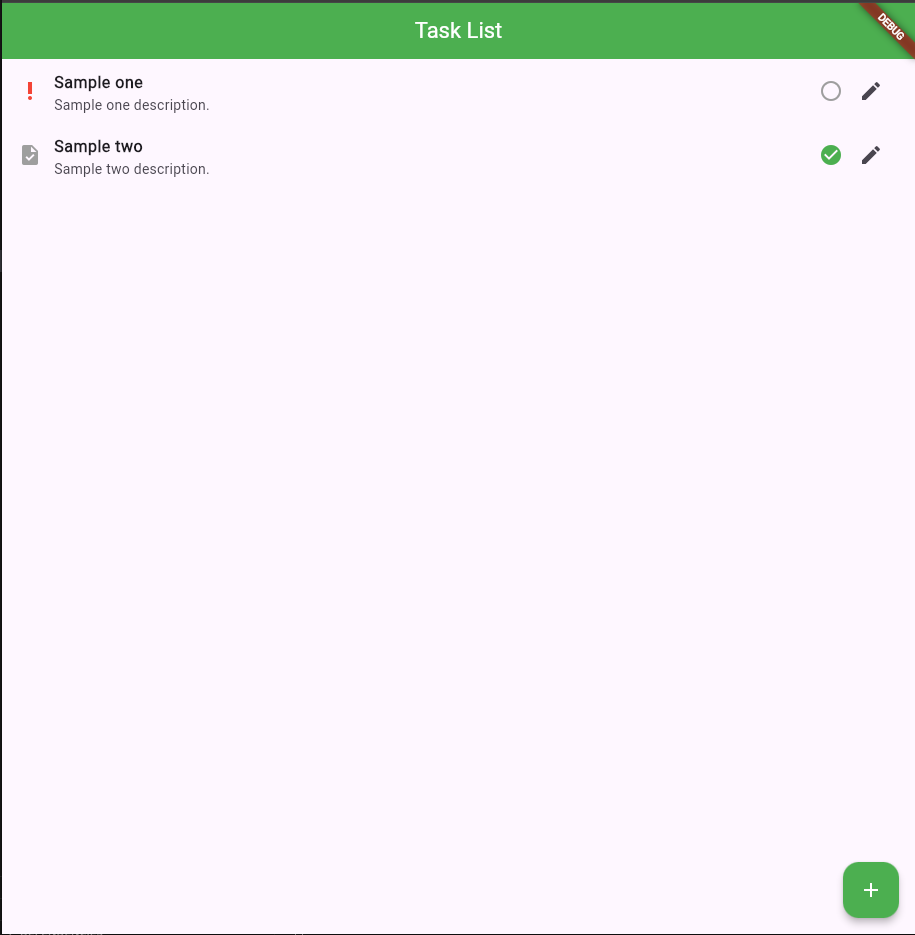
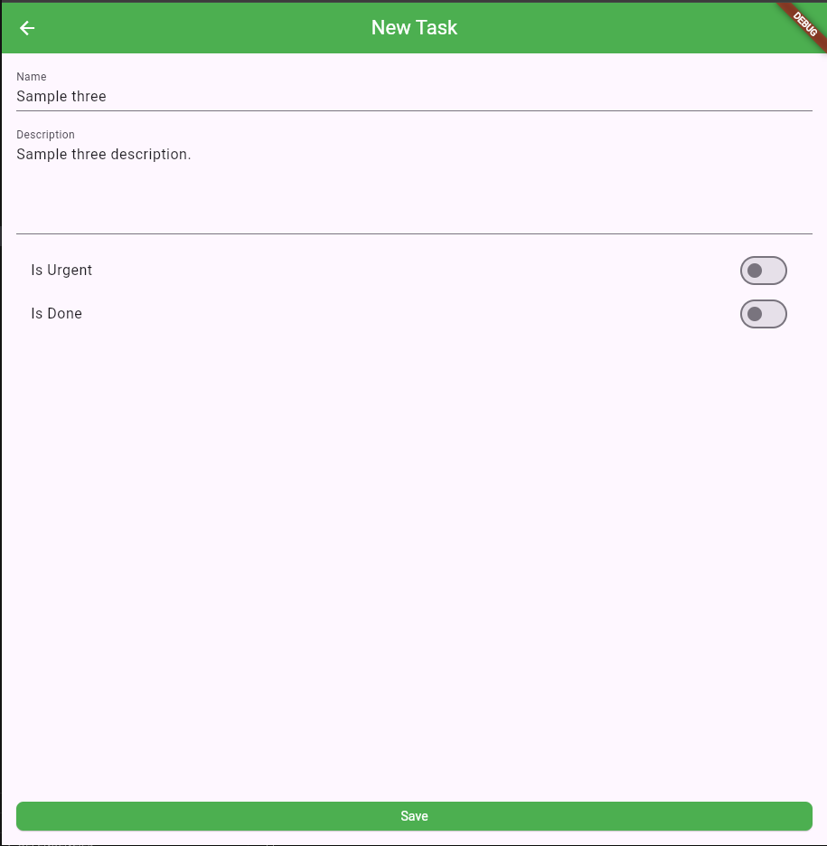
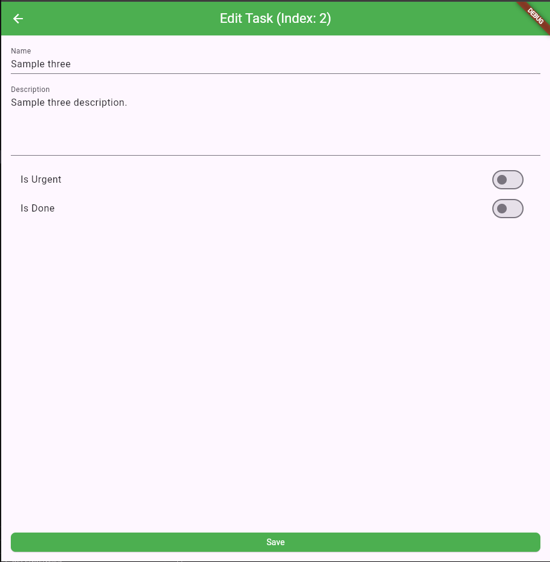

# tasks

A simple application to become familiar with layouts.

## tree of `tasks` project

```text
.
├── lib
│   ├── main.dart
│   ├── models
│   │   └── task.dart
│   ├── providers
│   │   └── task_provider.dart
│   ├── screens
│   │   ├── edit_task_page.dart
│   │   ├── new_task_page.dart
│   │   └── task_list_page.dart
│   ├── utils
│   │   └── functions.dart
│   └── widgets
│       ├── scaffold_with_app_bar.dart
│       └── task_tile.dart
└── pubspec.yaml
```

## scaffolding

Create app:

```shell
flutter create --suppress-analytics \
--template=app \
--platforms linux,web,android \
--empty \
--description "A simple application to become familiar with layouts." \
--org "local.hologram" \
--android-language kotlin \
tasks
```

Go to directory project:

```shell
cd tasks/
```

Install dependencies:

```shell
flutter pub add provider
```

Try this app on linux:

```shell
flutter run --device-id linux
```

Try app on chrome:

```shell
flutter run --device-id chrome
```

Try app on android:

```shell
flutter emulators
```

and now type:

```shell
flutter emulators --launch id_of_emulator && flutter devices && flutter run --device-id emulator-5554
```

## WASM

Check configurations:

```shell
flutter doctor -v
flutter config --enable-web
```

To run type:

```shell
flutter run --wasm --device-id chrome
```

To build app type:

```shell
flutter build web --wasm
```

Build for debug:

```shell
flutter build web --wasm --debug
```

Build for production environment:

```shell
flutter build web --wasm --release
```

## Screenshots

### desktop device







### browser device







### mobile device


