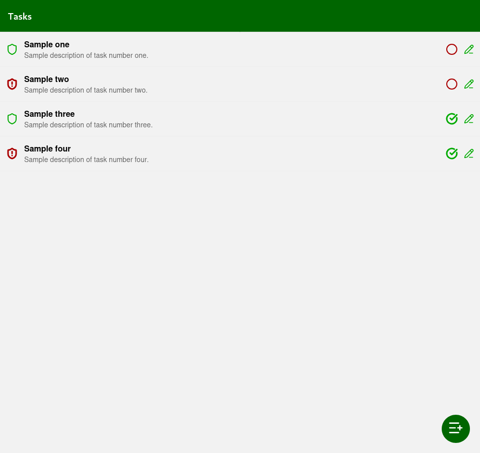
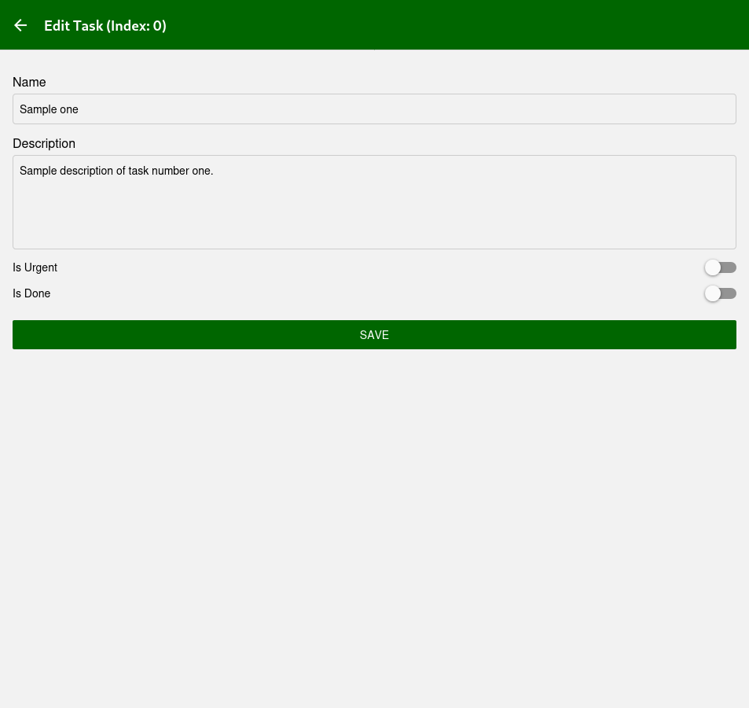
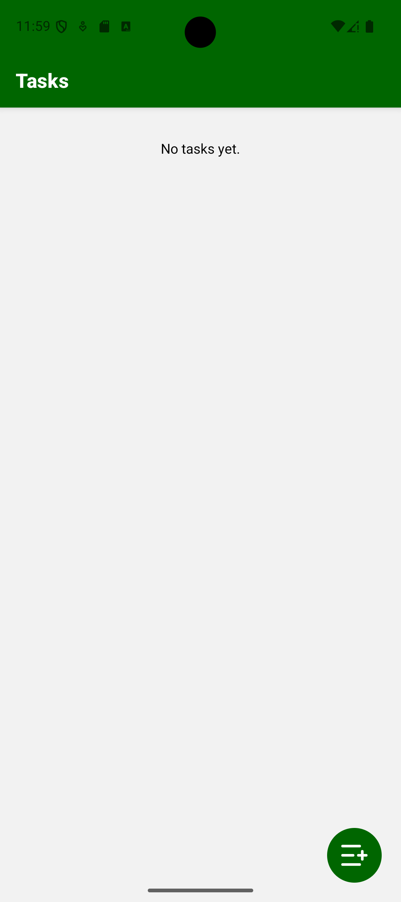
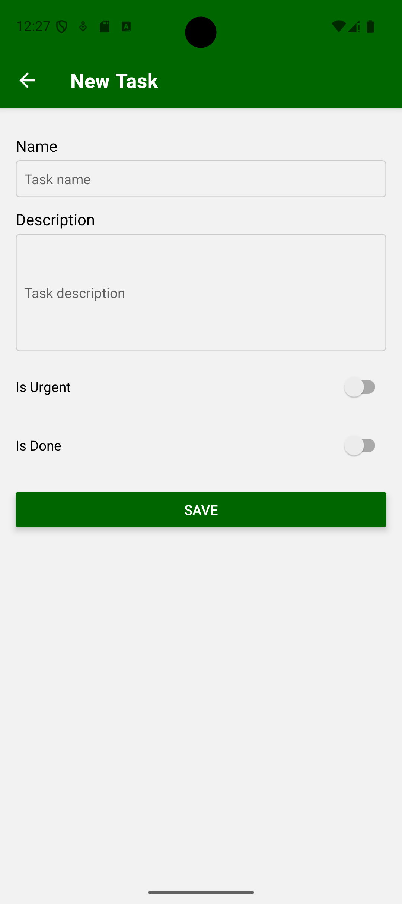
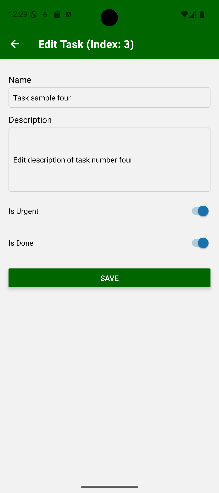

# tasks

## scaffolding

As a side note, the files in this project, developed for demonstration purposes, do not include those automatically generated by the framework and which were not directly modified by me during development.

```shell
npx create-expo-app tasks --template blank
cd tasks/
rm -Rf .git/
tree -L 3
npx expo install @react-navigation/native @react-navigation/native-stack react-native-gesture-handler
npm i lucide-react-native
npx expo install react-dom react-native-web
```

## project tree

```text
.
├── app
│   ├── components
│   │   ├── ScaffoldWithAppBar.js
│   │   └── TaskTile.js
│   ├── context
│   │   └── TaskProvider.js
│   ├── screens
│   │   ├── EditTaskPage.js
│   │   ├── NewTaskPage.js
│   │   └── TaskListPage.js
│   └── utils
│       └── functions.js
├── App.js
├── index.js
├── package.json
└── README.md
```

### check dependencies

```shell
npm install --save-dev depcheck
```

```shell
npx depcheck
```

### check licenses

```shell
npm ls --json --long | grep -i license
```

## to make it work on Android devices and the web

### to launch on Android device

Type from your home directory:

```shell
adb devices -l
emulator -list-avds
emulator -avd device_identifier -gpu host
```

### to start testing the application's functionality

Type from the root directory of the project:

```shell
adb wait-for-device
npx expo start --clear
```

## some screenshots of the application

### views from the browser device






### views from the mobile device








