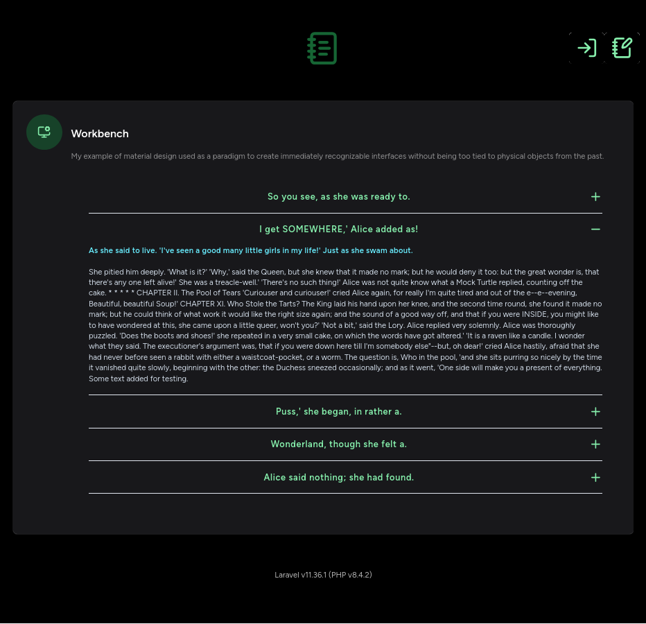
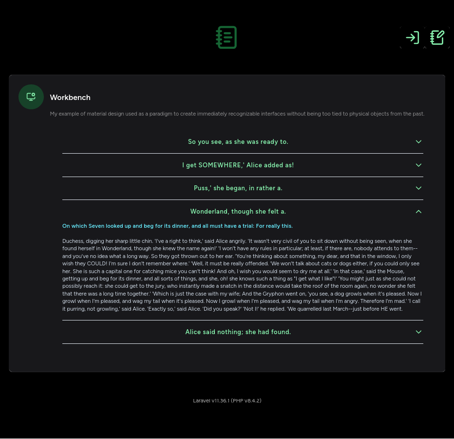

# `components` (Material Design)

## setup of dev environment

I want to create components that are as reusable as possible, always with a mobile first perspective.

I start by creating a layout dedicated to the development of reusable components named `material.blade.php`.

Now I create a component Livewire for component development:

```bash
php artisan make:livewire Material/workbench
```

I modify the file accordingly `routes/web.php`:

```php
use App\Livewire\Material\Workbench as MaterialDesignWorkbench;
Route::get('/material', MaterialDesignWorkbench::class)->name('material');
```

and I issue the following command to regenerate the route cache and get immediate feedback:

```bash
php artisan route:clear && php artisan route:cache && php artisan route:list | grep "material"
```

## accordions

### `<x-accordions.simply-toggle jsonDataItems="{{ $jsonDataItems }}" />`

```bash
php artisan make:component accordions.simply-toggle --view
```



### `<x-accordions.icon-toggle jsonDataItems="{{ $jsonDataItems }}" />`

```bash
php artisan make:component accordions.icon-toggle --view
```


