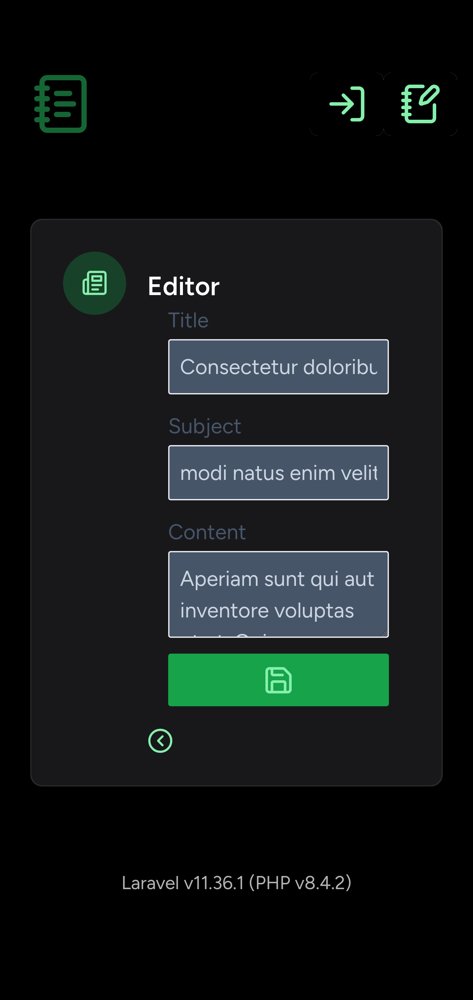

# development of `thesis` web application

Apply the mobile first paradigm:



## first scaffold

```bash
cd /var/www/html/
composer create-project laravel/laravel thesis
cd thesis/
sudo chown --recursive developer_username:apache .
chmod --recursive 775 bootstrap/cache && chmod --recursive 775 storage && chmod --recursive 775 database
```

### parameter for generate keys:

Here is just an example of the parameters to keep on hand:

```text
[national_acronym]
[state]
[city]
thesis-php84.local
thesis-php84.local
thesis-php84.local
[webmaster@localhost]
```

It is obvious that the first three parameters must be appropriately valued.

Therefore I can proceed with the generation of the self-signed certificate without the passphrase thanks to the `-nodes` flag:

```bash
ls -al /etc/ssl/
sudo openssl req -new -x509 -nodes -days 365 -newkey rsa:2048 -keyout /etc/ssl/private/thesis-php84.key -out /etc/ssl/certs/thesis-php84.crt
sudo ls -al /etc/ssl/private/
sudo ls -al /etc/ssl/certs/
```

### file `/etc/httpd/conf.d/thesis-php84.local.conf`

```bash
sudo nano /etc/httpd/conf.d/thesis-php84.local.conf
```

```xml
<VirtualHost *:80>
        ServerAdmin webmaster@localhost
        ServerName thesis-php84.local
        ServerAlias www.thesis-php84.local
        DocumentRoot /var/www/html/thesis/public
        Redirect permanent "/" "https://thesis-php84.local/"
</VirtualHost>

<VirtualHost *:443>
        ServerAdmin webmaster@localhost
        ServerName thesis-php84.local
        ServerAlias www.thesis-php84.local
        DocumentRoot /var/www/html/thesis/public

        <Directory /var/www/html/thesis/public>
                Options Indexes FollowSymLinks MultiViews
                AllowOverride All
                Require all granted
        </Directory>

        SSLEngine on

        SSLCertificateFile /etc/ssl/certs/thesis-php84.crt
        SSLCertificateKeyFile /etc/ssl/private/thesis-php84.key

        ErrorLog /var/log/httpd/thesis-php84_error_log

        <FilesMatch "\.(cgi|shtml|phtml|php)$">
                SSLOptions +StdEnvVars
        </FilesMatch>
</VirtualHost>
```

### application scaffolding

With developer user credentials:

```bash
sudo apachectl configtest
sudo systemctl reload httpd
systemctl status httpd --no-pager
```

If I encounter any problems I can investigate with the following command:

```bash
journalctl -u httpd --since today --no-pager
```

### continuation of scaffolding

```bash
composer show | grep "livewire"
composer require livewire/livewire
npm install
npm run build
php artisan migrate:status
```

### to improve the development of `Livewire` components

```bash
composer require wire-elements/wire-spy --dev
```

### fix coding stile with `pint`

```bash
./vendor/bin/pint --help
./vendor/bin/pint --test
./vendor/bin/pint
```

## install Pest

```bash
composer require --dev --with-all-dependencies pestphp/pest
./vendor/bin/pest --init
composer require --dev pestphp/pest-plugin-laravel
```

### migrate all tests from PHPUnit to Pest

```bash
composer require --dev pestphp/pest-plugin-drift
./vendor/bin/pest --drift
```

### run all the tests

Please, pay attention, to verify the validity of the texts with the `--coverage` option, it is necessary to have appropriately modified the `php.ini` file with, for example, a line similar to the following:

```ini
xdebug.mode=develop,debug,trace,coverage
```

```bash
php artisan test --coverage
```

## how to check installed packages

```bash
composer show --help
composer show
composer show --tree
composer show | grep laravel
composer show | grep pest
```

## how to check licenses of installed packages

```bash
composer require --dev dominikb/composer-license-checker
./vendor/bin/composer-license-checker help
./vendor/bin/composer-license-checker list
./vendor/bin/composer-license-checker check
./vendor/bin/composer-license-checker report
```

## commands that may prove useful

```bash
composer suggest --all
```

To diagnose any problems:

```bash
composer --help diagnose
composer diagnose
```

## how to create a new testing class with Pest

```bash
php artisan make:test --help
```

### `web` routes example test

```bash
php artisan make:test --pest WelcomeFeatureTest
```

```php
<?php

test('welcome feature test', function () {
    $response = $this->get('/');

    $response->assertStatus(200);
});
```

```bash
php artisan test --filter WelcomeFeatureTest
```

## update dependencies to the latest version

```bash
composer update --help
composer update --ignore-platform-reqs
```

## reset the entire database

Edit `.env`:

```env
# DB_CONNECTION=sqlite

# thesis_db_v1
DB_CONNECTION=mariadb
DB_HOST=127.0.0.1
DB_PORT=3306
DB_DATABASE=thesis_db_v1
DB_USERNAME=developer_username
DB_PASSWORD=developer_password

# IP address of LLM server on the same local network
OLLAMA_URL=http://192.168.1.XXX:11434/v1
```

Create a new database with collection type `utf8_unicode_ci`, and type:

```bash
php artisan db:wipe
php artisan migrate:fresh
php artisan migrate:status
```

### only if I need to go back to the previous migration

```bash
php artisan migrate:rollback
```

## I have to remember to issue the following commands when I add a new route and it is not listed:

```bash
npm run build
chmod --recursive 775 bootstrap/cache
chmod --recursive 775 storage
chmod --recursive 775 database
chown --recursive developer_username:apache .
php artisan route:cache && php artisan route:clear && php artisan route:list
```

and, if I am examining the presence of a specific route, the following command has been useful to me:

```bash
php artisan route:list | grep "help"
```

## to get inspired to write custom commands

```bash
php artisan inspire
```

## a library for generate SVG charts

```bash
composer require maantje/charts
```

## libraries for processing typical office documents

Documents such as spreadsheets, text documents, and documents suitable for printing:

```bash
composer require tecnickcom/tc-lib-pdf
composer require phpoffice/phpspreadsheet
composer require phpoffice/phpword
```

## to integrate a Laravel web application with an LLM service

```bash
composer require echolabsdev/prism
php artisan vendor:publish --tag=prism-config
./vendor/bin/composer-license-checker report
```

and edit `config/prism.php` like this:

```php
<?php

return [
    'prism_server' => [
        // The middleware that will be applied to the Prism Server routes.
        'middleware' => [],
        'enabled' => env('PRISM_SERVER_ENABLED', true),
    ],
    'providers' => [
        'ollama' => [
            'url' => env('OLLAMA_URL', 'http://localhost:11434/v1'),
        ],
    ],
];
```

Finally, a further check on the licenses of the packages installed in the web application:

```bash
./vendor/bin/composer-license-checker report
```

### `BasicLlmUnitTest`

```bash
php artisan make:test --pest --unit BasicLlmUnitTest
```

```php
<?php

use EchoLabs\Prism\Prism;
use EchoLabs\Prism\Enums\Provider;
use EchoLabs\Prism\ValueObjects\Usage;
use EchoLabs\Prism\Enums\FinishReason;
use EchoLabs\Prism\Providers\ProviderResponse;

test('basic LLM unit test', function () {

    $fakeProvidedResponse = new ProviderResponse(
        text: 'This is a basic LLM test!',
        toolCalls: [],
        usage: new Usage(10, 20),
        finishReason: FinishReason::Stop,
        response: ['id' => 'fake_provided_1', 'model' => 'fake_model']
    );

    $fakePrism = Prism::fake([$fakeProvidedResponse]);

    $prismResponse = Prism::text()
        ->using(Provider::Ollama, 'llama3.2')
        ->withPrompt('Hello!')
        ->generate();

    var_dump($prismResponse->text);

    expect($prismResponse->text)->toBe('This is a basic LLM test!');
});
```

```bash
php artisan test --filter BasicLlmUnitTest
```

## thesis data tables

### model `Article`

```bash
php artisan make:model --migration --factory --seed Article
php artisan livewire:form ArticleForm
```

### model `Author`

```bash
php artisan make:model --migration --factory --seed Author
php artisan livewire:form AuthorForm
```

### model `Contributor`

```bash
php artisan make:model --migration --pivot Contributor
php artisan livewire:form ContributorForm
```

I must remember to add:

```php
use HasFactory;
```

to the above mentioned class.

Now I create the factory and seeder files:

```bash
php artisan make:factory --model Contributor ContributorFactory
php artisan make:seed ContributorSeeder
```

### model `ScannedDocument`

```bash
php artisan make:model --migration --factory --seed ScannedDocument
php artisan livewire:form ScannedDocumentForm
```

### model `Documentation`

```bash
php artisan make:model --migration --factory --seed Documentation
php artisan livewire:form DocumentationForm
```

### model `Statistic`

```bash
php artisan make:model --migration --factory --seed Statistic
php artisan livewire:form StatisticForm
```

### model `Admin`

```bash
php artisan make:model --migration --factory --seed Admin
php artisan livewire:form AdminForm
```

### data model definition, factories, seeders and migration

```bash
php artisan migrate:status
php artisan migrate --pretend
php artisan migrate
php artisan migrate:status
php artisan model:show Article
php artisan model:show Author
php artisan model:show ScannedDocument
php artisan model:show Documentation
php artisan model:show Statistic
php artisan model:show Admin
php artisan model:show User
php artisan db:show
php artisan db:show --counts
php artisan db:table -- articles
php artisan db:table -- authors
php artisan db:table -- scanned_documents
php artisan db:table -- documentations
php artisan db:table -- statistics
php artisan db:table -- users
```

Check:

```bash
php artisan tinker
```

and now:

```sh
App\Models\Article::all()
App\Models\Author::all()
App\Models\Contributor::all()
App\Models\ScannedDocument::all()
App\Models\Documentation::all()
App\Models\Statistic::all()
App\Models\Admin::all()
App\Models\User::all()
quit
```

## rollback

```bash
php artisan migrate:rollback
```

## thesis UI

### `Article` components

```bash
php artisan make:livewire Article/index
php artisan make:livewire Article/filter
php artisan make:livewire Article/catalog
php artisan make:livewire Article/create
php artisan make:livewire Article/read
php artisan make:livewire Article/edit
php artisan make:livewire Article/upload-images
php artisan make:livewire Article/download-images
```

### `Author` components

```bash
php artisan make:livewire Author/index
php artisan make:livewire Author/create
php artisan make:livewire Author/read
php artisan make:livewire Author/edit
```

### `ScannedDocument` components

```bash
php artisan make:livewire ScannedDocument/index
php artisan make:livewire ScannedDocument/create
php artisan make:livewire ScannedDocument/read
php artisan make:livewire ScannedDocument/edit
```

### `Documentation` components

```bash
php artisan make:livewire Documentation/index
php artisan make:livewire Documentation/create
php artisan make:livewire Documentation/read
php artisan make:livewire Documentation/edit
```

### `Statistic` components

```bash
php artisan make:livewire Statistic/query
php artisan make:livewire Statistic/response
php artisan make:livewire Statistic/catalog
```

### `Admin` components

```bash
php artisan make:livewire Admin/index
php artisan make:livewire Admin/create
php artisan make:livewire Admin/read
php artisan make:livewire Admin/edit
```

### `User` components

```bash
php artisan make:livewire User/index
php artisan make:livewire User/create
php artisan make:livewire User/read
php artisan make:livewire User/edit
```

### `View` components

```bash
php artisan make:livewire View/greeter
php artisan make:livewire View/dashboard
php artisan make:livewire View/admin
php artisan make:livewire View/filtered
php artisan make:livewire View/search
php artisan make:livewire View/results
```

### create layout

Edit `web.php`:

```php
<?php

use App\Livewire\View\Search;
use Illuminate\Support\Facades\Route;

Route::get('/', Search::class);
```

```bash
php artisan livewire:layout
```

## install `Fortify`

```bash
composer require laravel/fortify
php artisan fortify:install
php artisan migrate:status
php artisan migrate --pretend
php artisan migrate
./vendor/bin/composer-license-checker report
```

## install Livewire `Volt`

```bash
composer require livewire/volt
php artisan volt:install
./vendor/bin/composer-license-checker report
```

### `View` components

```bash
php artisan make:volt View/login --test --pest
php artisan make:volt View/register --class --test --pest
```

The requesting user model `Applicant`:

```bash
php artisan make:model --migration --factory --seed Applicant
php artisan livewire:form ApplicantForm
```

The components for admin `Applicant` model:

```bash
php artisan make:livewire Applicant/index --inline
php artisan make:livewire Applicant/acceptance --inline
php artisan make:livewire Applicant/read --inline
php artisan make:livewire Applicant/edit --inline
```

## add fields to `articles` table

```bash
php artisan make:migration --help
php artisan make:migration add_published_to_articles
php artisan make:migration add_notifications_to_articles
php artisan make:migration add_image_path_to_articles
php artisan make:migration add_sortable_token_to_articles
php artisan migrate:status
```

## add fields to `authors` table

```bash
php artisan make:migration add_email_checked_at_to_authors
php artisan make:migration add_temporary_token_to_authors
php artisan migrate:status
```

## I edit the latest models and migration files

### migrate `admins` table

```bash
php artisan migrate --pretend --path database/migrations/2024_12_16_130419_create_admins_table.php
php artisan migrate --path database/migrations/2024_12_16_130419_create_admins_table.php
php artisan migrate:status
```

### migrate `applicants` table

```bash
php artisan migrate --pretend --path database/migrations/2024_12_17_180041_create_applicants_table.php
php artisan migrate --path database/migrations/2024_12_17_180041_create_applicants_table.php
php artisan migrate:status
```

### migrate new fields to `articles` table

```bash
php artisan migrate --path database/migrations/2024_12_18_185843_add_published_to_articles.php
php artisan migrate --path database/migrations/2024_12_18_185930_add_notifications_to_articles.php
php artisan migrate --path database/migrations/2024_12_18_190004_add_image_path_to_articles.php
php artisan migrate --path database/migrations/2024_12_18_203527_add_sortable_token_to_articles.php
php artisan migrate:status
```

### migrate new fields to `authors` table

```bash
php artisan migrate --path database/migrations/2024_12_18_205215_add_email_checked_at_to_authors.php
php artisan migrate --path database/migrations/2024_12_18_205245_add_temporary_token_to_authors.php
php artisan migrate:status
```

### add fields to `admins` table

```bash
php artisan make:migration add_remember_token_to_admins
php artisan migrate:status
```

### migrate new fields to `admins` table

```bash
php artisan migrate --path database/migrations/2024_12_18_221350_add_remember_token_to_admins.php
php artisan migrate:status
```

### add fields to `applicants` table

```bash
php artisan make:migration add_remember_token_to_applicants
php artisan make:migration add_email_verified_at_to_applicants
php artisan migrate:status
```

### migrate new fields to `applicants` table

```bash
php artisan migrate --path database/migrations/2024_12_18_221634_add_remember_token_to_applicants.php
php artisan migrate --path database/migrations/2024_12_18_224028_add_email_verified_at_to_applicants.php
php artisan migrate:status
```

### I complete this part of the procedure with the last migration

```bash
php artisan migrate
php artisan migrate:status
```

## seeding

and, if I have already prepared what is needed to generate the test data, I can also send the following command:

```bash
php artisan db:seed
```

or, for a complete reset of the test data:

```bash
php artisan db:wipe && php artisan migrate:fresh && php artisan db:seed
```

and check:

```bash
php artisan db:show
php artisan db:show --counts
php artisan db:table -- admins
php artisan db:table -- users
php artisan db:table -- applicants
php artisan db:table -- articles
php artisan db:table -- authors
php artisan db:table -- contributor
php artisan db:table -- scanned_documents
php artisan db:table -- documentations
```

Check:

```bash
php artisan tinker
```

and now:

```sh
App\Models\Article::all()
App\Models\Author::all()
App\Models\Contributor::all()
App\Models\ScannedDocument::all()
App\Models\Documentation::all()
App\Models\Statistic::all()
App\Models\Admin::all()
App\Models\Applicant::all()
App\Models\User::all()
quit
```

Now I can delete the contents of the database I just seeded in one go:

```bash
php artisan migrate:fresh
```

or I can truncate the contents of a single table:

```bash
php artisan tinker
```

```sh
App\Models\Contributor::truncate()
quit
```

## to update development tools:

If I find that I don't have an updated version of composer just issue the following commands:

```bash
composer -v
su -
composer self-update
```

Later, when I need to update to the latest release of Node.js tools:

```bash
node -v
npm view node version
npm cache clean -f
npm install -g n
n stable
npm -v
npm view npm version
npm install -g npm@latest
```

## commands to update the packages used by the web application

Run the following commands to see what will actually update:

```bash
composer --help update
composer update --dry-run
npm outdated
```

and the following command to carry out the actual update:

```bash
composer update
npm update
```

### check the licenses of the packages used

Here are some utilities to choose from:

```bash
su -
npm install -g license-report
exit
```

and here are three tips on how to use them:

```bash
license-report --output=csv > licenses_report.csv
./vendor/bin/composer-license-checker report
```

### I added CleaningUtility class

```bash
php artisan make:class Utils/CleaningUtility
```

## routes

If, after having appropriately edited all files Blade and file `routes/web.php`, the routes defined there do not appear or an error indicating an undefined route is returned, the following commands may be useful:

```bash
php artisan route:list
php artisan route:list | grep "upload-images"
php artisan route:clear
php artisan route:cache
php artisan route:list
```

## to fix error 403 caused by directory `storage`

After having appropriately edited the file `config/filesystem.php`

```php
    'links' => [
        public_path('storage') => storage_path('app/public'),
        public_path('article_images') => storage_path('app/public/article_images'),
    ],
```

I should send the following commands:

```bash
php artisan storage --help
php artisan storage:link --help
php artisan storage:unlink --help
```

Create the symbolic links configured for the application:

```bash
php artisan storage:link
```

Create the symbolic link using relative paths:

```bash
php artisan storage:link --relative
```

## to create anonymous components

```bash
php artisan make:component forms.input-text-required --view
php artisan make:component forms.input-text-optional --view
php artisan make:component forms.downloadable-image --view
```

## `Playground` layout and views

I created this layout to exemplify the use of Alpine.js:

```bash
php artisan make:livewire Playground/message
php artisan make:livewire Playground/canvas
php artisan make:livewire Playground/binding
php artisan make:livewire Playground/toggle
php artisan make:livewire Playground/two-way-binding
php artisan make:livewire Playground/something
```

After creating a layout and adding an `playground` route, I can issue the following commands:

```bash
php artisan route:clear && php artisan route:cache && php artisan route:list | grep "playground"
```

### example of test on browser console

First the code:

```php
        {{-- feedback message --}}
        <div x-data="{ show: false, message: '' }"
            x-on:feedback.window="
                message = $event.detail.message;
                console.log(message);
                show = true;
                setTimeout(() => show = false, 2000);
            ">
            {{-- feedback message view --}}
            <p x-show="show" x-text="message" class="w-full h-10 dark:text-green-300 text-green-300/30"></p>
        </div>
```

Now I load the page in the browser and move to its console:

```javascript
let event = new CustomEvent("feedback", {
    detail: { message: "Hello world!" },
});
window.dispatchEvent(event);
```

now I type:

```javascript
event.detail.message;
```

and getting:

```javascript
"Hello world!";
```

## install Alpine.js plugin `@alpinejs/persist`

Optionally I can choose to install some plugins, according to my needs:

```bash
npm i @alpinejs/persist
```
