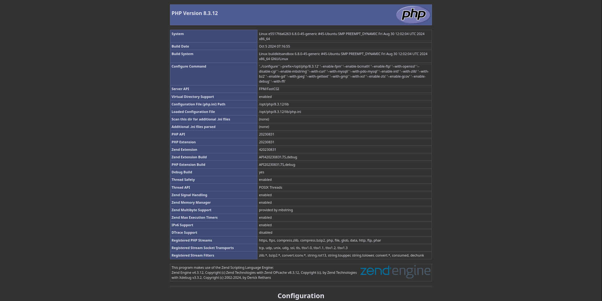

# `lamp-xdbg-8.3.12` how to customize an image named `lamp-xdbg-img:8.3.12`

*image used as a starting point for further developments, as the approach is to proceed step by step towards the final result*



I optimize the screenshot as follows:

```bash
ls -l lamp-xdbg-cntr-8-3-12_info_page.png
convert lamp-xdbg-cntr-8-3-12_info_page.png lamp-xdbg-cntr-8-3-12_info_page.jpg
mogrify -quality 35 lamp-xdbg-cntr-8-3-12_info_page.jpg
du -h lamp-xdbg-cntr-8-3-12_info_page*
identify -verbose lamp-xdbg-cntr-8-3-12_info_page.jpg
rm lamp-xdbg-cntr-8-3-12_info_page.png
```

## create an example of container

Below I will use `img` as an abbreviation for image and `cntr` as an abbreviation for container.

```bash
ls ~/project/templates/backend/lamp-xdbg-8.3.12
cd ~/project/templates/backend/lamp-xdbg-8.3.12
```

First I will need to create the settings files and web content in their respective directories.
The same files and directories that will be used in the `COPY` commands expressed in `Dockerfile`.
Including self-signed certificates, generated, for example, as follows:

```bash
ls -l conf/self-signed-certificates
openssl req -new -x509 -days 365 -out conf/self-signed-certificates/hologram.pem -keyout conf/self-signed-certificates/hologram.key
```

Here is just an example of the parameters to keep on hand:

```text
[long_passphrase]
[national_acronym]
[state]
[city]
hologram.local
hologram.local
hologram.local
[webmaster@localhost]
```

Long_passphrase generated with:

```bash
pwgen -s 48 1
```

It is obvious that the first four parameters must be appropriately valued.

A short script `echo_passphrase.sh` similar to the following must be written in directory `self-signed-certificates`:

```text
#!/bin/sh
echo "long_passphrase"
```

A directory must be created `mods-available` with a file inside named `dir.conf` containing text similar to the following:

```xml
<IfModule mod_dir.c>
        DirectoryIndex index.php index.html index.cgi index.pl index.xhtml index.htm
</IfModule>
```

A directory must be created `sites-available` with a file inside named `default-ssl.conf` containing the text:

```xml
<IfModule mod_ssl.c>
        <VirtualHost _default_:443>
                ServerAdmin webmaster@localhost
                ServerName hologram.local
                ServerAlias www.hologram.local
                DocumentRoot /var/www/html/landing/public

                <Directory /var/www/html/landing/public>
                    Options Indexes FollowSymLinks MultiViews
                    AllowOverride All
                    Require all granted
                </Directory>

                LogLevel warn

                ErrorLog ${APACHE_LOG_DIR}/error.log
                CustomLog ${APACHE_LOG_DIR}/access.log combined

                SSLEngine on

                SSLCertificateFile /etc/ssl/self_signed_certs/hologram.pem
                SSLCertificateKeyFile /etc/ssl/self_signed_certs/hologram.key

                <FilesMatch "\.(cgi|shtml|phtml|php)$">
                    SSLOptions +StdEnvVars
                </FilesMatch>

                <Directory /usr/lib/cgi-bin>
                    SSLOptions +StdEnvVars
                </Directory>
        </VirtualHost>
</IfModule>
```

and a file named `default-ssl.conf` with the following text:

```xml
<VirtualHost *:80>
        ServerAdmin webmaster@localhost
        ServerName hologram.local
        ServerAlias www.hologram.local
        DocumentRoot /var/www/html/landing/public

        <Directory /var/www/html/landing/public>
            Options Indexes FollowSymLinks MultiViews
            AllowOverride All
            Require all granted
        </Directory>

        LogLevel warn

        ErrorLog ${APACHE_LOG_DIR}/error.log
        CustomLog ${APACHE_LOG_DIR}/access.log combined
</VirtualHost>
```

### image build

Once the example web application is built I can issue the following command:

```bash
docker image ls | grep "lamp-xdbg-img"
cat Dockerfile
docker build --tag lamp-xdbg-img:8.3.12 .
```

The output of this command should also contain the digest of the newly created local image.

I continue with the verification of some details:

```bash
docker images --all
docker images --no-trunc --quiet lamp-xdbg-img:8.3.12
docker image inspect lamp-xdbg-img:8.3.12
```

### create the container

The `html` directory can contain either a simple html page or a web application developed using a JavaScript framework.

In addition, of course, to all the instructions needed to customize an image and get the container working.

Now I can proceed to create a container starting from the above image in privileged mode:

```bash
docker container ls --all
docker run --volume $(pwd)/html:/var/www/html --detach --name lamp-xdbg-cntr-8-3-12 --publish 8022:22 --publish 8080:80 --publish 8443:443 --publish 9003:9003 --pull=never  lamp-xdbg-img:8.3.12
docker container ls --all --size
docker exec --interactive --tty --privileged lamp-xdbg-cntr-8-3-12 bash
```

### open a bash shell in the container

Examples of commands typed into container shell:

```bash
ping -c 3 192.168.1.XXX
ip help
ip link
ip address
ip route
ip neigh
tail --follow --lines=20 /var/log/apache2/access.log
tail --follow --lines=20 /var/log/apache2/error.log
exit
```

### login via OpenSSH

I log in from the system that hosts the containers:

```bash
nmap 172.17.0.XXX -Pn -p 22
ssh root@172.17.0.XXX
```

and I try the following command to see if all the expected processes are running:

```bash
ps -eo 'tty,pid,comm' | grep ^?
```

### login from another host

Now I try to log in from the system that hosts the virtual machine that in turn hosts the containers:

```bash
nmap 192.168.1.XXX -Pn -p 8022
ssh root@192.168.1.XXX -p 8022
```

### example of sftp.json for `vscode`

```json
{
    "$schema": "http://json-schema.org/draft-07/schema",
    "name": "lamp-xdbg-cntr-8-3-12",
    "username": "root",
    "password": "some_password",
    "host": "192.168.1.XXX",
    "port": 8022,
    "remotePath": "/var/www/html",
    "connectTimeout": 20000,
    "uploadOnSave": true,
    "watcher": {
        "files": "dist/*.{js,css}",
        "autoUpload": false,
        "autoDelete": false
    },
    "syncOption": {
        "delete": true,
        "update": false
    },
    "ignore": [
        ".vscode",
        ".howto",
        ".docs",
        ".git",
        ".DS_Store",
        "TEMP",
        "nbproject",
        "probe.http"
    ]
}
```

### a simple debugging example

The source of the example follows:

```php
<?php

// example of debugging an iteration that uses a constant

const WELCOME = "Welcome to demo iteration number ";
$sample = "";

toIterate();

function toIterate() {
    for ($i = 0; $i < 10; $i++) {
        xdebug_break();
        $sample = WELCOME . $i . "!<br>";
        echo $sample;
    }
}
```

And here's what I got after starting the debugging session and refreshing the page in the browser I was using:


### stop the container

I can use the container name like this:

```bash
docker stop lamp-xdbg-cntr-8-3-12
docker container ls --all
```

### restart the container

I can proceed to restarting `lamp-xdbg-cntr-8-3-12` in privileged mode:

```bash
docker container ls --all
docker start lamp-xdbg-cntr-8-3-12
docker exec --interactive --tty --privileged lamp-xdbg-cntr-8-3-12 bash
```

## to clean up

### remove container

```bash
docker stop lamp-xdbg-cntr-8-3-12 && docker rm lamp-xdbg-cntr-8-3-12
docker container ls --all
```

### remove image

How to remove the custom image in question once I'm done testing or when I have an updated version.

```bash
docker image rm lamp-xdbg-img:8.3.12
docker image ls
```
