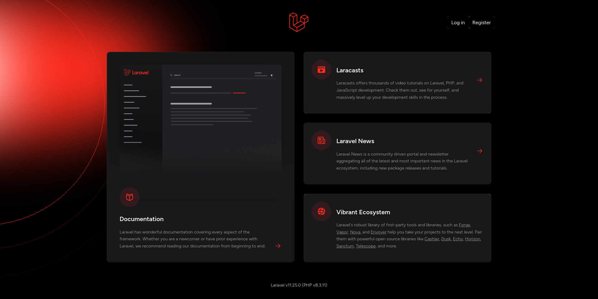
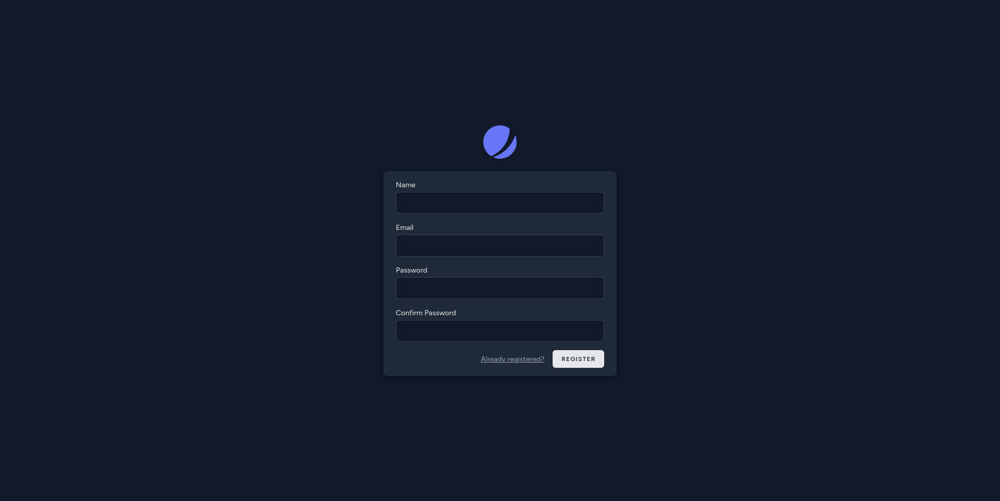

# `laravel-landing-1.1` how to customize an image named `laravel-landing-img:1.1`

*This demo does not use an external database, but simply stores data in a SQLite file.*

## create an example of container

Below I will use `img` as an abbreviation for image and `cntr` as an abbreviation for container.


I optimize the screenshot `laravel-landing-cntr-1-1_step_1` as follows:

```bash
ls -l laravel-landing-cntr-1-1_step_1.png
convert laravel-landing-cntr-1-1_step_1.png laravel-landing-cntr-1-1_step_1.jpg
mogrify -quality 45 laravel-landing-cntr-1-1_step_1.jpg
du -h laravel-landing-cntr-1-1_step_1*
rm laravel-landing-cntr-1-1_step_1.png
identify -verbose laravel-landing-cntr-1-1_step_1.jpg
```

```bash
ls ~/project/templates/frontend/laravel-landing-1.1
cd ~/project/templates/frontend/laravel-landing-1.1
```

First I will need to create the settings files and web content in their respective directories.
The same files and directories that will be used in the `COPY` commands expressed in `Dockerfile`.
Including self-signed certificates, generated, for example, as follows:

```bash
ls -l conf/self-signed-certificates
openssl req -new -x509 -days 365 -out conf/self-signed-certificates/hologram.pem -keyout conf/self-signed-certificates/hologram.key
```

Here is just an example of the parameters to keep on hand:

```text
[long_passphrase]
[national_acronym]
[state]
[city]
hologram.local
hologram.local
hologram.local
[webmaster@localhost]
```

Long_passphrase generated with:

```bash
pwgen -s 48 1
```

It is obvious that the first four parameters must be appropriately valued.

A short script `echo_passphrase.sh` similar to the following must be written in directory `self-signed-certificates`:

```text
#!/bin/sh
echo "long_passphrase"
```

A directory must be created `mods-available` with a file inside named `dir.conf` containing text similar to the following:

```xml
<IfModule mod_dir.c>
        DirectoryIndex index.php index.html index.cgi index.pl index.xhtml index.htm
</IfModule>
```

A directory must be created `sites-available` with a file inside named `default-ssl.conf` containing the text:

```xml
<IfModule mod_ssl.c>
        <VirtualHost _default_:443>
                ServerAdmin webmaster@localhost
                ServerName hologram.local
                ServerAlias www.hologram.local
                DocumentRoot /var/www/html/landing/public

                <Directory /var/www/html/landing/public>
                    Options Indexes FollowSymLinks MultiViews
                    AllowOverride All
                    Require all granted
                </Directory>

                LogLevel warn

                ErrorLog ${APACHE_LOG_DIR}/error.log
                CustomLog ${APACHE_LOG_DIR}/access.log combined

                SSLEngine on

                SSLCertificateFile /etc/ssl/self_signed_certs/hologram.pem
                SSLCertificateKeyFile /etc/ssl/self_signed_certs/hologram.key

                <FilesMatch "\.(cgi|shtml|phtml|php)$">
                    SSLOptions +StdEnvVars
                </FilesMatch>

                <Directory /usr/lib/cgi-bin>
                    SSLOptions +StdEnvVars
                </Directory>
        </VirtualHost>
</IfModule>
```

and a file named `default-ssl.conf` with the following text:

```xml
<VirtualHost *:80>
        ServerAdmin webmaster@localhost
        ServerName hologram.local
        ServerAlias www.hologram.local
        DocumentRoot /var/www/html/landing/public

        <Directory /var/www/html/landing/public>
            Options Indexes FollowSymLinks MultiViews
            AllowOverride All
            Require all granted
        </Directory>

        LogLevel warn

        ErrorLog ${APACHE_LOG_DIR}/error.log
        CustomLog ${APACHE_LOG_DIR}/access.log combined
</VirtualHost>
```

## scaffolding the application

Then I create the directory that will be used to consolidate the volume that will host the container web content and make the source code in it persistent:

```bash
mkdir html
composer --version
composer create-project laravel/laravel landing
```

Please note that the following are key steps for the correct functioning of the web application:

```bash
sudo -s
chown --recursive --verbose 1000:33 landing
cd landing
chmod --recursive 775 bootstrap/cache
chmod --recursive 775 storage
chmod --recursive 775 database
php artisan cache:clear
exit
```

In defining the owner and group of the directory `landing` I used the numeric identifiers obtained from the following command:

```bash
cat /etc/passwd
```

### image build

Once the example web application is built I can issue the following command:

```bash
docker image ls
cat Dockerfile
docker build --tag laravel-landing-img:1.1 .
```

The output of this command should also contain the digest of the newly created local image.

I continue with the verification of some details:

```bash
docker images --all
docker images --no-trunc --quiet laravel-landing-img:1.1
docker image inspect laravel-landing-img:1.1
```

### create the container

The `html` directory can contain either a simple html page or a web application developed using a JavaScript framework.

In addition, of course, to all the instructions needed to customize an image and get the container working.

Now I can proceed to create a container starting from the above image in privileged mode:

```bash
docker container ls --all
docker run --volume $(pwd)/html:/var/www/html --detach --name laravel-landing-cntr-1-1 --publish 8443:443 --pull=never laravel-landing-img:1.1
docker container ls --all --size
docker exec --interactive --tty --privileged laravel-landing-cntr-1-1 bash
```

### open a bash shell in the container

Examples of commands typed into container shell:

```bash
ip help
ip link
ip address
ip route
ip neigh
tail --follow --lines=20 /var/log/apache2/access.log
tail --follow --lines=20 /var/log/apache2/error.log
exit
```

### stop the container

I can use the container name like this:

```bash
docker stop laravel-landing-cntr-1-1
```

### further development of the web application

```bash
cd ~/project/templates/frontend/laravel-landing-1.1/html/landing/
ls -l
composer require laravel/jetstream
php artisan jetstream:install inertia --teams --dark --ssr
npm install
npm run build
sudo chown --recursive --verbose 1000:33 .
```






### restart the container

I can proceed to restarting `laravel-landing-cntr-1-1` in privileged mode:

```bash
docker container ls --all
docker start laravel-landing-cntr-1-1
docker exec --interactive --tty --privileged laravel-landing-cntr-1-1 bash
```

## to clean up

### remove container

```bash
docker stop laravel-landing-cntr-1-1 && docker rm laravel-landing-cntr-1-1
```

### remove image

How to remove the custom image in question once I'm done testing or when I have an updated version.

```bash
docker image rm laravel-landing-img:1.1
```

I'm checking to make sure I've cleaned up:

```bash
docker container ls --all
docker images --all
```
