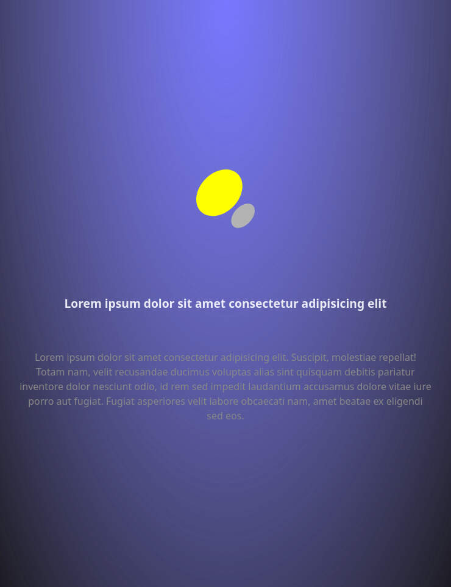

# landing

Landing page developed thanks to `React`.



Once the short development was finished I optimized the screenshot as follows:

```bash
ls -l landing_page.png
convert landing_page.png landing_page.jpg
mogrify -quality 65 landing_page.jpg
du -h landing_page*
identify -verbose landing_page.jpg
```

Scaffolding:

```bash
ls ~/project/templates/web/content/landing-1.0
cd ~/project/templates/web/content/landing-1.0
npm create vite@latest landing -- --template react
```

Install dependencies:

```bash
cd landing
npm install
```

Add this to `vite.config.js`:

```js
  server: {
    host: true,
    port: 8080
  },
```

Start development view:

```bash
npm run dev
```

Build dist code:

```bash
npm run build
```
