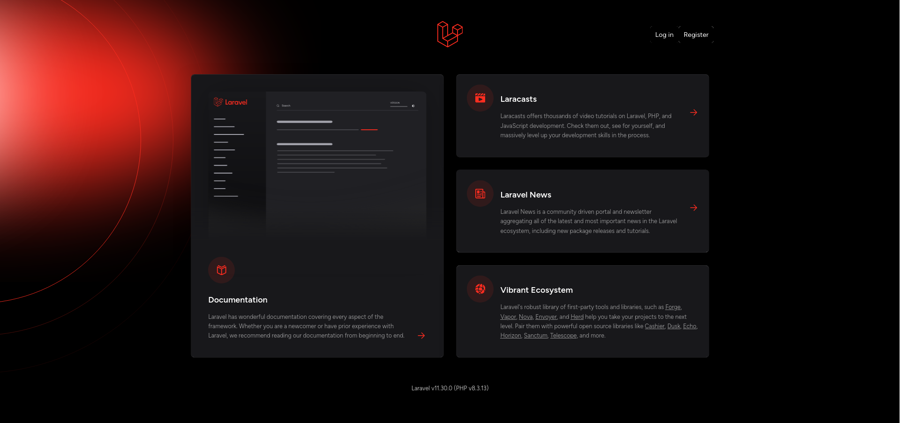

# `agora-be-cntr-1-0`



```bash
mkdir -p ~/projects/apps/agora/agora-1.0/backend/agora-be-cntr-1-0
ls ~/projects/apps/agora/agora-1.0/backend/agora-be-cntr-1-0/
cd ~/projects/apps/agora/agora-1.0/backend/agora-be-cntr-1-0/
```

### solve problems caused by SELinux

The `html` directory can contain either a simple html page or a web application developed using a JavaScript framework.

The best solution in my opinion is to act as the owner of the specific directory:

```bash
mkdir html && chcon --recursive --type=container_file_t html && ls -lZ
```

### create the container

The `html` directory can contain either a simple info PHP page. But this time the container has all the tools to develop an application from within and the above mentioned directory serves to make this operation permanent, even after the container is stopped.

Here are all the instructions you need to customize an image and get the container working:

```bash
podman image list | grep lamp-app-img
podman container list --all
podman run --volume $(pwd)/html:/var/www/html --detach --name agora-be-cntr-1-0 --publish 8022:22 --publish 8080:80 --publish 8443:443 --publish 9003:9003 --pull=never lamp-app-img:1.1
podman container list --size
podman exec --interactive --tty --privileged agora-be-cntr-1-0 bash
```

### open a bash shell in the container

Examples of commands typed into container shell:

```bash
ip address
tail --follow --lines=20 /var/log/apache2/access.log
tail --follow --lines=20 /var/log/apache2/error.log
cd /var/www/html/
exit
```

From here on it is best to follow the instructions mentioned in the AGORA.md.

### login via OpenSSH

Now I try to log in from the system that hosts the virtual machine that in turn hosts the containers:

```bash
nmap 192.168.1.XXX -Pn -p 8022
ssh root@192.168.1.XXX -p 8022
```

and I try the following command to see if all the expected processes are running:

```bash
ps -eo 'tty,pid,comm' | grep ^?
```

### example of sftp.json for `vscode`

```json
{
    "$schema": "http://json-schema.org/draft-07/schema",
    "name": "agora-be-cntr-1-0",
    "username": "root",
    "password": "some_password",
    "host": "192.168.1.XXX",
    "port": 8022,
    "remotePath": "/var/www/html",
    "connectTimeout": 20000,
    "uploadOnSave": true,
    "watcher": {
        "files": "dist/*.{js,css}",
        "autoUpload": false,
        "autoDelete": false
    },
    "syncOption": {
        "delete": true,
        "update": false
    },
    "ignore": [
        ".vscode",
        ".howto",
        ".docs",
        ".git",
        ".DS_Store",
        "TEMP",
        "nbproject",
        "probe.http"
    ]
}
```

### a simple debugging example code

The source of the example follows:

```php
<?php

// example of debugging an iteration that uses a constant

const WELCOME = "Welcome to demo iteration number ";
$sample = "";

toIterate();

function toIterate() {
    for ($i = 0; $i < 10; $i++) {
        xdebug_break();
        $sample = WELCOME . $i . "!<br>";
        echo $sample;
    }
}
```

### stop the container

I can use the container name like this:

```bash
podman stop agora-be-cntr-1-0
podman container list --all
```

### restart the container

I can proceed to restarting `agora-be-cntr-1-0` in privileged mode:

```bash
podman container list --all
podman start agora-be-cntr-1-0
podman exec --interactive --tty --privileged agora-be-cntr-1-0 bash
```

## to clean up

### remove container

```bash
podman stop agora-be-cntr-1-0 && podman rm agora-be-cntr-1-0
podman container list --all
```
