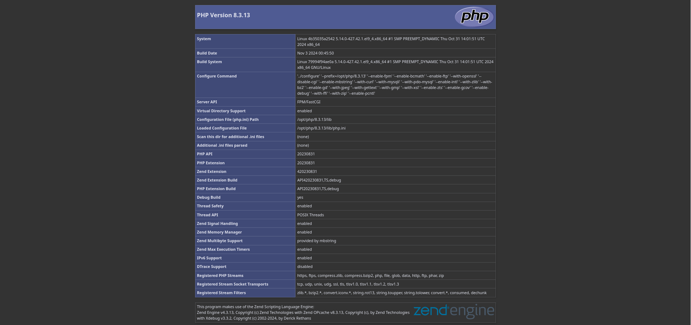

# `lamp-app-1.2` how to customize an image named `lamp-app-img:1.2`

*Image used as a starting point for further development, as the approach is to proceed step by step towards the final result which in this case is a complete and autonomous development environment, ideal for porting an existing application from a previous version of PHP to a more recent one.*

*Enable Process Control support, (PCNTL).*

## screenshot obtained with `phpinfo()` function:



## warnings

Be careful, in order to work this procedure also needs a directory `bin` containing `composer` already verified and a directory `sources` with the sources of `PHP`, `Xdebug` and `Node.js` in the desired versions. These last ones have already been verified.

## create an example of container

Below I will use `img` as an abbreviation for image and `cntr` as an abbreviation for container.

```bash
ls ~/projects/containers/backend/lamp-app-1.2
cd ~/projects/containers/backend/lamp-app-1.2
```

First I will need to create the settings files and web content in their respective directories.
The same files and directories that will be used in the `COPY` commands expressed in `Dockerfile`.
Including self-signed certificates, generated, for example, as follows:

```bash
ls -l conf/self-signed-certificates
openssl req -new -x509 -days 365 -out conf/self-signed-certificates/hologram.pem -keyout conf/self-signed-certificates/hologram.key
```

Here is just an example of the parameters to keep on hand:

```text
[long_passphrase]
[national_acronym]
[state]
[city]
hologram.local
hologram.local
hologram.local
[webmaster@localhost]
```

Long passphrase generated with:

```bash
pwgen -s 48 1
```

or with:

```bash
date +%s | sha512sum | base64 | head -c 48 ; echo
```

It is obvious that the first four parameters must be appropriately valued.

A short script `echo_passphrase.sh` similar to the following must be written in directory `self-signed-certificates`:

```text
#!/bin/sh
echo "long_passphrase"
```

A directory must be created `mods-available` with a file inside named `dir.conf` containing text similar to the following:

```xml
<IfModule mod_dir.c>
        DirectoryIndex index.php index.html index.cgi index.pl index.xhtml index.htm
</IfModule>
```

A directory must be created `sites-available` with a file inside named `default-ssl.conf` containing the text:

```xml
<IfModule mod_ssl.c>
        <VirtualHost _default_:443>
                ServerAdmin webmaster@localhost
                ServerName hologram.local
                ServerAlias www.hologram.local
                DocumentRoot /var/www/html/landing/public

                <Directory /var/www/html/landing/public>
                    Options Indexes FollowSymLinks MultiViews
                    AllowOverride All
                    Require all granted
                </Directory>

                LogLevel warn

                ErrorLog ${APACHE_LOG_DIR}/error.log
                CustomLog ${APACHE_LOG_DIR}/access.log combined

                SSLEngine on

                SSLCertificateFile /etc/ssl/self_signed_certs/hologram.pem
                SSLCertificateKeyFile /etc/ssl/self_signed_certs/hologram.key

                <FilesMatch "\.(cgi|shtml|phtml|php)$">
                    SSLOptions +StdEnvVars
                </FilesMatch>

                <Directory /usr/lib/cgi-bin>
                    SSLOptions +StdEnvVars
                </Directory>
        </VirtualHost>
</IfModule>
```

and a file named `default-ssl.conf` with the following text:

```xml
<VirtualHost *:80>
        ServerAdmin webmaster@localhost
        ServerName hologram.local
        ServerAlias www.hologram.local
        DocumentRoot /var/www/html/landing/public

        <Directory /var/www/html/landing/public>
            Options Indexes FollowSymLinks MultiViews
            AllowOverride All
            Require all granted
        </Directory>

        LogLevel warn

        ErrorLog ${APACHE_LOG_DIR}/error.log
        CustomLog ${APACHE_LOG_DIR}/access.log combined
</VirtualHost>
```

### image build

Once the example web application is built I can issue the following command:

```bash
podman image list
cat Dockerfile
podman build --tag lamp-app-img:1.2 .
```

The output of this command should also contain the digest of the newly created local image.

I continue with the verification of some details:

```bash
podman images --all
podman images --no-trunc --quiet lamp-app-img:1.2
podman image inspect lamp-app-img:1.2
```

### solve problems caused by SELinux

The `html` directory can contain either a simple html page or a web application developed using a JavaScript framework.

The best solution in my opinion is to act as the owner of the specific directory:

```bash
mkdir html
ls -Z html/
chcon --recursive --type=container_file_t html/
```

### create the container

The `html` directory can contain either a simple info PHP page. But this time the container has all the tools to develop an application from within and the above mentioned directory serves to make this operation permanent, even after the container is stopped.

Here are all the instructions you need to customize an image and get the container working:

```bash
podman container list --all
podman run --volume $(pwd)/html:/var/www/html --detach --name lamp-app-cntr-1-2 --publish 8022:22 --publish 8080:80 --publish 8443:443 --publish 9003:9003 --pull=never  lamp-app-img:1.2
podman container list --all --size
podman exec --interactive --tty --privileged lamp-app-cntr-1-2 bash
```

### open a bash shell in the container

Examples of commands typed into container shell:

```bash
ps ax
tail --follow --lines=20 /var/log/apache2/access.log
tail --follow --lines=20 /var/log/apache2/error.log
exit
```

### login via OpenSSH

Now I try to log in from the system that hosts the virtual machine that in turn hosts the containers:

```bash
nmap 192.168.1.XXX -Pn -p 8022
ssh root@192.168.1.XXX -p 8022
```

### example of sftp.json for `vscode`

```json
{
    "$schema": "http://json-schema.org/draft-07/schema",
    "name": "lamp-app-cntr-1-2",
    "username": "root",
    "password": "some_password",
    "host": "192.168.1.XXX",
    "port": 8022,
    "remotePath": "/var/www/html",
    "connectTimeout": 20000,
    "uploadOnSave": true,
    "watcher": {
        "files": "dist/*.{js,css}",
        "autoUpload": false,
        "autoDelete": false
    },
    "syncOption": {
        "delete": true,
        "update": false
    },
    "ignore": [
        ".vscode",
        ".howto",
        ".docs",
        ".git",
        ".DS_Store",
        "TEMP",
        "nbproject",
        "probe.http"
    ]
}
```

### a simple debugging example code

The source of the example follows:

```php
<?php

// example of debugging an iteration that uses a constant

const WELCOME = "Welcome to demo iteration number ";
$sample = "";

toIterate();

function toIterate() {
    for ($i = 0; $i < 10; $i++) {
        xdebug_break();
        $sample = WELCOME . $i . "!<br>";
        echo $sample;
    }
}
```

### stop the container

I can use the container name like this:

```bash
podman stop lamp-app-cntr-1-2
podman container list --all
```

### restart the container

I can proceed to restarting `lamp-app-cntr-1-2` in privileged mode:

```bash
podman container list --all
podman start lamp-app-cntr-1-2
podman exec --interactive --tty --privileged lamp-app-cntr-1-2 bash
```

## to clean up

### remove container

```bash
podman stop lamp-app-cntr-1-2 && podman rm lamp-app-cntr-1-2
podman container list --all
```

### remove image

How to remove the custom image in question once I'm done testing or when I have an updated version.

```bash
podman image rm lamp-app-img:1.2
podman image list
```
