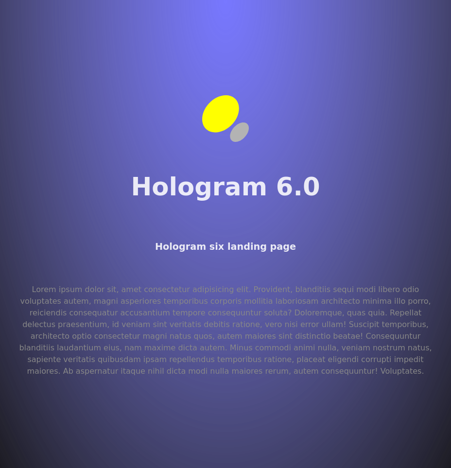

# landing

Landing page developed thanks to `React`.



Scaffolding:

```bash
npm create vite@latest landing -- --template react
```

Install dependencies:

```bash
cd landing
npm install
```

Add this to `vite.config.js`:

```js
  server: {
    host: true,
    port: 8080
  },
```

Start development view:

```bash
npm run dev
```

Build dist code:

```bash
npm run build
```
