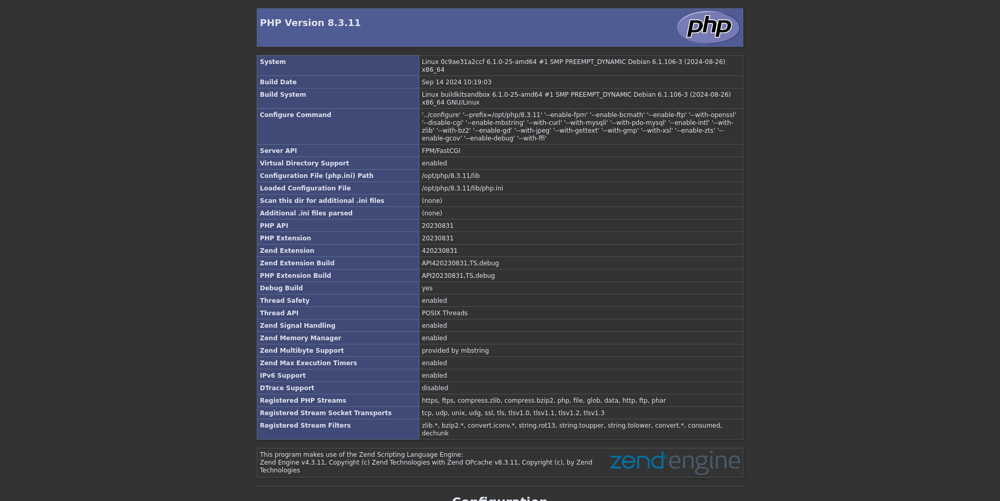

# `hologram-7.0` customized image

*In this stage I will present an example of configuring an execution environment for PHP-FPM*

Below is an example of how to customize a Docker image used locally for testing purposes, capable of serving web content over the HTTPS protocol.
In this case I mean to get an application environment that can execute a simple info code written in PHP language.



## create an example of container

Below I will use `img` as an abbreviation for image and `cntr` as an abbreviation for container.

```bash
ls ~/docker-playground/hologram-7.0
cd ~/docker-playground/hologram-7.0
```

First I will need to create the settings files and web content in their respective directories.
The same files and directories that will be used in the `COPY` commands expressed in `Dockerfile`.
Including self-signed certificates, generated, for example, as follows:

```bash
mkdir -p conf/self-signed-certificates
openssl req -new -x509 -days 365 -out conf/self-signed-certificates/hologram.pem -keyout conf/self-signed-certificates/hologram.key
```

Here is just an example of the parameters to keep on hand:

```text
[long passphrase]
[national_acronym]
[state]
[city]
hologram.local
hologram.local
hologram.local
[webmaster@localhost]
```

Long passphrase generated with:

```bash
pwgen -s 48 1
```

It is obvious that the first four parameters must be appropriately valued.

A short script `echo_passphrase.sh` similar to the following must be written in directory `self-signed-certificates`:

```text
#!/bin/sh
echo "long passphrase"
```

A directory must be created `mods-available` with a file inside named `dir.conf` containing text similar to the following:

```xml
<IfModule mod_dir.c>
        DirectoryIndex index.html index.cgi index.pl index.xhtml index.htm index.php
</IfModule>
```

A directory must be created `sites-available` with a file inside named `default-ssl.conf` containing the text:

```xml
<IfModule mod_ssl.c>
        <VirtualHost _default_:443>
                ServerAdmin webmaster@localhost
                ServerName hologram.local
                ServerAlias www.hologram.local
                DocumentRoot /var/www/html

                <Directory /var/www/html>
                    Options Indexes FollowSymLinks MultiViews
                    AllowOverride All
                    Require all granted
                </Directory>

                LogLevel warn

                ErrorLog ${APACHE_LOG_DIR}/error.log
                CustomLog ${APACHE_LOG_DIR}/access.log combined

                SSLEngine on

                SSLCertificateFile /etc/ssl/self_signed_certs/hologram.pem
                SSLCertificateKeyFile /etc/ssl/self_signed_certs/hologram.key

                <FilesMatch "\.(cgi|shtml|phtml|php)$">
                    SSLOptions +StdEnvVars
                </FilesMatch>

                <Directory /usr/lib/cgi-bin>
                    SSLOptions +StdEnvVars
                </Directory>
        </VirtualHost>
</IfModule>
```

and a file named `default-ssl.conf` with the following text:

```xml
<VirtualHost *:80>
        ServerAdmin webmaster@localhost
        ServerName hologram.local
        ServerAlias www.hologram.local
        DocumentRoot /var/www/html

        <Directory /var/www/html>
            Options Indexes FollowSymLinks MultiViews
            AllowOverride All
            Require all granted
        </Directory>

        LogLevel warn

        ErrorLog ${APACHE_LOG_DIR}/error.log
        CustomLog ${APACHE_LOG_DIR}/access.log combined
</VirtualHost>
```

The `source` directory can contain either a simple PHP info page.

In addition, of course, to all the instructions needed to customize an image and get the container working.

### image build

Once the example web application is built I can issue the following command:

```bash
docker image ls
cat Dockerfile
docker build --tag hologram-img:7.0 .
```

The output of this command should also contain the digest of the newly created local image.

I continue with the verification of some details:

```bash
docker image ls
docker images --no-trunc --quiet hologram-img:7.0
docker image inspect hologram-img:7.0
```

### create the container

I can proceed to create a container starting from the above image in privileged mode:

```bash
docker container ls --all
docker run --detach --name hologram-cntr-7 --publish 8443:443 --pull=never hologram-img:7.0
docker container ls --all --size
docker exec --interactive --tty --privileged hologram-cntr-7 bash
```

### open a bash shell in the container

Examples of commands typed into container shell:

```bash
cd ~
nano .bashrc
. .bashrc
btop --utf-force
exit
```

### stop the container

I can use the container name like this:

```bash
docker stop hologram-cntr-7
```

### restart the container

I can proceed to restarting `hologram-cntr-7` in privileged mode:

```bash
docker container ls --all
docker start hologram-cntr-7
docker exec --interactive --tty --privileged hologram-cntr-7 bash
```

## to clean up

### remove container

```bash
docker stop hologram-cntr-7 && docker rm hologram-cntr-7
```

### remove image

How to remove the custom image in question once I'm done testing or when I have an updated version.

```bash
docker image rm hologram-img:7.0
```

I'm checking to make sure I've cleaned up:

```bash
docker container ls --all
docker images --all
```
