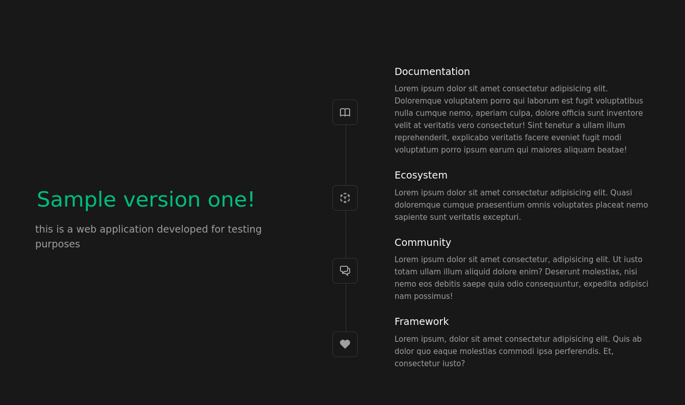

# `webserver-deploy-rolling-update`

## first I prepare two versions of custom images

First I need to have a cluster to run the example on.
Then it is good to create the cluster following the procedure indicated in the second part of the `README.md` file contained in the parent directory of this one.

## get cluster name

With the following command I will get, unequivocally, the name of the cluster:

```bash
kind get clusters
```

I will use the cluster name obtained from the previous command to load the custom image present locally, created with the procedure described in the `~/docker-playground/sample-1.0/README.md` and `~/docker-playground/sample-2.0/README.md` files:
Anyway, I make sure I have the custom images ready to use:

```bash
docker images --all
```

I upload images to local cluster:

```bash
kind load docker-image sample:1.0 --name cluster-one-five
kind load docker-image sample:2.0 --name cluster-one-five
```

Be careful, if you skip this step, when you create the pod you will get an error `ErrImageNeverPull` in column `STATUS` when you request the list of pods.

## second, to get to the heart of this example I can use a `kustomization.yaml` file

```bash
ls -l ~/kind-workload/webserver-deploy-rolling-update/custom/kustomization.yaml
kubectl apply -k ~/kind-workload/webserver-deploy-rolling-update/custom/
```

By doing this I do nothing more than apply the manifest files listed in `~/kind-workload/webserver-deploy-rolling-update/custom/kustomization.yaml`.

### test the Deployment object

To monitor the pod, in a separate terminal, I typed the following command:

```bash
kubectl get pods -o wide --watch
```

```bash
kubectl get deploy
kubectl get svc
kubectl get nodes -o wide
```

Now I consider the node names and IP addresses obtained from the last command.
After choosing one, I type the following commands, remembering that the port number is the one set in the `webserver-svc.yaml` manifest:

```bash
ping -c 3 <ip_node_address>
curl http://<ip_node_address>:31001
```



Well, if for some reason a node should respond to the home page request with an error, it is good to send the same request to another node, which can also be `control-plane`.
However, it would be good to investigate the return of the above error.

### 

Update `webserver-deploy.yaml` with image `sample:2.0`:

```yaml
...
      containers:
        - name: webserver
          image: sample:2.0
...
```

```bash
ls -l ~/kind-workload/webserver-deploy-rolling-update/custom/webserver-deploy.yaml
kubectl apply -f ~/kind-workload/webserver-deploy-rolling-update/custom/webserver-deploy.yaml
```

Or, in development and testing I could use the imperative command:

```bash
kubectl set image deploy webserver-deploy webserver=sample:2.0
```

Now I can rollout:

```bash
kubectl rollout status deploy webserver-deploy --watch
kubectl describe deploy webserver-deploy | grep -i "Image:"
kubectl get rs -o wide
kubectl describe pods | grep -i "Image:"
```

I check the version of the application just updated:

```bash
curl http://<ip_node_address>:31001
```


Now I want to test rolling back to previous version of image:

```bash
kubectl rollout undo deploy webserver-deploy
kubectl describe deploy webserver-deploy | grep -i "Image:"
kubectl get rs -o wide
kubectl describe pods | grep -i "Image:"
```

I check the application rolling back:

```bash
curl http://<ip_node_address>:31001
```


### deleting Service and Deployment objects

```bash
kubectl delete svc webserver-svc
kubectl delete deploy webserver-deploy
kubectl get pods,deploy,svc
```
