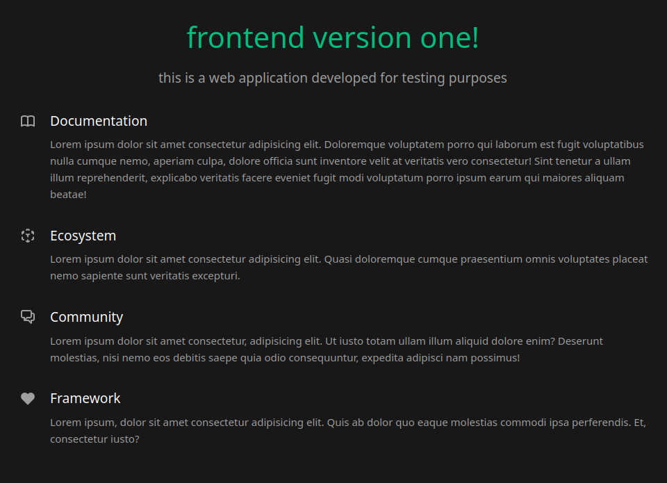

# `frontend` 1.0



## project setup

```bash
npm install
```

## check for updates

```bash
npm outdated
```

## do the update

```bash
npm update
license-report --output=csv > licenses_report.csv
```

but if, for example, I only wanted to update a specific package, it would be better to use the following command:

```bash
npm install eslint@latest
```

## small changes

I add a few lines of code to the `vite.config.js` file to set the port and make the development build accessible over the network:

```js
...
  server: {
    host: true,
    port: 8080
  },
...
```

## compile and hot-reload for development

```bash
npm run dev
```

## compile and minify for docker image testing

```bash
npm run build
```
