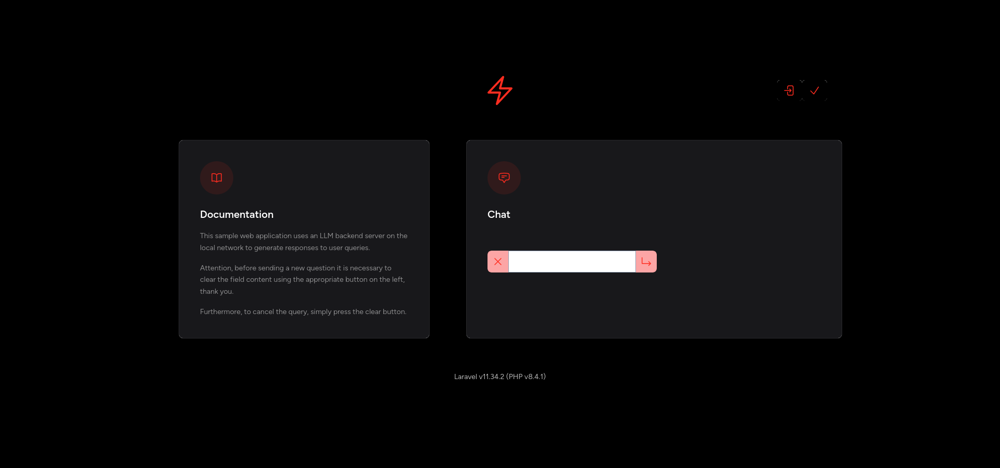
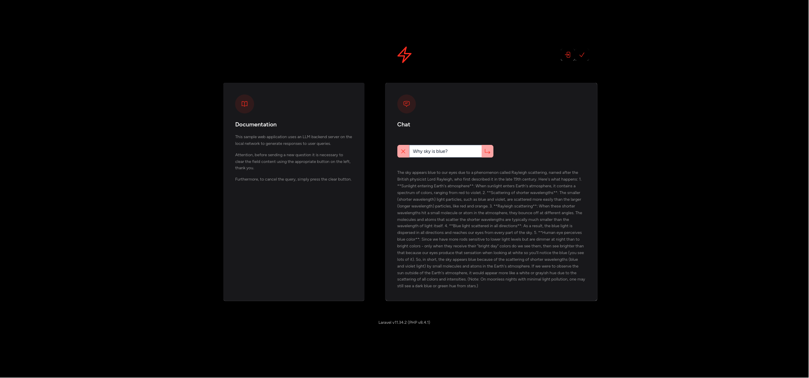
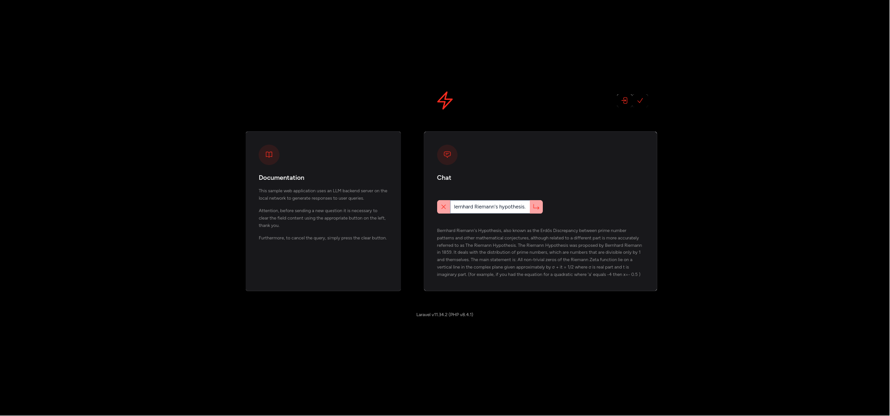
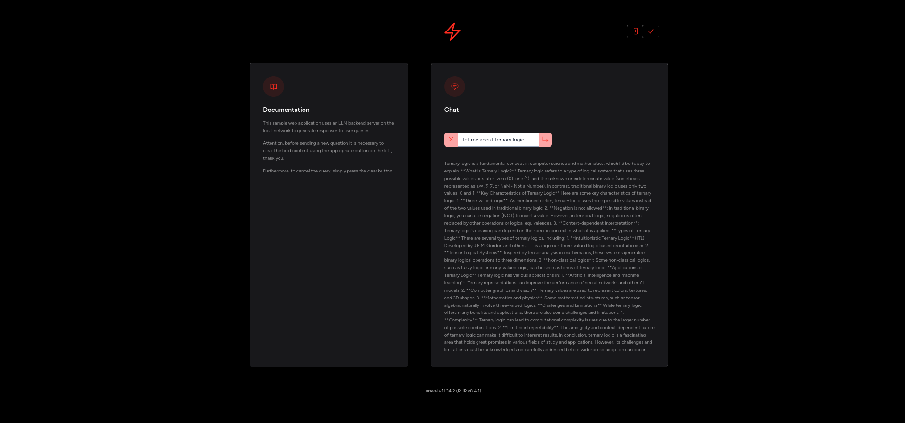
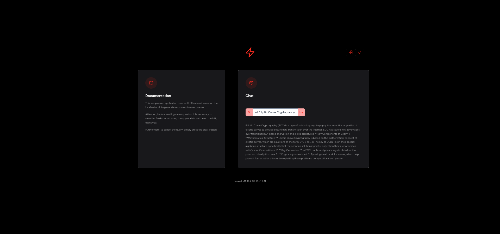
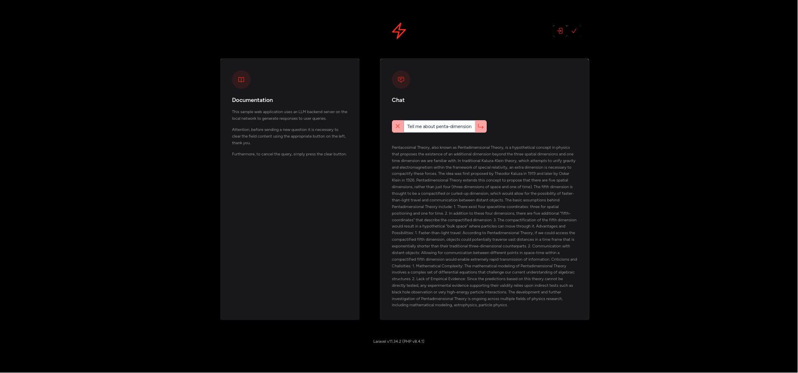

# `chatbot` virtual host setup



## example of queries

> Why sky is blue?



> Tell me about Bernhard Riemann's hypothesis.



> Tell me about ternary logic.



> Tell me about Elliptic Curve Cryptography.



> Tell me about penta-dimensional theory.



### parameter for generate keys:

Here is just an example of the parameters to keep on hand:

```text
[national_acronym]
[state]
[city]
chatbot-php84.local
chatbot-php84.local
chatbot-php84.local
[webmaster@localhost]
```

It is obvious that the first three parameters must be appropriately valued.

Therefore I can proceed with the generation of the self-signed certificate without the passphrase thanks to the `-nodes` flag:

```bash
su -
ls -al /etc/ssl/
openssl req -new -x509 -nodes -days 365 -newkey rsa:2048 -keyout /etc/ssl/private/chatbot-php84.key -out /etc/ssl/certs/chatbot-php84.crt
ls -al /etc/ssl/private/
ls -al /etc/ssl/certs/
```

### file `/etc/httpd/conf.d/chatbot-php84.local.conf`

```bash
nano /etc/httpd/conf.d/chatbot-php84.local.conf
```

```xml
<VirtualHost *:80>
        ServerAdmin webmaster@localhost
        ServerName chatbot-php84.local
        ServerAlias www.chatbot-php84.local
        DocumentRoot /var/www/html/chatbot/public
        Redirect permanent "/" "https://chatbot-php84.local/"
</VirtualHost>

<VirtualHost *:443>
        ServerAdmin webmaster@localhost
        ServerName chatbot-php84.local
        ServerAlias www.chatbot-php84.local
        DocumentRoot /var/www/html/chatbot/public

        <Directory /var/www/html/chatbot/public>
                Options Indexes FollowSymLinks MultiViews
                AllowOverride All
                Require all granted
        </Directory>

        SSLEngine on

        SSLCertificateFile /etc/ssl/certs/chatbot-php84.crt
        SSLCertificateKeyFile /etc/ssl/private/chatbot-php84.key

        ErrorLog /var/log/httpd/chatbot-php84_error_log

        <FilesMatch "\.(cgi|shtml|phtml|php)$">
                SSLOptions +StdEnvVars
        </FilesMatch>
</VirtualHost>
```

### application scaffolding

With developer user credentials:

```bash
sudo apachectl configtest
cd /var/www/html/
composer list
composer create-project laravel/laravel chatbot
sudo apachectl configtest
sudo systemctl reload httpd
systemctl status httpd --no-pager
cd chatbot/
```

If I encounter any problems I can investigate with the following command:

```bash
journalctl -u httpd --since today --no-pager
```

### solution of `failed to open stream: permission denied`

```bash
stat -c %a bootstrap/cache
find bootstrap/cache -printf '%m %p \n'
find storage -printf '%m %p \n'
find database -printf '%m %p \n'
chmod --recursive 775 bootstrap/cache && chmod --recursive 775 storage && chmod --recursive 775 database
chown --recursive developer_username:apache .
```

### continuation of scaffolding

```bash
composer require laravel/jetstream
php artisan jetstream:install livewire --teams --dark
npm install
npm run build
php artisan migrate:status
```

### to improve the development of `Livewire` components

```bash
composer require wire-elements/wire-spy --dev
```

### fix coding stile with `pint`

```bash
./vendor/bin/pint --help
./vendor/bin/pint --test
./vendor/bin/pint
```

## install Pest

```bash
composer require --dev --with-all-dependencies pestphp/pest
./vendor/bin/pest --init
composer require --dev pestphp/pest-plugin-laravel
```

### migrate all tests from PHPUnit to Pest

```bash
composer require --dev pestphp/pest-plugin-drift
./vendor/bin/pest --drift
```

### run all the tests

Please, pay attention, to verify the validity of the texts with the `--coverage` option, it is necessary to have appropriately modified the `php.ini` file with, for example, a line similar to the following:

```ini
xdebug.mode=develop,debug,trace,coverage
```

```bash
php artisan test --coverage
```

## how to check installed packages

```bash
composer show --help
composer show
composer show --tree
composer show | grep laravel
composer show | grep pest
```

## how to check licenses of installed packages

```bash
composer require --dev dominikb/composer-license-checker
./vendor/bin/composer-license-checker help
./vendor/bin/composer-license-checker list
./vendor/bin/composer-license-checker check
./vendor/bin/composer-license-checker report
```

## commands that may prove useful

```bash
composer suggest --all
```

To diagnose any problems:

```bash
composer --help diagnose
composer diagnose
```

## how to create a new testing class with Pest

```bash
php artisan make:test --help
```

### `web` routes example test

```bash
php artisan make:test --pest WelcomeFeatureTest
```

```php
<?php

test('welcome feature test', function () {
    $response = $this->get('/');

    $response->assertStatus(200);
});
```

```bash
php artisan test --filter WelcomeFeatureTest
```

## update dependencies to the latest version

```bash
composer update --help
composer update --ignore-platform-reqs
```

## reset the entire database

Edit `.env`:

```env
# DB_CONNECTION=sqlite

# chatbot_db_v1
DB_CONNECTION=mariadb
DB_HOST=127.0.0.1
DB_PORT=3306
DB_DATABASE=chatbot_db_v1
DB_USERNAME=developer_username
DB_PASSWORD=developer_password

# IP address of LLM server on the same local network
OLLAMA_URL=http://192.168.1.XXX:11434/v1
```

Create a new database with collection type `utf8_unicode_ci`, and type:

```bash
php artisan db:wipe
php artisan migrate:fresh
php artisan migrate:status
```

and, if I have already prepared what is needed to generate the test data, I can also send the following command:

```bash
php artisan db:seed
```

### only if I need to go back to the previous migration

```bash
php artisan migrate:rollback
```

## I have to remember to issue the following commands when I add a new route and it is not listed:

```bash
npm run build
chmod --recursive 775 bootstrap/cache
chmod --recursive 775 storage
chmod --recursive 775 database
chown --recursive developer_username:apache .
php artisan route:cache && php artisan route:clear && php artisan route:list
```

and, if I am examining the presence of a specific route, the following command has been useful to me:

```bash
php artisan route:list | grep "help"
```

## to get inspired to write custom commands

```bash
php artisan inspire
```

## to integrate a Laravel web application with an LLM service

```bash
composer require echolabsdev/prism
php artisan vendor:publish --tag=prism-config
```

and edit `config/prism.php` like this:

```php
<?php

return [
    'prism_server' => [
        // The middleware that will be applied to the Prism Server routes.
        'middleware' => [],
        'enabled' => env('PRISM_SERVER_ENABLED', true),
    ],
    'providers' => [
        'ollama' => [
            'url' => env('OLLAMA_URL', 'http://localhost:11434/v1'),
        ],
    ],
];
```

Finally, a further check on the licenses of the packages installed in the web application:

```bash
./vendor/bin/composer-license-checker report
```

### `BasicLlmUnitTest`

```bash
php artisan make:test --pest --unit BasicLlmUnitTest
```

```php
<?php

use EchoLabs\Prism\Prism;
use EchoLabs\Prism\Enums\Provider;
use EchoLabs\Prism\ValueObjects\Usage;
use EchoLabs\Prism\Enums\FinishReason;
use EchoLabs\Prism\Providers\ProviderResponse;

test('basic LLM unit test', function () {

    $fakeProvidedResponse = new ProviderResponse(
        text: 'This is a basic LLM test!',
        toolCalls: [],
        usage: new Usage(10, 20),
        finishReason: FinishReason::Stop,
        response: ['id' => 'fake_provided_1', 'model' => 'fake_model']
    );

    $fakePrism = Prism::fake([$fakeProvidedResponse]);

    $prismResponse = Prism::text()
        ->using(Provider::Ollama, 'llama3.2')
        ->withPrompt('Hello!')
        ->generate();

    var_dump($prismResponse->text);

    expect($prismResponse->text)->toBe('This is a basic LLM test!');
});
```

```bash
php artisan test --filter BasicLlmUnitTest
```

## chatbot UI

```bash
php artisan make:livewire LLM/chatbot-query --inline
```

and edit like this:

```php
<?php

namespace App\Livewire\LLM;

use Livewire\Component;
use Livewire\Attributes\Validate;

class ChatbotQuery extends Component
{
    #[Validate('required')]
    public string $query = '';

    public bool $queryInProgress = false;

    public function clear() {
        $this->query = '';
        $this->queryInProgress = false;
        $this->dispatch('clearResponse');
    }

    public function submitQuery() {
        $this->validate();
        $this->queryInProgress = true;
        $this->dispatch('askTheQuestion', ['query' => $this->query]);
    }

    public function render()
    {
        return <<<'HTML'
        <div>
            <div class="flex justify-center mt-4">
                <button wire:click="clear" {{ empty($query) ? "disabled" : "" }}
                    class="p-2 mt-4 mr-0 bg-red-300 rounded-l-lg">
                    <svg xmlns="http://www.w3.org/2000/svg" fill="none" viewBox="0 0 24 24"
                        stroke-width="1.5" class="size-6 shrink-0 stroke-[#FF2D20]">
                        <title>clear</title>
                        <path stroke-linecap="round" stroke-linejoin="round"
                            d="M6 18 18 6M6 6l12 12" />
                    </svg>
                </button>
                <input wire:model.live.debounce="query"
                    class="my-0 mt-4 w-full border-slate-400 text-slate-800 focus:border-red-300" />
                <button wire:click="submitQuery" {{ (empty($query) || $queryInProgress) ? "disabled" : "" }}
                    class="p-2 mt-4 ml-0 bg-red-300 rounded-r-lg">
                    <svg xmlns="http://www.w3.org/2000/svg" fill="none" viewBox="0 0 24 24"
                        stroke-width="1.5" class="size-6 shrink-0 stroke-[#FF2D20]">
                        <title>return</title>
                        <path stroke-linecap="round" stroke-linejoin="round"
                            d="m16.49 12 3.75 3.75m0 0-3.75 3.75m3.75-3.75H3.74V4.499" />
                    </svg>
                </button>
            </div>
        </div>
        HTML;
    }
}
```

```bash
php artisan make:livewire LLM/chatbot-response --inline
```

and edit like this:

```php
<?php

namespace App\Livewire\LLM;

use Livewire\Component;
use EchoLabs\Prism\Prism;
use EchoLabs\Prism\Enums\Provider;

class ChatbotResponse extends Component
{
    public string $llmResponse = '';

    protected $listeners = [
        'askTheQuestion',
        'clearResponse',
    ];

    private string $prismText = '';

    public function clearResponse() {
        $this->llmResponse = '';
    }

    public function askTheQuestion($query)
    {
        $this->prismText = Prism::text()
            ->using(Provider::Ollama, 'llama3.2')
            ->withPrompt($query['query'])
            ->withClientOptions(['timeout' => 60])
            ->generate()->text;

        $this->llmResponse = ! empty($this->prismText) ? $this->prismText : "I'm sorry, not found a valid response.";
    }

    public function render()
    {
        return <<<'HTML'
        <div>
            <p class="mt-4 text-sm/relaxed">
                {{ $this->llmResponse }}
            </p>
            <p wire:loading class="mt-4 text-red-600 opacity-40 text-sm/relaxed">
                Waiting for a response...
            </p>
        </div>
        HTML;
    }
}
```
