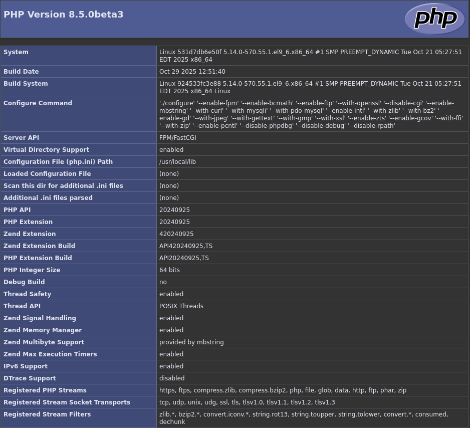

# containerization of PHP upcoming development environment

For a `micro-container` oriented architecture.

## local repository

```shell
git init
git branch -m main
git status
git add .
git commit -m "initializing the local repository"
git log
git tag -a v0.0.0 -m "starting version of the microservice"
git checkout -b staging
git checkout -b draft
git merge --no-ff main -m "merge main into draft"
git checkout staging
git merge --no-ff draft -m "merge draft into staging"
git checkout main
git merge --no-ff staging -m "merge staging into main"
git log
git tag -a v1.0.0 -m "first usable version of this microservice"
```

## `lamp-upcoming-cntr` is an example of use in development sessions

In this example I try to customize an image named `lamp-upcoming-img:1.0`

### sources

*First of all, a directory with the sources must be prepared which will then be copied into the image thanks to the dockerfile and subsequently compiled.*

It will therefore be necessary to obtain the following sources:

* php-src-php-8.5.0beta3.zip

Then place them in the sources directory.

## create an example of container

```shell
ls ~/Projects/fullstack-project/lamp/upcomingLAMP/
cd ~/Projects/fullstack-project/lamp/upcomingLAMP/
```

## image build

Once the example web application is built I can issue the following command:

```shell
podman image ls | grep "lamp-upcoming-img"
cat Dockerfile
podman build --tag lamp-upcoming-img:1.0 .
```

The output of this command should also contain the digest of the newly created local image.

Now I continue with the verification of some details:

```shell
podman image ls | grep "lamp-upcoming-img"
podman images --no-trunc --quiet lamp-upcoming-img:1.0
podman image inspect lamp-upcoming-img:1.0
```

### create the container

The `html` directory contains a simple technical PHP info page, a placeholder. But this time the container has all the tools to develop an application from within and the above mentioned directory serves to make this operation permanent, even after the container is stopped.

Here are all the instructions you need to customize an image and get the container working:

```shell
podman container ls --all
podman run --detach --name lamp-upcoming-cntr --publish 9000:9000 --pull=never lamp-upcoming-img:1.0
podman container ls --all --size | grep "lamp-upcoming-cntr"
podman exec --interactive --tty --privileged lamp-upcoming-cntr sh
```

### container operation checks from a host on the local network

Thanks to `nmap`:

```shell
nmap -Pn 192.168.XXX.XXX -p 9000 | grep "9000/tcp open"
```

Using `nc`:

```shell
nc -vz -w 3 192.168.XXX.XXX 9000 | grep succeeded
```

Or thanks to the `cgi-fcgi` tool:

```shell
SCRIPT_NAME=/app/index.php SCRIPT_FILENAME=/app/index.php REQUEST_METHOD=GET cgi-fcgi -bind -connect 192.168.XXX.XXX:9000
```

Considering that the PHP script in question is the classic: "<?php phpinfo();", the response will contain nothing but the current PHP interpreter settings, but the possibilities are endless.

Getting the HTML code that rendered gives the following screenshot:



Then, in a completely different case, if I had to pass a query string, I could write something like this:

```shell
SCRIPT_NAME=/app/index.php SCRIPT_FILENAME=/app/index.php REQUEST_METHOD=GET QUERY_STRING='one=1&two=2' cgi-fcgi -bind -connect 192.168.XXX.XXX:9000
```

When using the HTTP POST verb:

```shell
BODY='one=1&two=2&three=3'
export SCRIPT_NAME=/app/index.php
export SCRIPT_FILENAME=/app/index.php
export REQUEST_METHOD=POST
export CONTENT_TYPE='application/x-www-form-urlencoded'
export CONTENT_LENGTH=${#BODY}
echo -n "$BODY" | cgi-fcgi -bind -connect 192.168.XXX.XXX:9000
```

Also, if you are using JSON format:

```shell
BODY='{"one":1,"two":2,"three":3}'
export SCRIPT_NAME=/app/index.php
export SCRIPT_FILENAME=/app/index.php
export REQUEST_METHOD=POST
export CONTENT_TYPE='application/json'
export CONTENT_LENGTH=${#BODY}
echo -n "$BODY" | cgi-fcgi -bind -connect 192.168.XXX.XXX:9000
```

Remembering that historically PHP superglobals were born to handle the HTTP verbs GET and POST.
