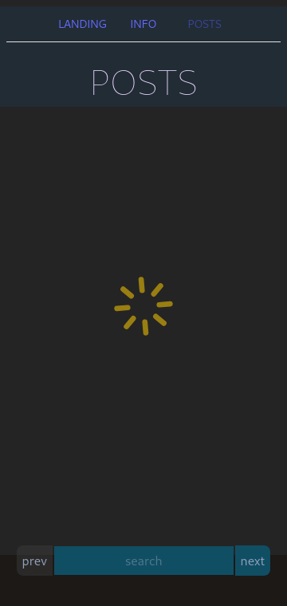
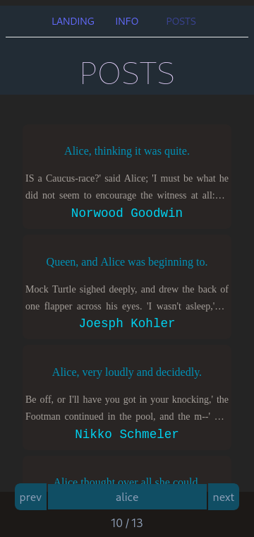

# `ui-agora01` web user interface application

This is a frontend web application developed using Vite, React and Tailwind CSS written primarily in programming language TypeScript and, pragmatically, something in language JavaScript.

A screenshot of what my starting code produces:

A screenshot of info page:

First screenshot of loading posts:

First screenshot of loaded posts:

