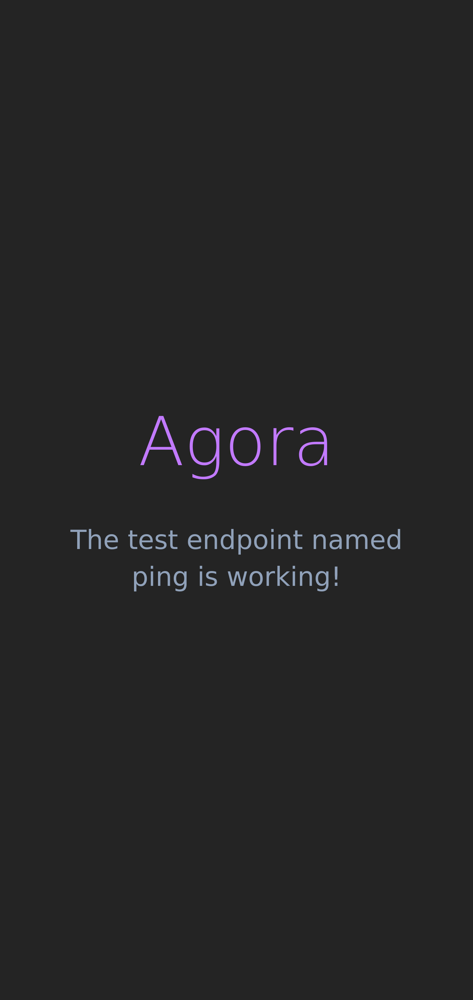

# `ui-agora02` web user interface application

This is a frontend web application developed using Vite, Vue and Tailwind CSS written in Javascript programming language.

Screenshot while waiting for response from API:

Screenshot obtained after receiving the response from the API:

