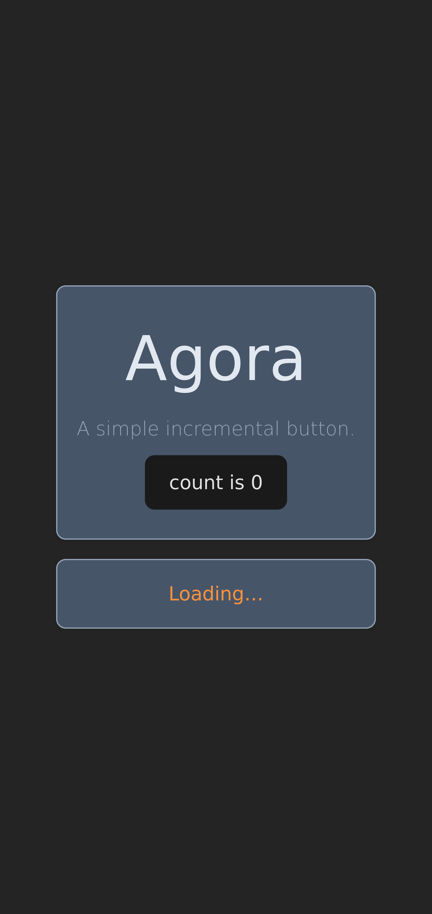

# `ui-agora03` web user interface application

This is a frontend web application developed using Angular and Tailwind CSS framework written in TypeScript programming language.

Cover:

Screenshot taken during loading:

Screenshot taken after retrieving the response from the API:

