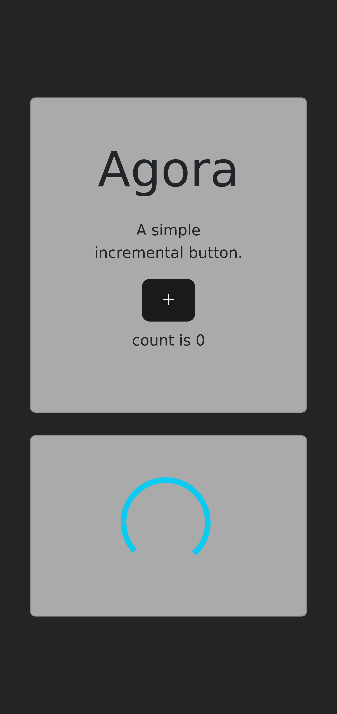

# `ui-agora04` a legacy example of web application

This is a frontend web application developed using jQuery and Bootstrap frameworks written in JavaScript programming language

Screenshot while waiting for response from API:

Screenshot obtained after receiving the response from the API:

