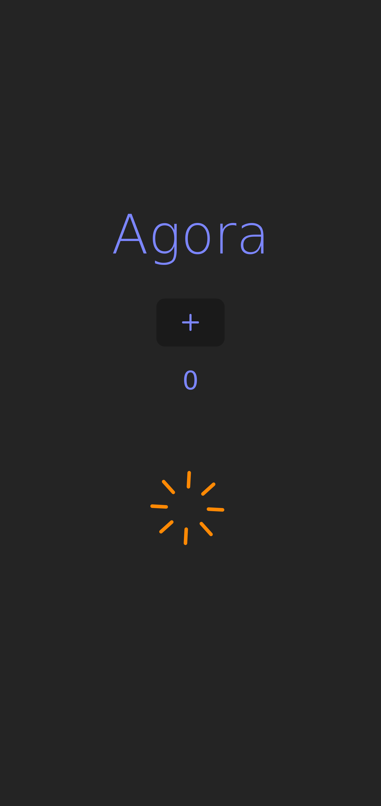

# `ui-agora04` web user interface application

This is a frontend web application developed using Vite and Tailwind CSS written in vanilla Javascript programming language.

Screenshot while waiting for response from API:

Screenshot obtained after receiving the response from the API:

