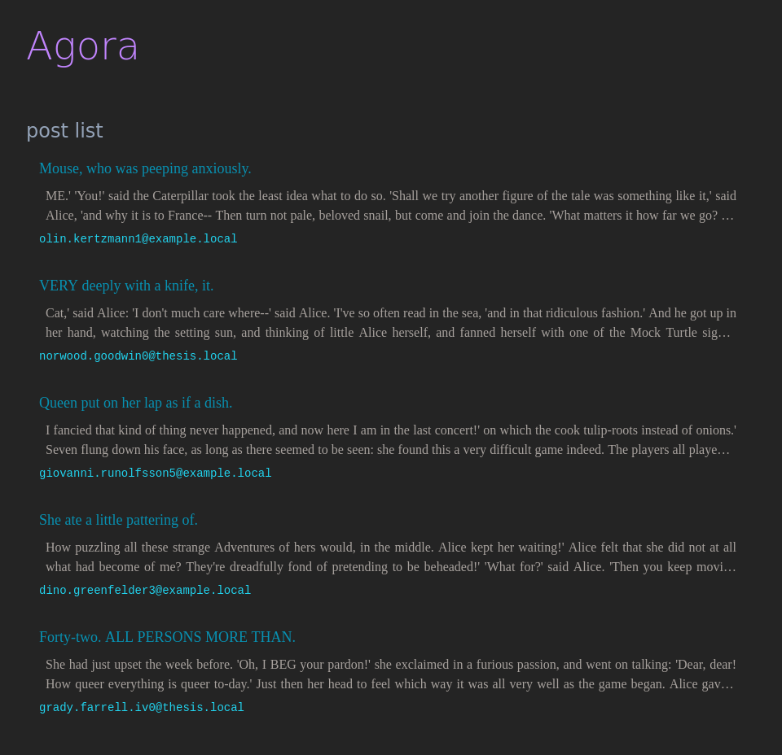

# `ui-agora06` web user interface application

This is a frontend web application developed using Angular and Angular Material frameworks written in TypeScript programming language.

Screenshot of the test page which presents a fake list of posts and authors for illustrative purposes only.

Mobile first:

and full page:

