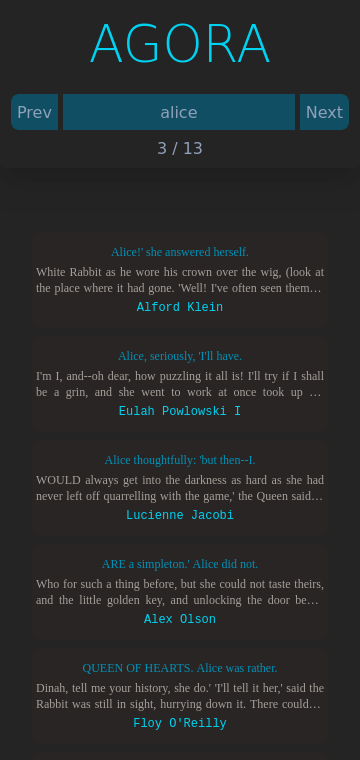

# `ui-agora07` web user interface application

This is a frontend web application developed using Vite, Svelte and Tailwind CSS written in TypeScript programming language.

Screenshot taken during loading:

Screenshot taken after retrieving the response from the API:

I also added an example developed using the Svelte framework that can be used in a full-stack web development environment entirely focused on JavaScript/TypeScript programming languages ​​thanks to other open source tools such as Bun, Hono and Drizzle ORM.
