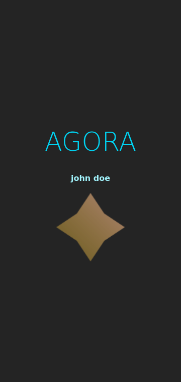
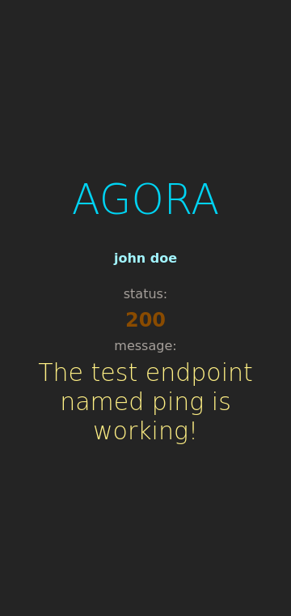
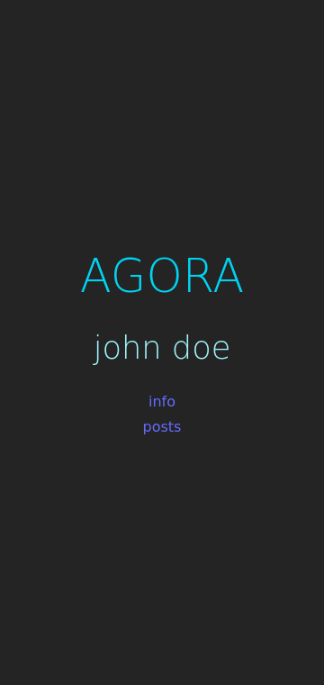
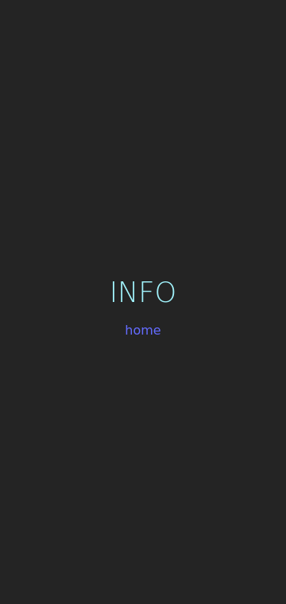
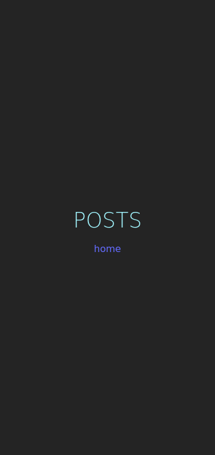

# `ui-agora08` web user interface application

This is a frontend web application developed using Vite, SvelteKit and Tailwind CSS written in TypeScript programming language.

Screenshot obtained from the starting code written with a perspective of further developments:

Screenshot obtained while the micro-frontend application is waiting for a response from the API:

Screenshot obtained when the micro-frontend application received a response from the API:

With navigation bar:

Route: `info`

Route: `posts`

