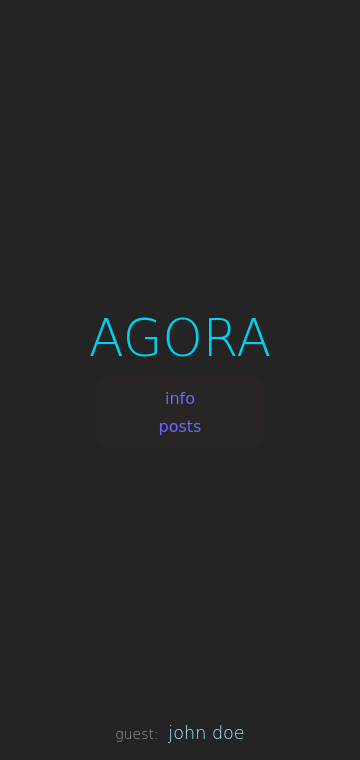
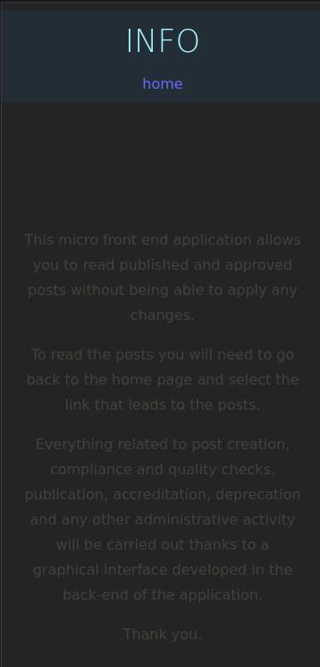
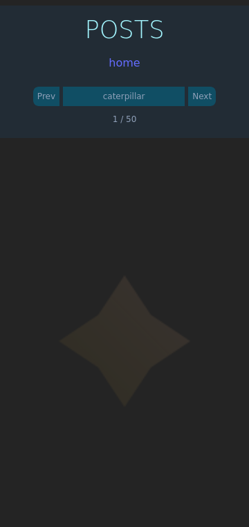
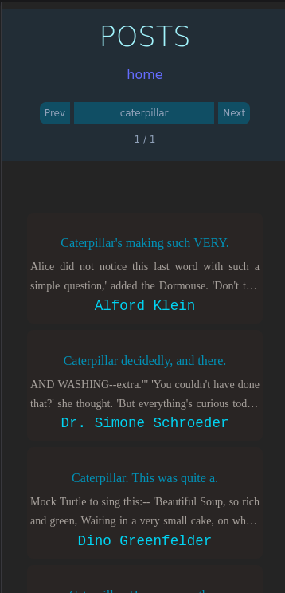

# `ui-agora08` web user interface application

This is a frontend web application developed using Vite, SvelteKit and Tailwind CSS written in TypeScript programming language.

Below are some screenshots that provide a visual representation of the different states of the web application.

Landing page:

Info page:

Image obtained while the micro-frontend application is waiting for a response from the API:

Image obtained when the micro-frontend application received a response from the API:

Finally here is the blur effect you get when the list of posts scrolls below the header:

